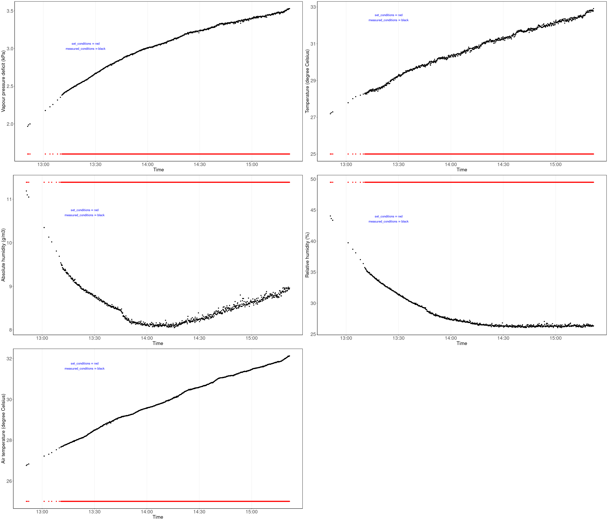
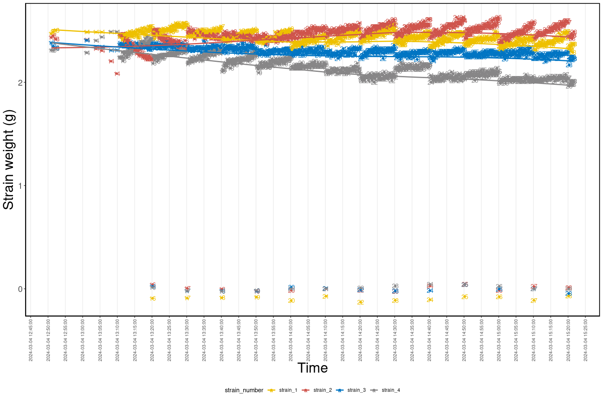
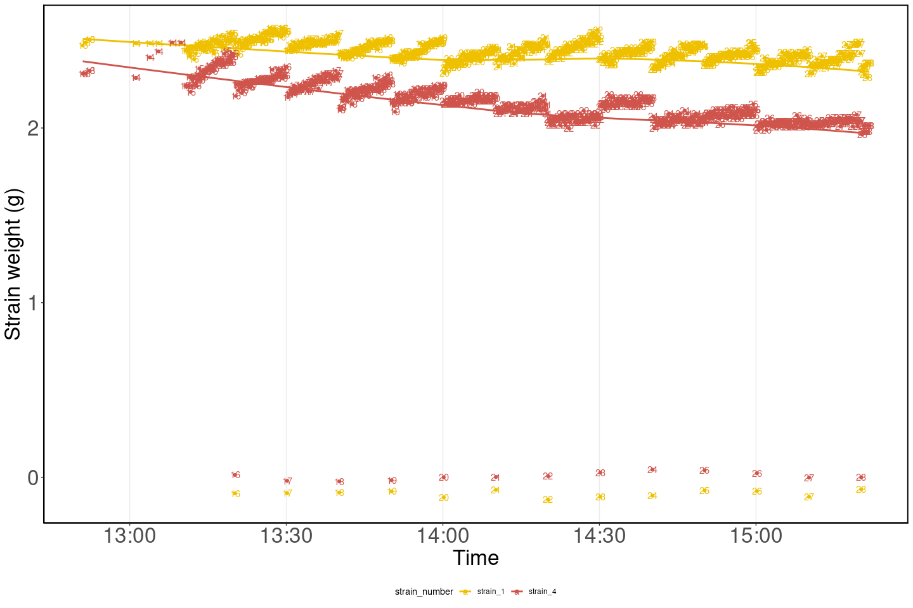
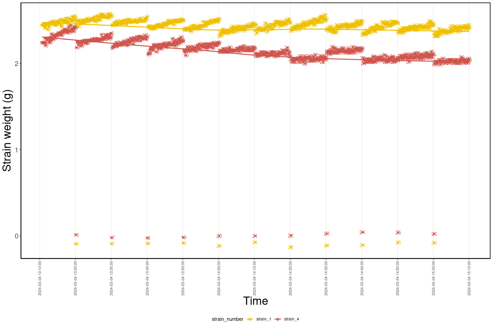
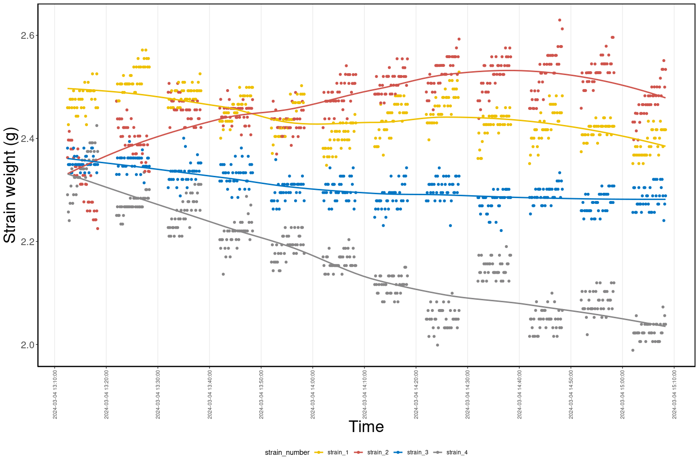

<!-- README.md is generated from README.Rmd. Please edit that file -->

# HIEdroughtbox

<!-- badges: start -->
<!-- badges: end -->

The goal of HIEdroughtbox is to facilitate the pre-prepossessing of the
data produced by [droughtbox located at the Hawkesbury Institute for the
Environment](https://ecamo19.github.io/droughtbox_documentation/) and
prepare it for calculating tree species branch minimum conductance ($g_{res}$) and
it’s temperature dependence ($T_p$).However, each dataset generated by the droughtbox has the following issues:

- **The data file generated by the droughtbox has a .dat extension with the first three rows of the
  data file containing information about the variable measured, the units, and the type of data**. This generates errors when
  loaded into R with the function read.table(). Thus, the `read_hie_droughtbox_data()` function was developed to consider
  the unique characteristics of the .dat file.

- **Contains data points outside of the time or dates desired.** This
  happens because the data logger collects all data, which might include
  (among others) data generated by another person on a different day,
  data generated during an undesired hour or data where the droughtbox
  didn’t achieve the climatic conditions desired(i.e. Temperature).
  Because of these issues, the function `filter_droughtbox_data()` was
  developed. With this function, a date or hour (or both) interval can be
  chosen to focus on a specific period.

- **Produce values close to zero (or even negative) and the first and
  last data points within each taring process are not valid due to temperature drift.** Every 5
  minutes the droughtbox automatically tares itself to avoid temperature drift in
  the measurements. However, this causes that between each taring process,
  the droughtbox records wrong data points. To overcome these issues the
  function `clean_droughtbox_data()` was developed. This function
  removes all values below a desired threshold (the default is 0.2
  grams) **AND** the first and last values within each taring process.
  For example, when the parameter remove_n_observations is set to 10, the first 10 and last
  10 values within each taring process are removed.

## Installation

You can install the development version of HIEdroughtbox from
[GitHub](https://github.com/) with:

``` r
# install.packages("devtools")
devtools::install_github("ecamo19/HIEdroughtbox")
```

## Data preprocessing example

``` r
library(HIEdroughtbox)
library(dplyr)
```

### Read droughtbox data

The first step is reading the data. The `read_hie_droughtbox_data()`
only reads files with the .dat extension that haven’t been modified.
Thus make sure to provide **UNMODIFIED** files coming from the
droughtbox.

``` r
droughtbox_data <- read_hie_droughtbox_data("inst/extdata/acacia_aneura_25c.dat")
glimpse(droughtbox_data)
Rows: 796
Columns: 17
$ tare_count_smp               <fct> 13, 13, 13, 13, 14, 14, 14, 14, 14, 14, 1…
$ date_time                    <dttm> 2024-03-04 12:51:00, 2024-03-04 12:51:30…
$ date                         <date> 2024-03-04, 2024-03-04, 2024-03-04, 2024…
$ time                         <time> 12:51:00, 12:51:30, 12:52:20, 12:52:20, …
$ air_tc_avg_deg_c_avg         <dbl> 26.76, 26.80, 26.83, 26.83, 27.22, 27.22,…
$ rh_avg_percent_avg           <dbl> 44.05, 43.63, 43.36, 43.36, 39.73, 39.73,…
$ tc_avg_deg_c_avg             <dbl> 27.19, 27.25, 27.29, 27.29, 27.79, 27.79,…
$ set_point_t_avg_avg          <dbl> 25, 25, 25, 25, 25, 25, 25, 25, 25, 25, 2…
$ set_point_vpd_avg_avg        <dbl> 1.6, 1.6, 1.6, 1.6, 1.6, 1.6, 1.6, 1.6, 1…
$ set_point_abs_h_avg_avg      <dbl> 11.39, 11.39, 11.39, 11.39, 11.39, 11.39,…
$ vpd_avg_kpa_avg              <dbl> 1.967, 1.986, 1.999, 1.999, 2.177, 2.177,…
$ abs_h_avg_g_m3_avg           <dbl> 11.19, 11.10, 11.05, 11.05, 10.35, 10.35,…
$ set_point_rh_avg_avg         <dbl> 49.48, 49.48, 49.48, 49.48, 49.48, 49.48,…
$ strain_avg_1_microstrain_avg <dbl> 2.472753, 2.489199, 2.505648, 2.505648, 2…
$ strain_avg_2_microstrain_avg <dbl> 2.434764, 2.451971, 2.417776, 2.417776, 2…
$ strain_avg_3_microstrain_avg <dbl> 2.381188, 2.349167, 2.333139, 2.333139, 2…
$ strain_avg_4_microstrain_avg <dbl> 2.310796, 2.310783, 2.327533, 2.327533, 2…
```

### Visualize climatic conditions

The droughtbox have sensors that measures the temperature and the
relative humidity. To visualize the set and measured climatic controls
the followiong function can be used:

``` r
plot_droughtbox_climatic_controls(droughtbox_data, cowplot = T)
```



### Visualize all weights measured by the droughtbox

With the function `plot_strains_weights` it is possible to visualize all
weights measured by each strain inside the droughtbox. Also it let you
identify to which taring group does each data point belongs to (denoted
as numbers).

``` r
plot_strains_weights(droughtbox_data, 
                     show_strain = "all",
                     time_breaks = "5 min",
                     show_tare_group = TRUE)
`geom_smooth()` using method = 'loess' and formula = 'y ~ x'
```



… or just some strains

``` r
plot_strains_weights(droughtbox_data, 
                     show_strain =  "strain_4", 
                     time_breaks = "2 min",
                     show_tare_group = TRUE)
`geom_smooth()` using method = 'loess' and formula = 'y ~ x'
```



### Choose a interval of time

Using the previous plot as reference, I decided to focus only on the
data collected between 13:10:00 and 15:10:00.

``` r
filtered_droughtbox_data <- filter_droughtbox_data(droughtbox_data, 
                       from_start_time = "13:10:00",
                       to_end_time = "15:10:00")
[1] "Times must have a HH:MM:SS format i.e. 13:53:00"
[1] "Dates must have a YYYY-MM-DD format i.e. 1991-10-19"
[1] "Filtering data by hour from: 13:10:00 to: 15:10:00"

glimpse(filtered_droughtbox_data)
Rows: 716
Columns: 17
$ tare_count_smp               <fct> 15, 15, 15, 15, 15, 15, 15, 15, 15, 15, 1…
$ date_time                    <dttm> 2024-03-04 13:10:40, 2024-03-04 13:11:00…
$ date                         <date> 2024-03-04, 2024-03-04, 2024-03-04, 2024…
$ time                         <time> 13:10:40, 13:11:00, 13:11:10, 13:11:20, …
$ air_tc_avg_deg_c_avg         <dbl> 27.66, 27.67, 27.68, 27.69, 27.70, 27.70,…
$ rh_avg_percent_avg           <dbl> 35.75, 35.61, 35.49, 35.48, 35.45, 35.24,…
$ tc_avg_deg_c_avg             <dbl> 28.30, 28.26, 28.32, 28.29, 28.32, 28.31,…
$ set_point_t_avg_avg          <dbl> 25, 25, 25, 25, 25, 25, 25, 25, 25, 25, 2…
$ set_point_vpd_avg_avg        <dbl> 1.6, 1.6, 1.6, 1.6, 1.6, 1.6, 1.6, 1.6, 1…
$ set_point_abs_h_avg_avg      <dbl> 11.39, 11.39, 11.39, 11.39, 11.39, 11.39,…
$ vpd_avg_kpa_avg              <dbl> 2.381, 2.387, 2.394, 2.394, 2.397, 2.405,…
$ abs_h_avg_g_m3_avg           <dbl> 9.54, 9.51, 9.48, 9.49, 9.48, 9.43, 9.42,…
$ set_point_rh_avg_avg         <dbl> 49.48, 49.48, 49.48, 49.48, 49.48, 49.48,…
$ strain_avg_1_microstrain_avg <dbl> 2.443138, 2.443120, 2.459561, 2.443120, 2…
$ strain_avg_2_microstrain_avg <dbl> 2.465538, 2.448162, 2.465310, 2.448166, 2…
$ strain_avg_3_microstrain_avg <dbl> 2.365185, 2.381247, 2.349241, 2.365244, 2…
$ strain_avg_4_microstrain_avg <dbl> 2.240364, 2.240412, 2.240412, 2.240412, 2…
```

``` r
plot_strains_weights(filtered_droughtbox_data, 
                     show_strain = c("strain_1", "strain_4"), 
                     time_breaks = "10 min",
                     show_tare_group = TRUE)
`geom_smooth()` using method = 'loess' and formula = 'y ~ x'
```



### Clean the data

Finally, after filtering the data by the interval of time desired the
last step is to remove the values close to zero and the first and last
points within each taring process.

The following code will remove the values lower than 0.2 grams and the
first 10 and last 10 values of each taring group.

``` r
clean_droughtbox_data <- 
    clean_droughtbox_data(filtered_droughtbox_data, 
                      remove_n_observations = 10, 
                      threshold = 0.2)
[1] "Total number of rows removed: 251"

glimpse(clean_droughtbox_data)
Rows: 465
Columns: 17
Groups: tare_count_smp [12]
$ tare_count_smp               <fct> 15, 15, 15, 15, 15, 15, 15, 15, 15, 15, 1…
$ date_time                    <dttm> 2024-03-04 13:12:30, 2024-03-04 13:12:40…
$ date                         <date> 2024-03-04, 2024-03-04, 2024-03-04, 2024…
$ time                         <time> 13:12:30, 13:12:40, 13:12:50, 13:13:00, …
$ air_tc_avg_deg_c_avg         <dbl> 27.74, 27.75, 27.76, 27.76, 27.76, 27.77,…
$ rh_avg_percent_avg           <dbl> 35.03, 34.93, 34.92, 34.88, 34.91, 34.96,…
$ tc_avg_deg_c_avg             <dbl> 28.36, 28.34, 28.42, 28.38, 28.38, 28.45,…
$ set_point_t_avg_avg          <dbl> 25, 25, 25, 25, 25, 25, 25, 25, 25, 25, 2…
$ set_point_vpd_avg_avg        <dbl> 1.6, 1.6, 1.6, 1.6, 1.6, 1.6, 1.6, 1.6, 1…
$ set_point_abs_h_avg_avg      <dbl> 11.39, 11.39, 11.39, 11.39, 11.39, 11.39,…
$ vpd_avg_kpa_avg              <dbl> 2.419, 2.424, 2.425, 2.427, 2.425, 2.425,…
$ abs_h_avg_g_m3_avg           <dbl> 9.39, 9.37, 9.37, 9.36, 9.37, 9.39, 9.36,…
$ set_point_rh_avg_avg         <dbl> 49.48, 49.48, 49.48, 49.48, 49.48, 49.48,…
$ strain_avg_1_microstrain_avg <dbl> 2.459589, 2.426686, 2.459547, 2.475988, 2…
$ strain_avg_2_microstrain_avg <dbl> 2.362792, 2.396814, 2.413695, 2.396552, 2…
$ strain_avg_3_microstrain_avg <dbl> 2.381156, 2.349218, 2.349285, 2.349285, 2…
$ strain_avg_4_microstrain_avg <dbl> 2.290644, 2.257162, 2.240449, 2.273988, 2…
```

``` r
plot_strains_weights(clean_droughtbox_data, 
                     show_strain = "all",
                     time_breaks = "15 min",
                     # If true, this will display the taring group
                     show_tare_group = FALSE)
`geom_smooth()` using method = 'loess' and formula = 'y ~ x'
```


