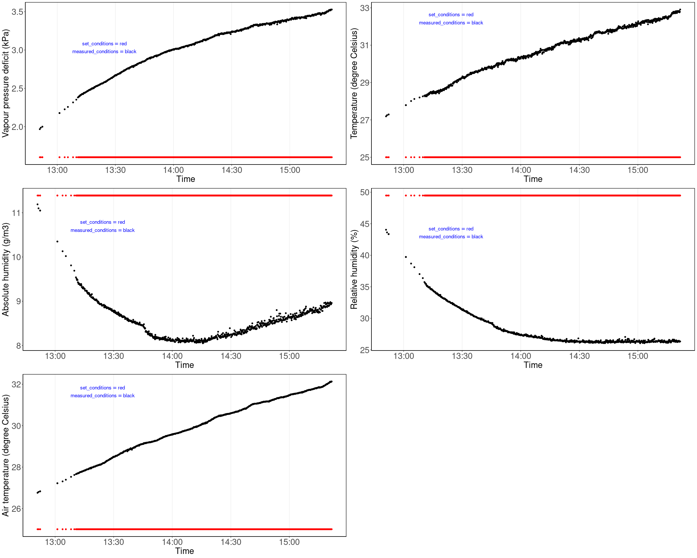

<!-- README.md is generated from README.Rmd. Please edit that file -->

# HIEdroughtbox

<!-- badges: start -->
<!-- badges: end -->

The goal of HIEdroughtbox is to facilitate the pre-prepossessing of the
data produced by [droughtbox located at the Hawkesbury Institute for the
Environment](https://ecamo19.github.io/droughtbox_documentation/) and
prepare it for calculating the branch minimum conductance $g_{res}$ and
it’s temperature  
dependence $T_p$.

Each dataset generated by the droughtbox have the following issues:

- **The data file have a .dat extension with the first three rows of the
  data file containing information about the variable measured, the
  units and the type of data**. This which generates some errors when
  loaded into R with the function read.table(). Thus, the
  `read_hie_droughtbox_data()` function was developed for taking into
  account these issues.

- **Contains data points outside of the time or dates desired.** This
  happens because the data logger collects all data, which might include
  (among others) data generated by another person in a different day,
  data generated during an undesired hour or data where the droughtbox
  didn’t achieved the climatic conditions desired(i.e Temperature).
  Because of these issues, the function `filter_droughtbox_data()` was
  develop. With this function a date or hour (or both) interval can be
  chosen to focus on a specific time period.

- **Produce values close to zero (or even negative) and the firsts and
  last data points within each taring process are not valid.** Every 60
  minutes the droughtbox automatically tares itself to avoid drift in
  the measurements. However this causes that between each taring process
  the droughtbox records wrong data points. To overcome this issue the
  function `clean_droughtbox_data()` was develop. This function removes
  all values below a desired threshold (the default is 0.2 grams)
  **AND** the first and last values within each taring process (the
  default is 10, which removes the first 10 and last 10 values within
  each taring process).

## Installation

You can install the development version of HIEdroughtbox from
[GitHub](https://github.com/) with:

``` r
# install.packages("devtools")
devtools::install_github("ecamo19/HIEdroughtbox")
```

## Data preprocessing example

``` r
library(HIEdroughtbox)
library(dplyr)
```

### Read droughtbox data

The first step is reading the data. The `read_hie_droughtbox_data()`
only reads files with the .dat extension that haven’t been modified.
Thus make sure to provide **UNMODIFIED** files coming from the
droughtbox.

``` r
droughtbox_data <- read_hie_droughtbox_data("inst/extdata/acacia_aneura_25c.dat")
head(droughtbox_data)
  tare_count_smp           date_time       date     time air_tc_avg_deg_c_avg
1             13 2024-03-04 12:51:00 2024-03-04 12:51:00                26.76
2             13 2024-03-04 12:51:30 2024-03-04 12:51:30                26.80
3             13 2024-03-04 12:52:20 2024-03-04 12:52:20                26.83
4             13 2024-03-04 12:52:20 2024-03-04 12:52:20                26.83
5             14 2024-03-04 13:01:10 2024-03-04 13:01:10                27.22
6             14 2024-03-04 13:01:10 2024-03-04 13:01:10                27.22
  rh_avg_percent_avg tc_avg_deg_c_avg set_point_t_avg_avg set_point_vpd_avg_avg
1              44.05            27.19                  25                   1.6
2              43.63            27.25                  25                   1.6
3              43.36            27.29                  25                   1.6
4              43.36            27.29                  25                   1.6
5              39.73            27.79                  25                   1.6
6              39.73            27.79                  25                   1.6
  set_point_abs_h_avg_avg vpd_avg_kpa_avg abs_h_avg_g_m3_avg
1                   11.39           1.967              11.19
2                   11.39           1.986              11.10
3                   11.39           1.999              11.05
4                   11.39           1.999              11.05
5                   11.39           2.177              10.35
6                   11.39           2.177              10.35
  set_point_rh_avg_avg strain_avg_1_microstrain_avg
1                49.48                     2.472753
2                49.48                     2.489199
3                49.48                     2.505648
4                49.48                     2.505648
5                49.48                     2.485881
6                49.48                     2.485881
  strain_avg_2_microstrain_avg strain_avg_3_microstrain_avg
1                     2.434764                     2.381188
2                     2.451971                     2.349167
3                     2.417776                     2.333139
4                     2.417776                     2.333139
5                     2.410692                     2.406784
6                     2.410692                     2.406784
  strain_avg_4_microstrain_avg
1                     2.310796
2                     2.310783
3                     2.327533
4                     2.327533
5                     2.287311
6                     2.287311
```

### Visualize climatic conditions

The droughtbox have sensors that measures the temperature and the
relative humidity. To visualize the set and measured climatic controls
the followiong function can be used:

``` r
plot_droughtbox_climatic_controls(droughtbox_data, cowplot = T)
```



### Visualize all weights measured by the droughtbox

With the function `plot_strains_weights` it is possible to visualize all
weights measured by each strain inside the droughtbox. Also it let you
identify to which taring group does each data point belongs to (denoted
as numbers).

``` r
plot_strains_weights(droughtbox_data, 
                     show_strain = "all",
                     time_breaks = "5 min",
                     show_tare_group = TRUE)
`geom_smooth()` using method = 'loess' and formula = 'y ~ x'
```


… or just some strains

``` r
plot_strains_weights(droughtbox_data, 
                     show_strain =  "strain_4", 
                     time_breaks = "2 min",
                     show_tare_group = TRUE)
`geom_smooth()` using method = 'loess' and formula = 'y ~ x'
```


### Choose a interval of time

Using the previous plot as reference, I decided to focus only on the
data collected between 13:10:00 and 15:10:00.

``` r
filtered_data <- filter_droughtbox_data(droughtbox_data, 
                       from_start_time = "13:10:00",
                       to_end_time = "15:10:00")
[1] "Times must have a HH:MM:SS format i.e. 13:53:00"
[1] "Dates must have a YYYY-MM-DD format i.e. 1991-10-19"
[1] "Filtering data by hour from: 13:10:00 to: 15:10:00"

head(filtered_data)
  tare_count_smp           date_time       date     time air_tc_avg_deg_c_avg
1             15 2024-03-04 13:10:40 2024-03-04 13:10:40                27.66
2             15 2024-03-04 13:11:00 2024-03-04 13:11:00                27.67
3             15 2024-03-04 13:11:10 2024-03-04 13:11:10                27.68
4             15 2024-03-04 13:11:20 2024-03-04 13:11:20                27.69
5             15 2024-03-04 13:11:30 2024-03-04 13:11:30                27.70
6             15 2024-03-04 13:11:40 2024-03-04 13:11:40                27.70
  rh_avg_percent_avg tc_avg_deg_c_avg set_point_t_avg_avg set_point_vpd_avg_avg
1              35.75            28.30                  25                   1.6
2              35.61            28.26                  25                   1.6
3              35.49            28.32                  25                   1.6
4              35.48            28.29                  25                   1.6
5              35.45            28.32                  25                   1.6
6              35.24            28.31                  25                   1.6
  set_point_abs_h_avg_avg vpd_avg_kpa_avg abs_h_avg_g_m3_avg
1                   11.39           2.381               9.54
2                   11.39           2.387               9.51
3                   11.39           2.394               9.48
4                   11.39           2.394               9.49
5                   11.39           2.397               9.48
6                   11.39           2.405               9.43
  set_point_rh_avg_avg strain_avg_1_microstrain_avg
1                49.48                     2.443138
2                49.48                     2.443120
3                49.48                     2.459561
4                49.48                     2.443120
5                49.48                     2.410238
6                49.48                     2.426678
  strain_avg_2_microstrain_avg strain_avg_3_microstrain_avg
1                     2.465538                     2.365185
2                     2.448162                     2.381247
3                     2.465310                     2.349241
4                     2.448166                     2.365244
5                     2.448166                     2.365244
6                     2.465310                     2.365244
  strain_avg_4_microstrain_avg
1                     2.240364
2                     2.240412
3                     2.240412
4                     2.240412
5                     2.290720
6                     2.206874
```

``` r
plot_strains_weights(filtered_data, 
                     show_strain = c("strain_1", "strain_4"), 
                     time_breaks = "10 min",
                     show_tare_group = TRUE)
`geom_smooth()` using method = 'loess' and formula = 'y ~ x'
```


### Clean the data

Finally, after filtering the data by the interval of time desired the
last step is to remove the values close to zero and the first and last
points within each taring process.

The following code will remove the values lower than 0.2 grams and the
first 10 and last 10 values of each taring group.

``` r
clean_data <- 
    clean_droughtbox_data(filtered_data, 
                      remove_n_observations = 10, 
                      threshold = 0.2)
[1] "Total number of rows removed: 251"

head(clean_data)
# A tibble: 6 × 17
# Groups:   tare_count_smp [1]
  tare_count_smp date_time           date       time     air_tc_avg_deg_c_avg
  <fct>          <dttm>              <date>     <time>                  <dbl>
1 15             2024-03-04 13:12:30 2024-03-04 13:12:30                 27.7
2 15             2024-03-04 13:12:40 2024-03-04 13:12:40                 27.8
3 15             2024-03-04 13:12:50 2024-03-04 13:12:50                 27.8
4 15             2024-03-04 13:13:00 2024-03-04 13:13:00                 27.8
5 15             2024-03-04 13:13:10 2024-03-04 13:13:10                 27.8
6 15             2024-03-04 13:13:20 2024-03-04 13:13:20                 27.8
# ℹ 12 more variables: rh_avg_percent_avg <dbl>, tc_avg_deg_c_avg <dbl>,
#   set_point_t_avg_avg <dbl>, set_point_vpd_avg_avg <dbl>,
#   set_point_abs_h_avg_avg <dbl>, vpd_avg_kpa_avg <dbl>,
#   abs_h_avg_g_m3_avg <dbl>, set_point_rh_avg_avg <dbl>,
#   strain_avg_1_microstrain_avg <dbl>, strain_avg_2_microstrain_avg <dbl>,
#   strain_avg_3_microstrain_avg <dbl>, strain_avg_4_microstrain_avg <dbl>
```

``` r
plot_strains_weights(clean_data, 
                     show_strain = "all",
                     time_breaks = "10 min",
                     # If true, this will display the taring group
                     show_tare_group = FALSE)
`geom_smooth()` using method = 'loess' and formula = 'y ~ x'
```


