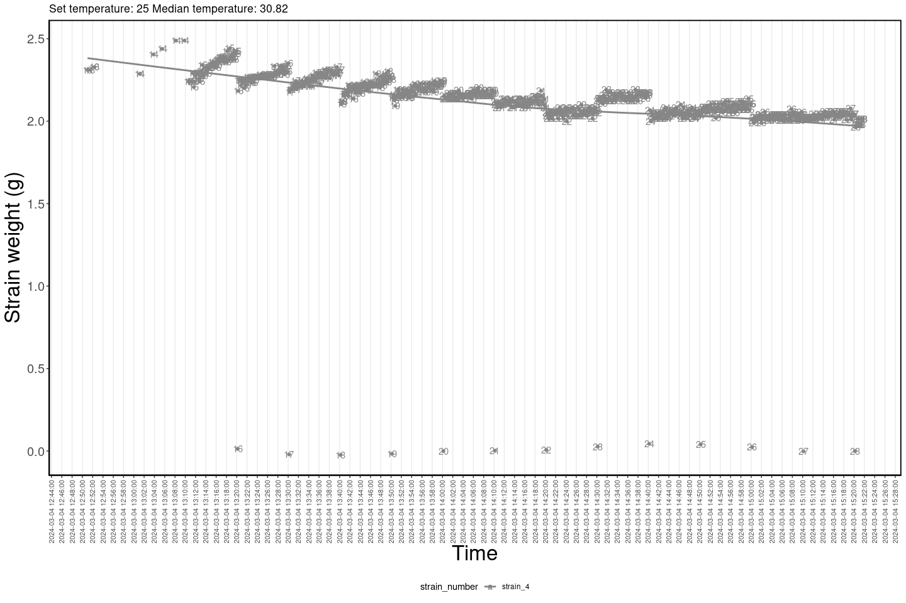

<!-- README.md is generated from README.Rmd. Please edit that file -->

# HIEdroughtbox

<!-- badges: start -->
<!-- badges: end -->

The goal of HIEdroughtbox is to facilitate the analysis of the data
coming from the [droughtbox located at the Hawkesbury Institute for the
Environment](https://ecamo19.github.io/droughtbox_documentation/)

## Installation

You can install the development version of HIEdroughtbox from
[GitHub](https://github.com/) with:

``` r
# install.packages("devtools")
devtools::install_github("ecamo19/hie_dRoughtbox")
```

## Example

``` r
library(HIEdroughtbox)
library(dplyr)
```

### Read droughtbox data

``` r
data <- read_hie_droughtbox_data("inst/extdata/acacia_aneura_25c.dat")
head(data)
  tare_count_smp           date_time       date     time air_tc_avg_deg_c_avg
1             13 2024-03-04 12:51:00 2024-03-04 12:51:00                26.76
2             13 2024-03-04 12:51:30 2024-03-04 12:51:30                26.80
3             13 2024-03-04 12:52:20 2024-03-04 12:52:20                26.83
4             13 2024-03-04 12:52:20 2024-03-04 12:52:20                26.83
5             14 2024-03-04 13:01:10 2024-03-04 13:01:10                27.22
6             14 2024-03-04 13:01:10 2024-03-04 13:01:10                27.22
  rh_avg_percent_avg tc_avg_deg_c_avg set_point_t_avg_avg set_point_vpd_avg_avg
1              44.05            27.19                  25                   1.6
2              43.63            27.25                  25                   1.6
3              43.36            27.29                  25                   1.6
4              43.36            27.29                  25                   1.6
5              39.73            27.79                  25                   1.6
6              39.73            27.79                  25                   1.6
  set_point_abs_h_avg_avg vpd_avg_kpa_avg abs_h_avg_g_m3_avg
1                   11.39           1.967              11.19
2                   11.39           1.986              11.10
3                   11.39           1.999              11.05
4                   11.39           1.999              11.05
5                   11.39           2.177              10.35
6                   11.39           2.177              10.35
  set_point_rh_avg_avg strain_avg_1_microstrain_avg
1                49.48                     2.472753
2                49.48                     2.489199
3                49.48                     2.505648
4                49.48                     2.505648
5                49.48                     2.485881
6                49.48                     2.485881
  strain_avg_2_microstrain_avg strain_avg_3_microstrain_avg
1                     2.434764                     2.381188
2                     2.451971                     2.349167
3                     2.417776                     2.333139
4                     2.417776                     2.333139
5                     2.410692                     2.406784
6                     2.410692                     2.406784
  strain_avg_4_microstrain_avg
1                     2.310796
2                     2.310783
3                     2.327533
4                     2.327533
5                     2.287311
6                     2.287311
```

### Visualize climatic conditions

``` r
plot_droughtbox_climatic_controls(data, cowplot = T)
```


### Visualize raw weights measured by the strains

``` r
plot_strains_weights(data, show_strain = "all")
`geom_smooth()` using method = 'loess' and formula = 'y ~ x'
```


\#### Visualize some strains

``` r
plot_strains_weights(data, show_strain = c("strain_1", "strain_4"))
Warning in if (show_strain == "all") {: the condition has length > 1 and only
the first element will be used
`geom_smooth()` using method = 'loess' and formula = 'y ~ x'
```



### Choose a range of data

``` r
filtered_data <- filter_droughtbox_data(data, 
                       from_start_time = "13:15:00",
                       to_end_time = "15:15:00")
[1] "Times must have a HH:MM:SS format i.e. 13:53:00"
[1] "Dates must have a YYYY-MM-DD format i.e. 1991-10-19"
[1] "Filtering data by hour from: 13:15:00 to: 15:15:00"

filtered_data
    tare_count_smp           date_time       date     time air_tc_avg_deg_c_avg
1               15 2024-03-04 13:15:00 2024-03-04 13:15:00                27.84
2               15 2024-03-04 13:15:10 2024-03-04 13:15:10                27.84
3               15 2024-03-04 13:15:20 2024-03-04 13:15:20                27.84
4               15 2024-03-04 13:15:30 2024-03-04 13:15:30                27.84
5               15 2024-03-04 13:15:40 2024-03-04 13:15:40                27.86
6               15 2024-03-04 13:15:50 2024-03-04 13:15:50                27.86
7               15 2024-03-04 13:16:00 2024-03-04 13:16:00                27.88
8               15 2024-03-04 13:16:10 2024-03-04 13:16:10                27.88
9               15 2024-03-04 13:16:20 2024-03-04 13:16:20                27.89
10              15 2024-03-04 13:16:30 2024-03-04 13:16:30                27.89
11              15 2024-03-04 13:16:40 2024-03-04 13:16:40                27.89
12              15 2024-03-04 13:16:50 2024-03-04 13:16:50                27.90
13              15 2024-03-04 13:17:00 2024-03-04 13:17:00                27.90
14              15 2024-03-04 13:17:10 2024-03-04 13:17:10                27.90
15              15 2024-03-04 13:17:20 2024-03-04 13:17:20                27.93
16              15 2024-03-04 13:17:30 2024-03-04 13:17:30                27.93
17              15 2024-03-04 13:17:40 2024-03-04 13:17:40                27.94
18              15 2024-03-04 13:17:50 2024-03-04 13:17:50                27.94
19              15 2024-03-04 13:18:00 2024-03-04 13:18:00                27.96
20              15 2024-03-04 13:18:10 2024-03-04 13:18:10                27.93
21              15 2024-03-04 13:18:20 2024-03-04 13:18:20                27.97
22              15 2024-03-04 13:18:30 2024-03-04 13:18:30                27.94
23              15 2024-03-04 13:18:40 2024-03-04 13:18:40                27.98
24              15 2024-03-04 13:18:50 2024-03-04 13:18:50                27.98
25              15 2024-03-04 13:19:00 2024-03-04 13:19:00                27.98
26              15 2024-03-04 13:19:10 2024-03-04 13:19:10                27.99
27              15 2024-03-04 13:19:20 2024-03-04 13:19:20                27.99
28              15 2024-03-04 13:19:30 2024-03-04 13:19:30                27.99
29              15 2024-03-04 13:19:40 2024-03-04 13:19:40                28.01
30              15 2024-03-04 13:19:50 2024-03-04 13:19:50                28.01
31              15 2024-03-04 13:20:00 2024-03-04 13:20:00                28.03
32              16 2024-03-04 13:20:10 2024-03-04 13:20:10                28.03
33              16 2024-03-04 13:20:20 2024-03-04 13:20:20                28.02
34              16 2024-03-04 13:20:30 2024-03-04 13:20:30                28.03
35              16 2024-03-04 13:20:40 2024-03-04 13:20:40                28.03
36              16 2024-03-04 13:20:50 2024-03-04 13:20:50                28.05
37              16 2024-03-04 13:21:00 2024-03-04 13:21:00                28.06
38              16 2024-03-04 13:21:10 2024-03-04 13:21:10                28.07
39              16 2024-03-04 13:21:20 2024-03-04 13:21:20                28.06
40              16 2024-03-04 13:21:30 2024-03-04 13:21:30                28.07
41              16 2024-03-04 13:21:40 2024-03-04 13:21:40                28.07
42              16 2024-03-04 13:21:50 2024-03-04 13:21:50                28.09
43              16 2024-03-04 13:22:00 2024-03-04 13:22:00                28.09
44              16 2024-03-04 13:22:10 2024-03-04 13:22:10                28.09
45              16 2024-03-04 13:22:20 2024-03-04 13:22:20                28.09
46              16 2024-03-04 13:22:30 2024-03-04 13:22:30                28.11
47              16 2024-03-04 13:22:40 2024-03-04 13:22:40                28.10
48              16 2024-03-04 13:22:50 2024-03-04 13:22:50                28.12
49              16 2024-03-04 13:23:00 2024-03-04 13:23:00                28.12
50              16 2024-03-04 13:23:10 2024-03-04 13:23:10                28.13
51              16 2024-03-04 13:23:20 2024-03-04 13:23:20                28.11
52              16 2024-03-04 13:23:30 2024-03-04 13:23:30                28.13
53              16 2024-03-04 13:23:40 2024-03-04 13:23:40                28.14
54              16 2024-03-04 13:23:50 2024-03-04 13:23:50                28.15
55              16 2024-03-04 13:24:00 2024-03-04 13:24:00                28.15
56              16 2024-03-04 13:24:10 2024-03-04 13:24:10                28.17
57              16 2024-03-04 13:24:20 2024-03-04 13:24:20                28.18
58              16 2024-03-04 13:24:30 2024-03-04 13:24:30                28.19
59              16 2024-03-04 13:24:40 2024-03-04 13:24:40                28.19
60              16 2024-03-04 13:24:50 2024-03-04 13:24:50                28.20
61              16 2024-03-04 13:25:00 2024-03-04 13:25:00                28.19
62              16 2024-03-04 13:25:10 2024-03-04 13:25:10                28.20
63              16 2024-03-04 13:25:20 2024-03-04 13:25:20                28.22
64              16 2024-03-04 13:25:30 2024-03-04 13:25:30                28.22
65              16 2024-03-04 13:25:40 2024-03-04 13:25:40                28.24
66              16 2024-03-04 13:25:50 2024-03-04 13:25:50                28.24
67              16 2024-03-04 13:26:00 2024-03-04 13:26:00                28.27
68              16 2024-03-04 13:26:10 2024-03-04 13:26:10                28.27
69              16 2024-03-04 13:26:20 2024-03-04 13:26:20                28.30
70              16 2024-03-04 13:26:30 2024-03-04 13:26:30                28.29
71              16 2024-03-04 13:26:40 2024-03-04 13:26:40                28.31
72              16 2024-03-04 13:26:50 2024-03-04 13:26:50                28.31
73              16 2024-03-04 13:27:00 2024-03-04 13:27:00                28.32
74              16 2024-03-04 13:27:10 2024-03-04 13:27:10                28.33
75              16 2024-03-04 13:27:20 2024-03-04 13:27:20                28.34
76              16 2024-03-04 13:27:30 2024-03-04 13:27:30                28.35
77              16 2024-03-04 13:27:40 2024-03-04 13:27:40                28.35
78              16 2024-03-04 13:27:50 2024-03-04 13:27:50                28.37
79              16 2024-03-04 13:28:00 2024-03-04 13:28:00                28.39
80              16 2024-03-04 13:28:10 2024-03-04 13:28:10                28.39
81              16 2024-03-04 13:28:20 2024-03-04 13:28:20                28.38
82              16 2024-03-04 13:28:30 2024-03-04 13:28:30                28.41
83              16 2024-03-04 13:28:40 2024-03-04 13:28:40                28.41
84              16 2024-03-04 13:28:50 2024-03-04 13:28:50                28.43
85              16 2024-03-04 13:29:00 2024-03-04 13:29:00                28.44
86              16 2024-03-04 13:29:10 2024-03-04 13:29:10                28.43
87              16 2024-03-04 13:29:20 2024-03-04 13:29:20                28.46
88              16 2024-03-04 13:29:30 2024-03-04 13:29:30                28.47
89              16 2024-03-04 13:29:40 2024-03-04 13:29:40                28.47
90              16 2024-03-04 13:29:50 2024-03-04 13:29:50                28.50
91              16 2024-03-04 13:30:00 2024-03-04 13:30:00                28.48
92              17 2024-03-04 13:30:10 2024-03-04 13:30:10                28.50
93              17 2024-03-04 13:30:20 2024-03-04 13:30:20                28.50
94              17 2024-03-04 13:30:30 2024-03-04 13:30:30                28.50
95              17 2024-03-04 13:30:40 2024-03-04 13:30:40                28.52
96              17 2024-03-04 13:30:50 2024-03-04 13:30:50                28.51
97              17 2024-03-04 13:31:00 2024-03-04 13:31:00                28.53
98              17 2024-03-04 13:31:10 2024-03-04 13:31:10                28.55
99              17 2024-03-04 13:31:20 2024-03-04 13:31:20                28.55
100             17 2024-03-04 13:31:30 2024-03-04 13:31:30                28.55
101             17 2024-03-04 13:31:40 2024-03-04 13:31:40                28.54
102             17 2024-03-04 13:31:50 2024-03-04 13:31:50                28.56
103             17 2024-03-04 13:32:00 2024-03-04 13:32:00                28.57
104             17 2024-03-04 13:32:10 2024-03-04 13:32:10                28.58
105             17 2024-03-04 13:32:20 2024-03-04 13:32:20                28.59
106             17 2024-03-04 13:32:30 2024-03-04 13:32:30                28.59
107             17 2024-03-04 13:32:40 2024-03-04 13:32:40                28.61
108             17 2024-03-04 13:32:50 2024-03-04 13:32:50                28.61
109             17 2024-03-04 13:33:00 2024-03-04 13:33:00                28.62
110             17 2024-03-04 13:33:10 2024-03-04 13:33:10                28.63
111             17 2024-03-04 13:33:20 2024-03-04 13:33:20                28.65
112             17 2024-03-04 13:33:30 2024-03-04 13:33:30                28.67
113             17 2024-03-04 13:33:40 2024-03-04 13:33:40                28.66
114             17 2024-03-04 13:33:50 2024-03-04 13:33:50                28.67
115             17 2024-03-04 13:34:00 2024-03-04 13:34:00                28.67
116             17 2024-03-04 13:34:10 2024-03-04 13:34:10                28.68
117             17 2024-03-04 13:34:20 2024-03-04 13:34:20                28.68
118             17 2024-03-04 13:34:30 2024-03-04 13:34:30                28.71
119             17 2024-03-04 13:34:40 2024-03-04 13:34:40                28.69
120             17 2024-03-04 13:34:50 2024-03-04 13:34:50                28.72
121             17 2024-03-04 13:35:00 2024-03-04 13:35:00                28.72
122             17 2024-03-04 13:35:10 2024-03-04 13:35:10                28.76
123             17 2024-03-04 13:35:20 2024-03-04 13:35:20                28.75
124             17 2024-03-04 13:35:30 2024-03-04 13:35:30                28.76
125             17 2024-03-04 13:35:40 2024-03-04 13:35:40                28.76
126             17 2024-03-04 13:35:50 2024-03-04 13:35:50                28.76
127             17 2024-03-04 13:36:00 2024-03-04 13:36:00                28.78
128             17 2024-03-04 13:36:10 2024-03-04 13:36:10                28.79
129             17 2024-03-04 13:36:20 2024-03-04 13:36:20                28.80
130             17 2024-03-04 13:36:30 2024-03-04 13:36:30                28.80
131             17 2024-03-04 13:36:40 2024-03-04 13:36:40                28.81
132             17 2024-03-04 13:36:50 2024-03-04 13:36:50                28.82
133             17 2024-03-04 13:37:00 2024-03-04 13:37:00                28.76
134             17 2024-03-04 13:37:10 2024-03-04 13:37:10                28.84
135             17 2024-03-04 13:37:20 2024-03-04 13:37:20                28.84
136             17 2024-03-04 13:37:30 2024-03-04 13:37:30                28.84
137             17 2024-03-04 13:37:40 2024-03-04 13:37:40                28.81
138             17 2024-03-04 13:37:50 2024-03-04 13:37:50                28.85
139             17 2024-03-04 13:38:00 2024-03-04 13:38:00                28.86
140             17 2024-03-04 13:38:10 2024-03-04 13:38:10                28.87
141             17 2024-03-04 13:38:20 2024-03-04 13:38:20                28.86
142             17 2024-03-04 13:38:30 2024-03-04 13:38:30                28.86
143             17 2024-03-04 13:38:40 2024-03-04 13:38:40                28.91
144             17 2024-03-04 13:38:50 2024-03-04 13:38:50                28.86
145             17 2024-03-04 13:39:00 2024-03-04 13:39:00                28.89
146             17 2024-03-04 13:39:10 2024-03-04 13:39:10                28.88
147             17 2024-03-04 13:39:20 2024-03-04 13:39:20                28.84
148             17 2024-03-04 13:39:30 2024-03-04 13:39:30                28.90
149             17 2024-03-04 13:39:40 2024-03-04 13:39:40                28.91
150             17 2024-03-04 13:39:50 2024-03-04 13:39:50                28.91
151             17 2024-03-04 13:40:00 2024-03-04 13:40:00                28.93
152             18 2024-03-04 13:40:10 2024-03-04 13:40:10                28.94
153             18 2024-03-04 13:40:20 2024-03-04 13:40:20                28.93
154             18 2024-03-04 13:40:30 2024-03-04 13:40:30                28.96
155             18 2024-03-04 13:40:40 2024-03-04 13:40:40                28.96
156             18 2024-03-04 13:40:50 2024-03-04 13:40:50                28.94
157             18 2024-03-04 13:41:00 2024-03-04 13:41:00                28.96
158             18 2024-03-04 13:41:10 2024-03-04 13:41:10                28.99
159             18 2024-03-04 13:41:20 2024-03-04 13:41:20                28.99
160             18 2024-03-04 13:41:30 2024-03-04 13:41:30                29.00
161             18 2024-03-04 13:41:40 2024-03-04 13:41:40                29.01
162             18 2024-03-04 13:41:50 2024-03-04 13:41:50                29.01
163             18 2024-03-04 13:42:00 2024-03-04 13:42:00                29.02
164             18 2024-03-04 13:42:10 2024-03-04 13:42:10                29.04
165             18 2024-03-04 13:42:20 2024-03-04 13:42:20                29.03
166             18 2024-03-04 13:42:30 2024-03-04 13:42:30                29.04
167             18 2024-03-04 13:42:40 2024-03-04 13:42:40                29.04
168             18 2024-03-04 13:42:50 2024-03-04 13:42:50                29.06
169             18 2024-03-04 13:43:00 2024-03-04 13:43:00                29.03
170             18 2024-03-04 13:43:10 2024-03-04 13:43:10                29.08
171             18 2024-03-04 13:43:20 2024-03-04 13:43:20                29.07
172             18 2024-03-04 13:43:30 2024-03-04 13:43:30                29.08
173             18 2024-03-04 13:43:40 2024-03-04 13:43:40                29.08
174             18 2024-03-04 13:43:50 2024-03-04 13:43:50                29.09
175             18 2024-03-04 13:44:00 2024-03-04 13:44:00                29.11
176             18 2024-03-04 13:44:10 2024-03-04 13:44:10                29.10
177             18 2024-03-04 13:44:20 2024-03-04 13:44:20                29.10
178             18 2024-03-04 13:44:30 2024-03-04 13:44:30                29.11
179             18 2024-03-04 13:44:40 2024-03-04 13:44:40                29.11
180             18 2024-03-04 13:44:50 2024-03-04 13:44:50                29.11
181             18 2024-03-04 13:45:00 2024-03-04 13:45:00                29.13
182             18 2024-03-04 13:45:10 2024-03-04 13:45:10                29.12
183             18 2024-03-04 13:45:20 2024-03-04 13:45:20                29.12
184             18 2024-03-04 13:45:30 2024-03-04 13:45:30                29.16
185             18 2024-03-04 13:45:40 2024-03-04 13:45:40                29.15
186             18 2024-03-04 13:45:50 2024-03-04 13:45:50                29.15
187             18 2024-03-04 13:46:00 2024-03-04 13:46:00                29.15
188             18 2024-03-04 13:46:10 2024-03-04 13:46:10                29.17
189             18 2024-03-04 13:46:20 2024-03-04 13:46:20                29.16
190             18 2024-03-04 13:46:30 2024-03-04 13:46:30                29.15
191             18 2024-03-04 13:46:40 2024-03-04 13:46:40                29.17
192             18 2024-03-04 13:46:50 2024-03-04 13:46:50                29.18
193             18 2024-03-04 13:47:00 2024-03-04 13:47:00                29.17
194             18 2024-03-04 13:47:10 2024-03-04 13:47:10                29.18
195             18 2024-03-04 13:47:20 2024-03-04 13:47:20                29.18
196             18 2024-03-04 13:47:30 2024-03-04 13:47:30                29.18
197             18 2024-03-04 13:47:40 2024-03-04 13:47:40                29.19
198             18 2024-03-04 13:47:50 2024-03-04 13:47:50                29.19
199             18 2024-03-04 13:48:00 2024-03-04 13:48:00                29.19
200             18 2024-03-04 13:48:10 2024-03-04 13:48:10                29.20
201             18 2024-03-04 13:48:20 2024-03-04 13:48:20                29.19
202             18 2024-03-04 13:48:30 2024-03-04 13:48:30                29.21
203             18 2024-03-04 13:48:40 2024-03-04 13:48:40                29.20
204             18 2024-03-04 13:48:50 2024-03-04 13:48:50                29.20
205             18 2024-03-04 13:49:00 2024-03-04 13:49:00                29.20
206             18 2024-03-04 13:49:10 2024-03-04 13:49:10                29.21
207             18 2024-03-04 13:49:20 2024-03-04 13:49:20                29.21
208             18 2024-03-04 13:49:30 2024-03-04 13:49:30                29.23
209             18 2024-03-04 13:49:40 2024-03-04 13:49:40                29.22
210             18 2024-03-04 13:49:50 2024-03-04 13:49:50                29.22
211             18 2024-03-04 13:50:00 2024-03-04 13:50:00                29.23
212             19 2024-03-04 13:50:10 2024-03-04 13:50:10                29.24
213             19 2024-03-04 13:50:20 2024-03-04 13:50:20                29.24
214             19 2024-03-04 13:50:30 2024-03-04 13:50:30                29.24
215             19 2024-03-04 13:50:40 2024-03-04 13:50:40                29.25
216             19 2024-03-04 13:50:50 2024-03-04 13:50:50                29.25
217             19 2024-03-04 13:51:00 2024-03-04 13:51:00                29.27
218             19 2024-03-04 13:51:10 2024-03-04 13:51:10                29.26
219             19 2024-03-04 13:51:20 2024-03-04 13:51:20                29.26
220             19 2024-03-04 13:51:30 2024-03-04 13:51:30                29.27
221             19 2024-03-04 13:51:40 2024-03-04 13:51:40                29.27
222             19 2024-03-04 13:51:50 2024-03-04 13:51:50                29.28
223             19 2024-03-04 13:52:00 2024-03-04 13:52:00                29.28
224             19 2024-03-04 13:52:10 2024-03-04 13:52:10                29.28
225             19 2024-03-04 13:52:20 2024-03-04 13:52:20                29.29
226             19 2024-03-04 13:52:30 2024-03-04 13:52:30                29.31
227             19 2024-03-04 13:52:40 2024-03-04 13:52:40                29.32
228             19 2024-03-04 13:52:50 2024-03-04 13:52:50                29.32
229             19 2024-03-04 13:53:00 2024-03-04 13:53:00                29.32
230             19 2024-03-04 13:53:10 2024-03-04 13:53:10                29.33
231             19 2024-03-04 13:53:20 2024-03-04 13:53:20                29.35
232             19 2024-03-04 13:53:30 2024-03-04 13:53:30                29.35
233             19 2024-03-04 13:53:40 2024-03-04 13:53:40                29.37
234             19 2024-03-04 13:53:50 2024-03-04 13:53:50                29.37
235             19 2024-03-04 13:54:00 2024-03-04 13:54:00                29.37
236             19 2024-03-04 13:54:10 2024-03-04 13:54:10                29.39
237             19 2024-03-04 13:54:20 2024-03-04 13:54:20                29.39
238             19 2024-03-04 13:54:30 2024-03-04 13:54:30                29.39
239             19 2024-03-04 13:54:40 2024-03-04 13:54:40                29.40
240             19 2024-03-04 13:54:50 2024-03-04 13:54:50                29.42
241             19 2024-03-04 13:55:00 2024-03-04 13:55:00                29.41
242             19 2024-03-04 13:55:10 2024-03-04 13:55:10                29.44
243             19 2024-03-04 13:55:20 2024-03-04 13:55:20                29.44
244             19 2024-03-04 13:55:30 2024-03-04 13:55:30                29.44
245             19 2024-03-04 13:55:40 2024-03-04 13:55:40                29.46
246             19 2024-03-04 13:55:50 2024-03-04 13:55:50                29.46
247             19 2024-03-04 13:56:00 2024-03-04 13:56:00                29.46
248             19 2024-03-04 13:56:10 2024-03-04 13:56:10                29.47
249             19 2024-03-04 13:56:20 2024-03-04 13:56:20                29.47
250             19 2024-03-04 13:56:30 2024-03-04 13:56:30                29.48
251             19 2024-03-04 13:56:40 2024-03-04 13:56:40                29.50
252             19 2024-03-04 13:56:50 2024-03-04 13:56:50                29.50
253             19 2024-03-04 13:57:00 2024-03-04 13:57:00                29.49
254             19 2024-03-04 13:57:10 2024-03-04 13:57:10                29.49
255             19 2024-03-04 13:57:20 2024-03-04 13:57:20                29.51
256             19 2024-03-04 13:57:30 2024-03-04 13:57:30                29.51
257             19 2024-03-04 13:57:40 2024-03-04 13:57:40                29.52
258             19 2024-03-04 13:57:50 2024-03-04 13:57:50                29.52
259             19 2024-03-04 13:58:00 2024-03-04 13:58:00                29.53
260             19 2024-03-04 13:58:10 2024-03-04 13:58:10                29.53
261             19 2024-03-04 13:58:20 2024-03-04 13:58:20                29.53
262             19 2024-03-04 13:58:30 2024-03-04 13:58:30                29.54
263             19 2024-03-04 13:58:40 2024-03-04 13:58:40                29.54
264             19 2024-03-04 13:58:50 2024-03-04 13:58:50                29.55
265             19 2024-03-04 13:59:00 2024-03-04 13:59:00                29.55
266             19 2024-03-04 13:59:10 2024-03-04 13:59:10                29.55
267             19 2024-03-04 13:59:20 2024-03-04 13:59:20                29.56
268             19 2024-03-04 13:59:30 2024-03-04 13:59:30                29.57
269             19 2024-03-04 13:59:40 2024-03-04 13:59:40                29.56
270             19 2024-03-04 13:59:50 2024-03-04 13:59:50                29.56
271             19 2024-03-04 14:00:00 2024-03-04 14:00:00                29.59
272             20 2024-03-04 14:00:10 2024-03-04 14:00:10                29.57
273             20 2024-03-04 14:00:20 2024-03-04 14:00:20                29.59
274             20 2024-03-04 14:00:30 2024-03-04 14:00:30                29.58
275             20 2024-03-04 14:00:40 2024-03-04 14:00:40                29.60
276             20 2024-03-04 14:00:50 2024-03-04 14:00:50                29.60
277             20 2024-03-04 14:01:00 2024-03-04 14:01:00                29.60
278             20 2024-03-04 14:01:10 2024-03-04 14:01:10                29.61
279             20 2024-03-04 14:01:20 2024-03-04 14:01:20                29.61
280             20 2024-03-04 14:01:30 2024-03-04 14:01:30                29.60
281             20 2024-03-04 14:01:40 2024-03-04 14:01:40                29.61
282             20 2024-03-04 14:01:50 2024-03-04 14:01:50                29.62
283             20 2024-03-04 14:02:00 2024-03-04 14:02:00                29.63
284             20 2024-03-04 14:02:10 2024-03-04 14:02:10                29.63
285             20 2024-03-04 14:02:20 2024-03-04 14:02:20                29.63
286             20 2024-03-04 14:02:30 2024-03-04 14:02:30                29.63
287             20 2024-03-04 14:02:40 2024-03-04 14:02:40                29.64
288             20 2024-03-04 14:02:50 2024-03-04 14:02:50                29.64
289             20 2024-03-04 14:03:00 2024-03-04 14:03:00                29.65
290             20 2024-03-04 14:03:10 2024-03-04 14:03:10                29.64
291             20 2024-03-04 14:03:20 2024-03-04 14:03:20                29.65
292             20 2024-03-04 14:03:30 2024-03-04 14:03:30                29.66
293             20 2024-03-04 14:03:40 2024-03-04 14:03:40                29.67
294             20 2024-03-04 14:03:50 2024-03-04 14:03:50                29.67
295             20 2024-03-04 14:04:00 2024-03-04 14:04:00                29.68
296             20 2024-03-04 14:04:10 2024-03-04 14:04:10                29.67
297             20 2024-03-04 14:04:20 2024-03-04 14:04:20                29.69
298             20 2024-03-04 14:04:30 2024-03-04 14:04:30                29.69
299             20 2024-03-04 14:04:40 2024-03-04 14:04:40                29.69
300             20 2024-03-04 14:04:50 2024-03-04 14:04:50                29.70
301             20 2024-03-04 14:05:00 2024-03-04 14:05:00                29.72
302             20 2024-03-04 14:05:10 2024-03-04 14:05:10                29.72
303             20 2024-03-04 14:05:20 2024-03-04 14:05:20                29.72
304             20 2024-03-04 14:05:30 2024-03-04 14:05:30                29.74
305             20 2024-03-04 14:05:40 2024-03-04 14:05:40                29.73
306             20 2024-03-04 14:05:50 2024-03-04 14:05:50                29.73
307             20 2024-03-04 14:06:00 2024-03-04 14:06:00                29.74
308             20 2024-03-04 14:06:10 2024-03-04 14:06:10                29.75
309             20 2024-03-04 14:06:20 2024-03-04 14:06:20                29.76
310             20 2024-03-04 14:06:30 2024-03-04 14:06:30                29.75
311             20 2024-03-04 14:06:40 2024-03-04 14:06:40                29.77
312             20 2024-03-04 14:06:50 2024-03-04 14:06:50                29.76
313             20 2024-03-04 14:07:00 2024-03-04 14:07:00                29.77
314             20 2024-03-04 14:07:10 2024-03-04 14:07:10                29.77
315             20 2024-03-04 14:07:20 2024-03-04 14:07:20                29.77
316             20 2024-03-04 14:07:30 2024-03-04 14:07:30                29.79
317             20 2024-03-04 14:07:40 2024-03-04 14:07:40                29.79
318             20 2024-03-04 14:07:50 2024-03-04 14:07:50                29.79
319             20 2024-03-04 14:08:00 2024-03-04 14:08:00                29.80
320             20 2024-03-04 14:08:10 2024-03-04 14:08:10                29.81
321             20 2024-03-04 14:08:20 2024-03-04 14:08:20                29.81
322             20 2024-03-04 14:08:30 2024-03-04 14:08:30                29.80
323             20 2024-03-04 14:08:40 2024-03-04 14:08:40                29.82
324             20 2024-03-04 14:08:50 2024-03-04 14:08:50                29.83
325             20 2024-03-04 14:09:00 2024-03-04 14:09:00                29.83
326             20 2024-03-04 14:09:10 2024-03-04 14:09:10                29.82
327             20 2024-03-04 14:09:20 2024-03-04 14:09:20                29.84
328             20 2024-03-04 14:09:30 2024-03-04 14:09:30                29.84
329             20 2024-03-04 14:09:40 2024-03-04 14:09:40                29.86
330             20 2024-03-04 14:09:50 2024-03-04 14:09:50                29.86
331             20 2024-03-04 14:10:00 2024-03-04 14:10:00                29.86
332             21 2024-03-04 14:10:10 2024-03-04 14:10:10                29.86
333             21 2024-03-04 14:10:20 2024-03-04 14:10:20                29.86
334             21 2024-03-04 14:10:30 2024-03-04 14:10:30                29.88
335             21 2024-03-04 14:10:40 2024-03-04 14:10:40                29.90
336             21 2024-03-04 14:10:50 2024-03-04 14:10:50                29.90
337             21 2024-03-04 14:11:00 2024-03-04 14:11:00                29.93
338             21 2024-03-04 14:11:10 2024-03-04 14:11:10                29.92
339             21 2024-03-04 14:11:20 2024-03-04 14:11:20                29.93
340             21 2024-03-04 14:11:30 2024-03-04 14:11:30                29.92
341             21 2024-03-04 14:11:40 2024-03-04 14:11:40                29.93
342             21 2024-03-04 14:11:50 2024-03-04 14:11:50                29.94
343             21 2024-03-04 14:12:00 2024-03-04 14:12:00                29.95
344             21 2024-03-04 14:12:10 2024-03-04 14:12:10                29.95
345             21 2024-03-04 14:12:20 2024-03-04 14:12:20                29.93
346             21 2024-03-04 14:12:30 2024-03-04 14:12:30                29.97
347             21 2024-03-04 14:12:40 2024-03-04 14:12:40                29.96
348             21 2024-03-04 14:12:50 2024-03-04 14:12:50                29.95
349             21 2024-03-04 14:13:00 2024-03-04 14:13:00                29.96
350             21 2024-03-04 14:13:10 2024-03-04 14:13:10                29.98
351             21 2024-03-04 14:13:20 2024-03-04 14:13:20                29.98
352             21 2024-03-04 14:13:30 2024-03-04 14:13:30                29.99
353             21 2024-03-04 14:13:40 2024-03-04 14:13:40                29.99
354             21 2024-03-04 14:13:50 2024-03-04 14:13:50                30.01
355             21 2024-03-04 14:14:00 2024-03-04 14:14:00                30.01
356             21 2024-03-04 14:14:10 2024-03-04 14:14:10                30.02
357             21 2024-03-04 14:14:20 2024-03-04 14:14:20                30.02
358             21 2024-03-04 14:14:30 2024-03-04 14:14:30                30.02
359             21 2024-03-04 14:14:40 2024-03-04 14:14:40                30.05
360             21 2024-03-04 14:14:50 2024-03-04 14:14:50                30.04
361             21 2024-03-04 14:15:00 2024-03-04 14:15:00                30.05
362             21 2024-03-04 14:15:10 2024-03-04 14:15:10                30.08
363             21 2024-03-04 14:15:20 2024-03-04 14:15:20                30.09
364             21 2024-03-04 14:15:30 2024-03-04 14:15:30                30.09
365             21 2024-03-04 14:15:40 2024-03-04 14:15:40                30.07
366             21 2024-03-04 14:15:50 2024-03-04 14:15:50                30.11
367             21 2024-03-04 14:16:00 2024-03-04 14:16:00                30.09
368             21 2024-03-04 14:16:10 2024-03-04 14:16:10                30.09
369             21 2024-03-04 14:16:20 2024-03-04 14:16:20                30.10
370             21 2024-03-04 14:16:30 2024-03-04 14:16:30                30.12
371             21 2024-03-04 14:16:40 2024-03-04 14:16:40                30.10
372             21 2024-03-04 14:16:50 2024-03-04 14:16:50                30.10
373             21 2024-03-04 14:17:00 2024-03-04 14:17:00                30.15
374             21 2024-03-04 14:17:10 2024-03-04 14:17:10                30.11
375             21 2024-03-04 14:17:20 2024-03-04 14:17:20                30.12
376             21 2024-03-04 14:17:30 2024-03-04 14:17:30                30.16
377             21 2024-03-04 14:17:40 2024-03-04 14:17:40                30.15
378             21 2024-03-04 14:17:50 2024-03-04 14:17:50                30.13
379             21 2024-03-04 14:18:00 2024-03-04 14:18:00                30.16
380             21 2024-03-04 14:18:10 2024-03-04 14:18:10                30.18
381             21 2024-03-04 14:18:20 2024-03-04 14:18:20                30.19
382             21 2024-03-04 14:18:30 2024-03-04 14:18:30                30.20
383             21 2024-03-04 14:18:40 2024-03-04 14:18:40                30.21
384             21 2024-03-04 14:18:50 2024-03-04 14:18:50                30.23
385             21 2024-03-04 14:19:00 2024-03-04 14:19:00                30.23
386             21 2024-03-04 14:19:10 2024-03-04 14:19:10                30.23
387             21 2024-03-04 14:19:20 2024-03-04 14:19:20                30.23
388             21 2024-03-04 14:19:30 2024-03-04 14:19:30                30.25
389             21 2024-03-04 14:19:40 2024-03-04 14:19:40                30.25
390             21 2024-03-04 14:19:50 2024-03-04 14:19:50                30.26
391             21 2024-03-04 14:20:00 2024-03-04 14:20:00                30.29
392             22 2024-03-04 14:20:10 2024-03-04 14:20:10                30.30
393             22 2024-03-04 14:20:20 2024-03-04 14:20:20                30.29
394             22 2024-03-04 14:20:30 2024-03-04 14:20:30                30.32
395             22 2024-03-04 14:20:40 2024-03-04 14:20:40                30.32
396             22 2024-03-04 14:20:50 2024-03-04 14:20:50                30.32
397             22 2024-03-04 14:21:00 2024-03-04 14:21:00                30.32
398             22 2024-03-04 14:21:10 2024-03-04 14:21:10                30.34
399             22 2024-03-04 14:21:20 2024-03-04 14:21:20                30.37
400             22 2024-03-04 14:21:30 2024-03-04 14:21:30                30.36
401             22 2024-03-04 14:21:40 2024-03-04 14:21:40                30.38
402             22 2024-03-04 14:21:50 2024-03-04 14:21:50                30.39
403             22 2024-03-04 14:22:00 2024-03-04 14:22:00                30.40
404             22 2024-03-04 14:22:10 2024-03-04 14:22:10                30.39
405             22 2024-03-04 14:22:20 2024-03-04 14:22:20                30.40
406             22 2024-03-04 14:22:30 2024-03-04 14:22:30                30.41
407             22 2024-03-04 14:22:40 2024-03-04 14:22:40                30.42
408             22 2024-03-04 14:22:50 2024-03-04 14:22:50                30.42
409             22 2024-03-04 14:23:00 2024-03-04 14:23:00                30.43
410             22 2024-03-04 14:23:10 2024-03-04 14:23:10                30.44
411             22 2024-03-04 14:23:20 2024-03-04 14:23:20                30.45
412             22 2024-03-04 14:23:30 2024-03-04 14:23:30                30.45
413             22 2024-03-04 14:23:40 2024-03-04 14:23:40                30.45
414             22 2024-03-04 14:23:50 2024-03-04 14:23:50                30.46
415             22 2024-03-04 14:24:00 2024-03-04 14:24:00                30.49
416             22 2024-03-04 14:24:10 2024-03-04 14:24:10                30.48
417             22 2024-03-04 14:24:20 2024-03-04 14:24:20                30.48
418             22 2024-03-04 14:24:30 2024-03-04 14:24:30                30.46
419             22 2024-03-04 14:24:40 2024-03-04 14:24:40                30.47
420             22 2024-03-04 14:24:50 2024-03-04 14:24:50                30.50
421             22 2024-03-04 14:25:00 2024-03-04 14:25:00                30.47
422             22 2024-03-04 14:25:10 2024-03-04 14:25:10                30.49
423             22 2024-03-04 14:25:20 2024-03-04 14:25:20                30.50
424             22 2024-03-04 14:25:30 2024-03-04 14:25:30                30.48
425             22 2024-03-04 14:25:40 2024-03-04 14:25:40                30.50
426             22 2024-03-04 14:25:50 2024-03-04 14:25:50                30.50
427             22 2024-03-04 14:26:00 2024-03-04 14:26:00                30.51
428             22 2024-03-04 14:26:10 2024-03-04 14:26:10                30.50
429             22 2024-03-04 14:26:20 2024-03-04 14:26:20                30.52
430             22 2024-03-04 14:26:30 2024-03-04 14:26:30                30.52
431             22 2024-03-04 14:26:40 2024-03-04 14:26:40                30.53
432             22 2024-03-04 14:26:50 2024-03-04 14:26:50                30.52
433             22 2024-03-04 14:27:00 2024-03-04 14:27:00                30.54
434             22 2024-03-04 14:27:10 2024-03-04 14:27:10                30.53
435             22 2024-03-04 14:27:20 2024-03-04 14:27:20                30.55
436             22 2024-03-04 14:27:30 2024-03-04 14:27:30                30.53
437             22 2024-03-04 14:27:40 2024-03-04 14:27:40                30.56
438             22 2024-03-04 14:27:50 2024-03-04 14:27:50                30.55
439             22 2024-03-04 14:28:00 2024-03-04 14:28:00                30.56
440             22 2024-03-04 14:28:10 2024-03-04 14:28:10                30.56
441             22 2024-03-04 14:28:20 2024-03-04 14:28:20                30.57
442             22 2024-03-04 14:28:30 2024-03-04 14:28:30                30.56
443             22 2024-03-04 14:28:40 2024-03-04 14:28:40                30.56
444             22 2024-03-04 14:28:50 2024-03-04 14:28:50                30.57
445             22 2024-03-04 14:29:00 2024-03-04 14:29:00                30.57
446             22 2024-03-04 14:29:10 2024-03-04 14:29:10                30.58
447             22 2024-03-04 14:29:20 2024-03-04 14:29:20                30.57
448             22 2024-03-04 14:29:30 2024-03-04 14:29:30                30.57
449             22 2024-03-04 14:29:40 2024-03-04 14:29:40                30.59
450             22 2024-03-04 14:29:50 2024-03-04 14:29:50                30.60
451             22 2024-03-04 14:30:00 2024-03-04 14:30:00                30.59
452             23 2024-03-04 14:30:10 2024-03-04 14:30:10                30.60
453             23 2024-03-04 14:30:20 2024-03-04 14:30:20                30.61
454             23 2024-03-04 14:30:30 2024-03-04 14:30:30                30.61
455             23 2024-03-04 14:30:40 2024-03-04 14:30:40                30.61
456             23 2024-03-04 14:30:50 2024-03-04 14:30:50                30.62
457             23 2024-03-04 14:31:00 2024-03-04 14:31:00                30.62
458             23 2024-03-04 14:31:10 2024-03-04 14:31:10                30.63
459             23 2024-03-04 14:31:20 2024-03-04 14:31:20                30.63
460             23 2024-03-04 14:31:30 2024-03-04 14:31:30                30.63
461             23 2024-03-04 14:31:40 2024-03-04 14:31:40                30.63
462             23 2024-03-04 14:31:50 2024-03-04 14:31:50                30.65
463             23 2024-03-04 14:32:00 2024-03-04 14:32:00                30.64
464             23 2024-03-04 14:32:10 2024-03-04 14:32:10                30.66
465             23 2024-03-04 14:32:20 2024-03-04 14:32:20                30.66
466             23 2024-03-04 14:32:30 2024-03-04 14:32:30                30.67
467             23 2024-03-04 14:32:40 2024-03-04 14:32:40                30.68
468             23 2024-03-04 14:32:50 2024-03-04 14:32:50                30.66
469             23 2024-03-04 14:33:00 2024-03-04 14:33:00                30.68
470             23 2024-03-04 14:33:10 2024-03-04 14:33:10                30.68
471             23 2024-03-04 14:33:20 2024-03-04 14:33:20                30.67
472             23 2024-03-04 14:33:30 2024-03-04 14:33:30                30.69
473             23 2024-03-04 14:33:40 2024-03-04 14:33:40                30.68
474             23 2024-03-04 14:33:50 2024-03-04 14:33:50                30.68
475             23 2024-03-04 14:34:00 2024-03-04 14:34:00                30.71
476             23 2024-03-04 14:34:10 2024-03-04 14:34:10                30.70
477             23 2024-03-04 14:34:20 2024-03-04 14:34:20                30.72
478             23 2024-03-04 14:34:30 2024-03-04 14:34:30                30.73
479             23 2024-03-04 14:34:40 2024-03-04 14:34:40                30.74
480             23 2024-03-04 14:34:50 2024-03-04 14:34:50                30.74
481             23 2024-03-04 14:35:00 2024-03-04 14:35:00                30.73
482             23 2024-03-04 14:35:10 2024-03-04 14:35:10                30.74
483             23 2024-03-04 14:35:20 2024-03-04 14:35:20                30.74
484             23 2024-03-04 14:35:30 2024-03-04 14:35:30                30.75
485             23 2024-03-04 14:35:40 2024-03-04 14:35:40                30.77
486             23 2024-03-04 14:35:50 2024-03-04 14:35:50                30.77
487             23 2024-03-04 14:36:00 2024-03-04 14:36:00                30.78
488             23 2024-03-04 14:36:10 2024-03-04 14:36:10                30.79
489             23 2024-03-04 14:36:20 2024-03-04 14:36:20                30.80
490             23 2024-03-04 14:36:30 2024-03-04 14:36:30                30.79
491             23 2024-03-04 14:36:40 2024-03-04 14:36:40                30.81
492             23 2024-03-04 14:36:50 2024-03-04 14:36:50                30.81
493             23 2024-03-04 14:37:00 2024-03-04 14:37:00                30.82
494             23 2024-03-04 14:37:10 2024-03-04 14:37:10                30.83
495             23 2024-03-04 14:37:20 2024-03-04 14:37:20                30.81
496             23 2024-03-04 14:37:30 2024-03-04 14:37:30                30.83
497             23 2024-03-04 14:37:40 2024-03-04 14:37:40                30.81
498             23 2024-03-04 14:37:50 2024-03-04 14:37:50                30.84
499             23 2024-03-04 14:38:00 2024-03-04 14:38:00                30.83
500             23 2024-03-04 14:38:10 2024-03-04 14:38:10                30.85
501             23 2024-03-04 14:38:20 2024-03-04 14:38:20                30.87
502             23 2024-03-04 14:38:30 2024-03-04 14:38:30                30.88
503             23 2024-03-04 14:38:40 2024-03-04 14:38:40                30.88
504             23 2024-03-04 14:38:50 2024-03-04 14:38:50                30.90
505             23 2024-03-04 14:39:00 2024-03-04 14:39:00                30.91
506             23 2024-03-04 14:39:10 2024-03-04 14:39:10                30.92
507             23 2024-03-04 14:39:20 2024-03-04 14:39:20                30.94
508             23 2024-03-04 14:39:30 2024-03-04 14:39:30                30.94
509             23 2024-03-04 14:39:40 2024-03-04 14:39:40                30.95
510             23 2024-03-04 14:39:50 2024-03-04 14:39:50                30.96
511             23 2024-03-04 14:40:00 2024-03-04 14:40:00                30.96
512             24 2024-03-04 14:40:10 2024-03-04 14:40:10                30.98
513             24 2024-03-04 14:40:20 2024-03-04 14:40:20                31.00
514             24 2024-03-04 14:40:30 2024-03-04 14:40:30                31.00
515             24 2024-03-04 14:40:40 2024-03-04 14:40:40                31.01
516             24 2024-03-04 14:40:50 2024-03-04 14:40:50                31.02
517             24 2024-03-04 14:41:00 2024-03-04 14:41:00                31.02
518             24 2024-03-04 14:41:10 2024-03-04 14:41:10                31.04
519             24 2024-03-04 14:41:20 2024-03-04 14:41:20                31.03
520             24 2024-03-04 14:41:30 2024-03-04 14:41:30                31.05
521             24 2024-03-04 14:41:40 2024-03-04 14:41:40                31.04
522             24 2024-03-04 14:41:50 2024-03-04 14:41:50                31.05
523             24 2024-03-04 14:42:00 2024-03-04 14:42:00                31.05
524             24 2024-03-04 14:42:10 2024-03-04 14:42:10                31.06
525             24 2024-03-04 14:42:20 2024-03-04 14:42:20                31.06
526             24 2024-03-04 14:42:30 2024-03-04 14:42:30                31.06
527             24 2024-03-04 14:42:40 2024-03-04 14:42:40                31.06
528             24 2024-03-04 14:42:50 2024-03-04 14:42:50                31.06
529             24 2024-03-04 14:43:00 2024-03-04 14:43:00                31.06
530             24 2024-03-04 14:43:10 2024-03-04 14:43:10                31.06
531             24 2024-03-04 14:43:20 2024-03-04 14:43:20                31.06
532             24 2024-03-04 14:43:30 2024-03-04 14:43:30                31.08
533             24 2024-03-04 14:43:40 2024-03-04 14:43:40                31.07
534             24 2024-03-04 14:43:50 2024-03-04 14:43:50                31.08
535             24 2024-03-04 14:44:00 2024-03-04 14:44:00                31.07
536             24 2024-03-04 14:44:10 2024-03-04 14:44:10                31.08
537             24 2024-03-04 14:44:20 2024-03-04 14:44:20                31.08
538             24 2024-03-04 14:44:30 2024-03-04 14:44:30                31.09
539             24 2024-03-04 14:44:40 2024-03-04 14:44:40                31.10
540             24 2024-03-04 14:44:50 2024-03-04 14:44:50                31.09
541             24 2024-03-04 14:45:00 2024-03-04 14:45:00                31.09
542             24 2024-03-04 14:45:10 2024-03-04 14:45:10                31.10
543             24 2024-03-04 14:45:20 2024-03-04 14:45:20                31.10
544             24 2024-03-04 14:45:30 2024-03-04 14:45:30                31.12
545             24 2024-03-04 14:45:40 2024-03-04 14:45:40                31.13
546             24 2024-03-04 14:45:50 2024-03-04 14:45:50                31.13
547             24 2024-03-04 14:46:00 2024-03-04 14:46:00                31.12
548             24 2024-03-04 14:46:10 2024-03-04 14:46:10                31.14
549             24 2024-03-04 14:46:20 2024-03-04 14:46:20                31.14
550             24 2024-03-04 14:46:30 2024-03-04 14:46:30                31.14
551             24 2024-03-04 14:46:40 2024-03-04 14:46:40                31.14
552             24 2024-03-04 14:46:50 2024-03-04 14:46:50                31.16
553             24 2024-03-04 14:47:00 2024-03-04 14:47:00                31.15
554             24 2024-03-04 14:47:10 2024-03-04 14:47:10                31.15
555             24 2024-03-04 14:47:20 2024-03-04 14:47:20                31.15
556             24 2024-03-04 14:47:30 2024-03-04 14:47:30                31.16
557             24 2024-03-04 14:47:40 2024-03-04 14:47:40                31.16
558             24 2024-03-04 14:47:50 2024-03-04 14:47:50                31.15
559             24 2024-03-04 14:48:00 2024-03-04 14:48:00                31.17
560             24 2024-03-04 14:48:10 2024-03-04 14:48:10                31.16
561             24 2024-03-04 14:48:20 2024-03-04 14:48:20                31.17
562             24 2024-03-04 14:48:30 2024-03-04 14:48:30                31.17
563             24 2024-03-04 14:48:40 2024-03-04 14:48:40                31.17
564             24 2024-03-04 14:48:50 2024-03-04 14:48:50                31.17
565             24 2024-03-04 14:49:00 2024-03-04 14:49:00                31.16
566             24 2024-03-04 14:49:10 2024-03-04 14:49:10                31.17
567             24 2024-03-04 14:49:20 2024-03-04 14:49:20                31.16
568             24 2024-03-04 14:49:30 2024-03-04 14:49:30                31.18
569             24 2024-03-04 14:49:40 2024-03-04 14:49:40                31.16
570             24 2024-03-04 14:49:50 2024-03-04 14:49:50                31.19
571             24 2024-03-04 14:50:00 2024-03-04 14:50:00                31.20
572             25 2024-03-04 14:50:10 2024-03-04 14:50:10                31.21
573             25 2024-03-04 14:50:20 2024-03-04 14:50:20                31.19
574             25 2024-03-04 14:50:30 2024-03-04 14:50:30                31.21
575             25 2024-03-04 14:50:40 2024-03-04 14:50:40                31.21
576             25 2024-03-04 14:50:50 2024-03-04 14:50:50                31.23
577             25 2024-03-04 14:51:00 2024-03-04 14:51:00                31.23
578             25 2024-03-04 14:51:10 2024-03-04 14:51:10                31.24
579             25 2024-03-04 14:51:20 2024-03-04 14:51:20                31.23
580             25 2024-03-04 14:51:30 2024-03-04 14:51:30                31.25
581             25 2024-03-04 14:51:40 2024-03-04 14:51:40                31.26
582             25 2024-03-04 14:51:50 2024-03-04 14:51:50                31.25
583             25 2024-03-04 14:52:00 2024-03-04 14:52:00                31.25
584             25 2024-03-04 14:52:10 2024-03-04 14:52:10                31.25
585             25 2024-03-04 14:52:20 2024-03-04 14:52:20                31.28
586             25 2024-03-04 14:52:30 2024-03-04 14:52:30                31.28
587             25 2024-03-04 14:52:40 2024-03-04 14:52:40                31.28
588             25 2024-03-04 14:52:50 2024-03-04 14:52:50                31.29
589             25 2024-03-04 14:53:00 2024-03-04 14:53:00                31.29
590             25 2024-03-04 14:53:10 2024-03-04 14:53:10                31.29
591             25 2024-03-04 14:53:20 2024-03-04 14:53:20                31.30
592             25 2024-03-04 14:53:30 2024-03-04 14:53:30                31.31
593             25 2024-03-04 14:53:40 2024-03-04 14:53:40                31.33
594             25 2024-03-04 14:53:50 2024-03-04 14:53:50                31.32
595             25 2024-03-04 14:54:00 2024-03-04 14:54:00                31.33
596             25 2024-03-04 14:54:10 2024-03-04 14:54:10                31.33
597             25 2024-03-04 14:54:20 2024-03-04 14:54:20                31.34
598             25 2024-03-04 14:54:30 2024-03-04 14:54:30                31.32
599             25 2024-03-04 14:54:40 2024-03-04 14:54:40                31.33
600             25 2024-03-04 14:54:50 2024-03-04 14:54:50                31.34
601             25 2024-03-04 14:55:00 2024-03-04 14:55:00                31.35
602             25 2024-03-04 14:55:10 2024-03-04 14:55:10                31.36
603             25 2024-03-04 14:55:20 2024-03-04 14:55:20                31.35
604             25 2024-03-04 14:55:30 2024-03-04 14:55:30                31.36
605             25 2024-03-04 14:55:40 2024-03-04 14:55:40                31.37
606             25 2024-03-04 14:55:50 2024-03-04 14:55:50                31.38
607             25 2024-03-04 14:56:00 2024-03-04 14:56:00                31.36
608             25 2024-03-04 14:56:10 2024-03-04 14:56:10                31.37
609             25 2024-03-04 14:56:20 2024-03-04 14:56:20                31.37
610             25 2024-03-04 14:56:30 2024-03-04 14:56:30                31.37
611             25 2024-03-04 14:56:40 2024-03-04 14:56:40                31.37
612             25 2024-03-04 14:56:50 2024-03-04 14:56:50                31.36
613             25 2024-03-04 14:57:00 2024-03-04 14:57:00                31.39
614             25 2024-03-04 14:57:10 2024-03-04 14:57:10                31.37
615             25 2024-03-04 14:57:20 2024-03-04 14:57:20                31.39
616             25 2024-03-04 14:57:30 2024-03-04 14:57:30                31.39
617             25 2024-03-04 14:57:40 2024-03-04 14:57:40                31.39
618             25 2024-03-04 14:57:50 2024-03-04 14:57:50                31.41
619             25 2024-03-04 14:58:00 2024-03-04 14:58:00                31.40
620             25 2024-03-04 14:58:10 2024-03-04 14:58:10                31.41
621             25 2024-03-04 14:58:20 2024-03-04 14:58:20                31.40
622             25 2024-03-04 14:58:30 2024-03-04 14:58:30                31.42
623             25 2024-03-04 14:58:40 2024-03-04 14:58:40                31.42
624             25 2024-03-04 14:58:50 2024-03-04 14:58:50                31.43
625             25 2024-03-04 14:59:00 2024-03-04 14:59:00                31.43
626             25 2024-03-04 14:59:10 2024-03-04 14:59:10                31.43
627             25 2024-03-04 14:59:20 2024-03-04 14:59:20                31.43
628             25 2024-03-04 14:59:30 2024-03-04 14:59:30                31.46
629             25 2024-03-04 14:59:40 2024-03-04 14:59:40                31.45
630             25 2024-03-04 14:59:50 2024-03-04 14:59:50                31.47
631             25 2024-03-04 15:00:00 2024-03-04 15:00:00                31.47
632             26 2024-03-04 15:00:10 2024-03-04 15:00:10                31.47
633             26 2024-03-04 15:00:20 2024-03-04 15:00:20                31.47
634             26 2024-03-04 15:00:30 2024-03-04 15:00:30                31.50
635             26 2024-03-04 15:00:40 2024-03-04 15:00:40                31.49
636             26 2024-03-04 15:00:50 2024-03-04 15:00:50                31.51
637             26 2024-03-04 15:01:00 2024-03-04 15:01:00                31.51
638             26 2024-03-04 15:01:10 2024-03-04 15:01:10                31.51
639             26 2024-03-04 15:01:20 2024-03-04 15:01:20                31.51
640             26 2024-03-04 15:01:30 2024-03-04 15:01:30                31.52
641             26 2024-03-04 15:01:40 2024-03-04 15:01:40                31.52
642             26 2024-03-04 15:01:50 2024-03-04 15:01:50                31.51
643             26 2024-03-04 15:02:00 2024-03-04 15:02:00                31.53
644             26 2024-03-04 15:02:10 2024-03-04 15:02:10                31.52
645             26 2024-03-04 15:02:20 2024-03-04 15:02:20                31.53
646             26 2024-03-04 15:02:30 2024-03-04 15:02:30                31.54
647             26 2024-03-04 15:02:40 2024-03-04 15:02:40                31.54
648             26 2024-03-04 15:02:50 2024-03-04 15:02:50                31.53
649             26 2024-03-04 15:03:00 2024-03-04 15:03:00                31.53
650             26 2024-03-04 15:03:10 2024-03-04 15:03:10                31.55
651             26 2024-03-04 15:03:20 2024-03-04 15:03:20                31.55
652             26 2024-03-04 15:03:30 2024-03-04 15:03:30                31.55
653             26 2024-03-04 15:03:40 2024-03-04 15:03:40                31.55
654             26 2024-03-04 15:03:50 2024-03-04 15:03:50                31.55
655             26 2024-03-04 15:04:00 2024-03-04 15:04:00                31.56
656             26 2024-03-04 15:04:10 2024-03-04 15:04:10                31.57
657             26 2024-03-04 15:04:20 2024-03-04 15:04:20                31.56
658             26 2024-03-04 15:04:30 2024-03-04 15:04:30                31.56
659             26 2024-03-04 15:04:40 2024-03-04 15:04:40                31.57
660             26 2024-03-04 15:04:50 2024-03-04 15:04:50                31.58
661             26 2024-03-04 15:05:00 2024-03-04 15:05:00                31.59
662             26 2024-03-04 15:05:10 2024-03-04 15:05:10                31.58
663             26 2024-03-04 15:05:20 2024-03-04 15:05:20                31.59
664             26 2024-03-04 15:05:30 2024-03-04 15:05:30                31.59
665             26 2024-03-04 15:05:40 2024-03-04 15:05:40                31.60
666             26 2024-03-04 15:05:50 2024-03-04 15:05:50                31.59
667             26 2024-03-04 15:06:00 2024-03-04 15:06:00                31.60
668             26 2024-03-04 15:06:10 2024-03-04 15:06:10                31.61
669             26 2024-03-04 15:06:20 2024-03-04 15:06:20                31.62
670             26 2024-03-04 15:06:30 2024-03-04 15:06:30                31.59
671             26 2024-03-04 15:06:40 2024-03-04 15:06:40                31.63
672             26 2024-03-04 15:06:50 2024-03-04 15:06:50                31.61
673             26 2024-03-04 15:07:00 2024-03-04 15:07:00                31.61
674             26 2024-03-04 15:07:10 2024-03-04 15:07:10                31.62
675             26 2024-03-04 15:07:20 2024-03-04 15:07:20                31.64
676             26 2024-03-04 15:07:30 2024-03-04 15:07:30                31.64
677             26 2024-03-04 15:07:40 2024-03-04 15:07:40                31.64
678             26 2024-03-04 15:07:50 2024-03-04 15:07:50                31.64
679             26 2024-03-04 15:08:00 2024-03-04 15:08:00                31.67
680             26 2024-03-04 15:08:10 2024-03-04 15:08:10                31.67
681             26 2024-03-04 15:08:20 2024-03-04 15:08:20                31.66
682             26 2024-03-04 15:08:30 2024-03-04 15:08:30                31.66
683             26 2024-03-04 15:08:40 2024-03-04 15:08:40                31.68
684             26 2024-03-04 15:08:50 2024-03-04 15:08:50                31.68
685             26 2024-03-04 15:09:00 2024-03-04 15:09:00                31.70
686             26 2024-03-04 15:09:10 2024-03-04 15:09:10                31.71
687             26 2024-03-04 15:09:20 2024-03-04 15:09:20                31.70
688             26 2024-03-04 15:09:30 2024-03-04 15:09:30                31.71
689             26 2024-03-04 15:09:40 2024-03-04 15:09:40                31.71
690             26 2024-03-04 15:09:50 2024-03-04 15:09:50                31.72
691             26 2024-03-04 15:10:00 2024-03-04 15:10:00                31.73
692             27 2024-03-04 15:10:10 2024-03-04 15:10:10                31.72
693             27 2024-03-04 15:10:20 2024-03-04 15:10:20                31.73
694             27 2024-03-04 15:10:30 2024-03-04 15:10:30                31.73
695             27 2024-03-04 15:10:40 2024-03-04 15:10:40                31.73
696             27 2024-03-04 15:10:50 2024-03-04 15:10:50                31.72
697             27 2024-03-04 15:11:00 2024-03-04 15:11:00                31.74
698             27 2024-03-04 15:11:10 2024-03-04 15:11:10                31.74
699             27 2024-03-04 15:11:20 2024-03-04 15:11:20                31.75
700             27 2024-03-04 15:11:30 2024-03-04 15:11:30                31.75
701             27 2024-03-04 15:11:40 2024-03-04 15:11:40                31.76
702             27 2024-03-04 15:11:50 2024-03-04 15:11:50                31.75
703             27 2024-03-04 15:12:00 2024-03-04 15:12:00                31.76
704             27 2024-03-04 15:12:10 2024-03-04 15:12:10                31.77
705             27 2024-03-04 15:12:20 2024-03-04 15:12:20                31.77
706             27 2024-03-04 15:12:30 2024-03-04 15:12:30                31.78
707             27 2024-03-04 15:12:40 2024-03-04 15:12:40                31.77
708             27 2024-03-04 15:12:50 2024-03-04 15:12:50                31.79
709             27 2024-03-04 15:13:00 2024-03-04 15:13:00                31.80
710             27 2024-03-04 15:13:10 2024-03-04 15:13:10                31.80
711             27 2024-03-04 15:13:20 2024-03-04 15:13:20                31.80
712             27 2024-03-04 15:13:30 2024-03-04 15:13:30                31.80
713             27 2024-03-04 15:13:40 2024-03-04 15:13:40                31.82
714             27 2024-03-04 15:13:50 2024-03-04 15:13:50                31.80
715             27 2024-03-04 15:14:00 2024-03-04 15:14:00                31.80
716             27 2024-03-04 15:14:10 2024-03-04 15:14:10                31.82
717             27 2024-03-04 15:14:20 2024-03-04 15:14:20                31.83
718             27 2024-03-04 15:14:30 2024-03-04 15:14:30                31.83
719             27 2024-03-04 15:14:40 2024-03-04 15:14:40                31.83
720             27 2024-03-04 15:14:50 2024-03-04 15:14:50                31.85
721             27 2024-03-04 15:15:00 2024-03-04 15:15:00                31.84
    rh_avg_percent_avg tc_avg_deg_c_avg set_point_t_avg_avg
1                34.44            28.42                  25
2                34.41            28.48                  25
3                34.29            28.54                  25
4                34.28            28.51                  25
5                34.23            28.43                  25
6                34.25            28.44                  25
7                34.21            28.44                  25
8                34.11            28.50                  25
9                34.15            28.48                  25
10               34.00            28.41                  25
11               33.98            28.51                  25
12               33.91            28.52                  25
13               33.99            28.47                  25
14               33.98            28.53                  25
15               33.83            28.55                  25
16               33.88            28.48                  25
17               33.77            28.50                  25
18               33.66            28.52                  25
19               33.65            28.58                  25
20               33.73            28.42                  25
21               33.63            28.57                  25
22               33.55            28.57                  25
23               33.67            28.50                  25
24               33.72            28.59                  25
25               33.46            28.62                  25
26               33.38            28.58                  25
27               33.44            28.59                  25
28               33.39            28.54                  25
29               33.29            28.60                  25
30               33.28            28.57                  25
31               33.22            28.61                  25
32               33.20            28.65                  25
33               33.18            28.63                  25
34               33.13            28.65                  25
35               33.19            28.59                  25
36               33.08            28.67                  25
37               33.10            28.64                  25
38               33.12            28.69                  25
39               33.06            28.71                  25
40               33.01            28.67                  25
41               32.92            28.66                  25
42               32.96            28.65                  25
43               32.81            28.74                  25
44               32.88            28.72                  25
45               32.76            28.76                  25
46               32.76            28.75                  25
47               32.70            28.73                  25
48               32.65            28.78                  25
49               32.62            28.85                  25
50               32.65            28.73                  25
51               32.65            28.81                  25
52               32.60            28.81                  25
53               32.62            28.87                  25
54               32.54            28.83                  25
55               32.46            28.83                  25
56               32.43            28.90                  25
57               32.45            28.91                  25
58               32.42            28.83                  25
59               32.43            28.83                  25
60               32.37            28.83                  25
61               32.44            28.84                  25
62               32.22            28.95                  25
63               32.29            28.98                  25
64               32.23            28.94                  25
65               32.30            29.02                  25
66               32.16            29.00                  25
67               32.11            29.01                  25
68               32.13            29.03                  25
69               32.10            29.06                  25
70               32.01            29.06                  25
71               32.00            29.05                  25
72               32.00            29.05                  25
73               32.01            29.09                  25
74               31.97            29.03                  25
75               31.93            29.01                  25
76               31.85            29.13                  25
77               31.83            29.13                  25
78               31.80            29.14                  25
79               31.81            29.08                  25
80               31.76            29.14                  25
81               31.80            29.17                  25
82               31.70            29.15                  25
83               31.64            29.19                  25
84               31.63            29.19                  25
85               31.68            29.21                  25
86               31.53            29.16                  25
87               31.49            29.20                  25
88               31.47            29.23                  25
89               31.51            29.24                  25
90               31.37            29.24                  25
91               31.40            29.28                  25
92               31.29            29.33                  25
93               31.43            29.30                  25
94               31.42            29.24                  25
95               31.37            29.28                  25
96               31.26            29.30                  25
97               31.18            29.30                  25
98               31.21            29.22                  25
99               31.17            29.26                  25
100              31.18            29.27                  25
101              31.10            29.28                  25
102              31.07            29.32                  25
103              31.05            29.31                  25
104              31.03            29.32                  25
105              31.16            29.35                  25
106              30.92            29.40                  25
107              31.02            29.41                  25
108              31.01            29.36                  25
109              30.84            29.42                  25
110              30.81            29.43                  25
111              30.85            29.43                  25
112              30.85            29.41                  25
113              30.80            29.42                  25
114              30.78            29.44                  25
115              30.71            29.44                  25
116              30.71            29.51                  25
117              30.66            29.53                  25
118              30.56            29.45                  25
119              30.59            29.45                  25
120              30.63            29.50                  25
121              30.57            29.51                  25
122              30.55            29.54                  25
123              30.49            29.51                  25
124              30.50            29.50                  25
125              30.47            29.54                  25
126              30.33            29.51                  25
127              30.39            29.53                  25
128              30.33            29.51                  25
129              30.28            29.58                  25
130              30.29            29.56                  25
131              30.27            29.55                  25
132              30.27            29.57                  25
133              30.22            29.61                  25
134              30.24            29.57                  25
135              30.16            29.61                  25
136              30.18            29.59                  25
137              30.09            29.57                  25
138              30.06            29.55                  25
139              30.06            29.54                  25
140              30.07            29.61                  25
141              30.01            29.64                  25
142              29.98            29.65                  25
143              29.96            29.64                  25
144              30.00            29.60                  25
145              30.00            29.61                  25
146              29.94            29.64                  25
147              29.99            29.67                  25
148              29.81            29.65                  25
149              29.88            29.66                  25
150              29.79            29.69                  25
151              29.99            29.70                  25
152              29.83            29.76                  25
153              29.80            29.70                  25
154              29.80            29.73                  25
155              29.74            29.66                  25
156              29.73            29.70                  25
157              29.82            29.70                  25
158              29.62            29.72                  25
159              29.60            29.73                  25
160              29.57            29.76                  25
161              29.54            29.80                  25
162              29.63            29.77                  25
163              29.57            29.71                  25
164              29.57            29.78                  25
165              29.49            29.73                  25
166              29.45            29.71                  25
167              29.48            29.80                  25
168              29.48            29.81                  25
169              29.45            29.81                  25
170              29.45            29.80                  25
171              29.55            29.78                  25
172              29.41            29.86                  25
173              29.34            29.83                  25
174              29.32            29.85                  25
175              29.30            29.85                  25
176              29.30            29.82                  25
177              29.29            29.77                  25
178              29.24            29.82                  25
179              29.28            29.78                  25
180              29.27            29.77                  25
181              29.23            29.87                  25
182              29.17            29.81                  25
183              29.10            29.74                  25
184              29.27            29.83                  25
185              29.04            29.80                  25
186              28.97            29.82                  25
187              28.93            29.86                  25
188              28.93            29.87                  25
189              28.69            29.89                  25
190              28.74            29.83                  25
191              28.68            29.87                  25
192              28.65            29.90                  25
193              28.64            29.92                  25
194              28.66            29.90                  25
195              28.59            29.95                  25
196              28.50            29.96                  25
197              28.43            30.01                  25
198              28.52            29.99                  25
199              28.67            30.04                  25
200              28.40            29.90                  25
201              28.45            29.83                  25
202              28.34            30.00                  25
203              28.47            29.93                  25
204              28.30            30.05                  25
205              28.32            30.01                  25
206              28.30            30.01                  25
207              28.35            29.99                  25
208              28.41            30.01                  25
209              28.29            30.02                  25
210              28.25            30.00                  25
211              28.19            29.97                  25
212              28.11            30.06                  25
213              28.07            30.02                  25
214              28.07            30.07                  25
215              28.05            30.15                  25
216              28.15            30.00                  25
217              28.04            30.05                  25
218              27.94            30.06                  25
219              28.28            29.97                  25
220              28.13            30.03                  25
221              28.00            30.06                  25
222              27.98            30.10                  25
223              28.06            30.07                  25
224              28.09            30.13                  25
225              27.97            30.19                  25
226              27.97            30.18                  25
227              27.99            30.18                  25
228              27.96            30.18                  25
229              28.00            30.23                  25
230              27.89            30.22                  25
231              27.92            30.23                  25
232              27.77            30.22                  25
233              27.88            30.17                  25
234              27.88            30.24                  25
235              27.78            30.18                  25
236              27.79            30.23                  25
237              27.81            30.21                  25
238              27.79            30.21                  25
239              27.74            30.24                  25
240              27.78            30.19                  25
241              27.70            30.25                  25
242              27.81            30.28                  25
243              27.68            30.23                  25
244              27.67            30.18                  25
245              27.67            30.23                  25
246              27.67            30.23                  25
247              27.80            30.23                  25
248              27.69            30.28                  25
249              27.55            30.17                  25
250              27.67            30.23                  25
251              27.78            30.17                  25
252              27.57            30.18                  25
253              27.58            30.19                  25
254              27.48            30.25                  25
255              27.57            30.18                  25
256              27.57            30.13                  25
257              27.44            30.26                  25
258              27.46            30.18                  25
259              27.68            30.18                  25
260              27.45            30.20                  25
261              27.49            30.25                  25
262              27.45            30.35                  25
263              27.56            30.29                  25
264              27.43            30.37                  25
265              27.55            30.30                  25
266              27.35            30.27                  25
267              27.41            30.26                  25
268              27.37            30.34                  25
269              27.40            30.33                  25
270              27.35            30.31                  25
271              27.31            30.28                  25
272              27.45            30.37                  25
273              27.42            30.39                  25
274              27.39            30.38                  25
275              27.32            30.38                  25
276              27.33            30.38                  25
277              27.27            30.30                  25
278              27.26            30.35                  25
279              27.22            30.28                  25
280              27.24            30.43                  25
281              27.37            30.40                  25
282              27.41            30.33                  25
283              27.34            30.36                  25
284              27.30            30.34                  25
285              27.31            30.42                  25
286              27.36            30.29                  25
287              27.48            30.32                  25
288              27.31            30.38                  25
289              27.29            30.40                  25
290              27.15            30.41                  25
291              27.38            30.41                  25
292              27.19            30.45                  25
293              27.30            30.45                  25
294              27.27            30.34                  25
295              27.15            30.34                  25
296              27.10            30.47                  25
297              27.17            30.42                  25
298              27.11            30.42                  25
299              27.21            30.44                  25
300              27.11            30.43                  25
301              27.15            30.44                  25
302              27.13            30.46                  25
303              27.32            30.37                  25
304              27.14            30.47                  25
305              27.09            30.40                  25
306              27.11            30.54                  25
307              27.11            30.46                  25
308              27.13            30.53                  25
309              27.04            30.48                  25
310              26.98            30.54                  25
311              27.09            30.49                  25
312              27.05            30.52                  25
313              26.99            30.58                  25
314              27.09            30.52                  25
315              27.26            30.56                  25
316              27.13            30.56                  25
317              27.03            30.62                  25
318              26.99            30.65                  25
319              27.13            30.55                  25
320              26.97            30.58                  25
321              26.97            30.61                  25
322              26.92            30.48                  25
323              26.95            30.54                  25
324              26.98            30.65                  25
325              26.95            30.62                  25
326              27.07            30.63                  25
327              26.97            30.59                  25
328              27.06            30.65                  25
329              26.90            30.67                  25
330              26.91            30.71                  25
331              26.95            30.62                  25
332              26.88            30.81                  25
333              26.96            30.71                  25
334              26.88            30.75                  25
335              27.24            30.72                  25
336              26.89            30.73                  25
337              26.95            30.54                  25
338              27.08            30.61                  25
339              26.76            30.75                  25
340              26.72            30.62                  25
341              26.72            30.63                  25
342              26.76            30.61                  25
343              26.76            30.73                  25
344              26.89            30.75                  25
345              26.67            30.74                  25
346              26.77            30.69                  25
347              26.71            30.78                  25
348              26.67            30.69                  25
349              26.74            30.71                  25
350              26.79            30.79                  25
351              26.65            30.70                  25
352              26.76            30.75                  25
353              26.63            30.83                  25
354              26.79            30.76                  25
355              26.66            30.76                  25
356              26.69            30.82                  25
357              26.60            30.85                  25
358              26.70            30.75                  25
359              26.68            30.81                  25
360              26.66            30.86                  25
361              26.81            30.80                  25
362              26.67            30.81                  25
363              26.51            30.80                  25
364              26.57            30.84                  25
365              26.44            30.75                  25
366              26.54            30.75                  25
367              26.46            30.92                  25
368              26.66            30.82                  25
369              26.50            30.85                  25
370              26.60            30.77                  25
371              26.77            30.84                  25
372              26.59            30.93                  25
373              26.62            30.89                  25
374              26.50            30.91                  25
375              26.57            30.88                  25
376              26.52            30.96                  25
377              26.50            30.96                  25
378              26.50            31.03                  25
379              26.50            30.97                  25
380              26.55            31.02                  25
381              26.50            31.03                  25
382              26.54            31.01                  25
383              26.58            31.05                  25
384              26.60            31.07                  25
385              26.46            31.06                  25
386              26.48            31.05                  25
387              26.50            31.01                  25
388              26.52            31.09                  25
389              26.44            31.00                  25
390              26.48            31.05                  25
391              26.53            31.04                  25
392              26.62            31.12                  25
393              26.45            31.10                  25
394              26.43            31.09                  25
395              26.49            31.15                  25
396              26.48            31.10                  25
397              26.48            31.13                  25
398              26.49            31.10                  25
399              26.35            31.15                  25
400              26.43            31.14                  25
401              26.45            31.13                  25
402              26.37            31.09                  25
403              26.35            31.15                  25
404              26.43            31.18                  25
405              26.48            31.24                  25
406              26.52            31.23                  25
407              26.41            31.21                  25
408              26.38            31.11                  25
409              26.32            31.17                  25
410              26.20            31.10                  25
411              26.55            31.13                  25
412              26.74            31.17                  25
413              26.44            31.11                  25
414              26.40            31.13                  25
415              26.37            31.17                  25
416              26.39            31.18                  25
417              26.27            31.14                  25
418              26.33            31.03                  25
419              26.40            31.12                  25
420              26.24            31.13                  25
421              26.34            31.17                  25
422              26.29            31.04                  25
423              26.49            31.16                  25
424              26.49            31.23                  25
425              26.30            31.10                  25
426              26.34            31.24                  25
427              26.55            31.21                  25
428              26.30            31.16                  25
429              26.28            31.22                  25
430              26.29            31.25                  25
431              26.36            31.21                  25
432              26.45            31.19                  25
433              26.42            31.26                  25
434              26.34            31.31                  25
435              26.25            31.18                  25
436              26.16            31.27                  25
437              26.51            31.30                  25
438              26.41            31.25                  25
439              26.28            31.19                  25
440              26.24            31.18                  25
441              26.34            31.20                  25
442              26.34            31.21                  25
443              26.46            31.24                  25
444              26.33            31.31                  25
445              26.28            31.22                  25
446              26.35            31.23                  25
447              26.32            31.32                  25
448              26.82            31.31                  25
449              26.32            31.25                  25
450              26.30            31.38                  25
451              26.35            31.21                  25
452              26.14            31.31                  25
453              26.34            31.26                  25
454              26.34            31.32                  25
455              26.22            31.33                  25
456              26.31            31.18                  25
457              26.31            31.27                  25
458              26.32            31.32                  25
459              26.34            31.30                  25
460              26.37            31.35                  25
461              26.31            31.36                  25
462              26.55            31.32                  25
463              26.24            31.32                  25
464              26.33            31.33                  25
465              26.45            31.35                  25
466              26.26            31.38                  25
467              26.20            31.27                  25
468              26.21            31.38                  25
469              26.16            31.36                  25
470              26.35            31.34                  25
471              26.28            31.37                  25
472              26.36            31.30                  25
473              26.38            31.41                  25
474              26.24            31.41                  25
475              26.26            31.37                  25
476              26.32            31.32                  25
477              26.35            31.32                  25
478              26.25            31.35                  25
479              26.22            31.26                  25
480              26.16            31.44                  25
481              26.50            31.41                  25
482              26.39            31.47                  25
483              26.23            31.42                  25
484              26.12            31.46                  25
485              26.28            31.51                  25
486              26.37            31.56                  25
487              26.37            31.48                  25
488              26.37            31.37                  25
489              26.20            31.38                  25
490              26.14            31.50                  25
491              26.19            31.51                  25
492              26.34            31.43                  25
493              26.11            31.53                  25
494              26.14            31.51                  25
495              26.24            31.58                  25
496              26.24            31.60                  25
497              26.24            31.61                  25
498              26.31            31.65                  25
499              26.15            31.69                  25
500              26.34            31.63                  25
501              26.37            31.62                  25
502              26.16            31.65                  25
503              26.46            31.72                  25
504              26.33            31.66                  25
505              26.27            31.69                  25
506              26.27            31.70                  25
507              26.35            31.67                  25
508              26.20            31.73                  25
509              26.44            31.73                  25
510              26.14            31.73                  25
511              26.13            31.68                  25
512              26.32            31.75                  25
513              26.20            31.72                  25
514              26.16            31.66                  25
515              26.25            31.71                  25
516              26.36            31.69                  25
517              26.52            31.68                  25
518              26.21            31.66                  25
519              26.18            31.64                  25
520              26.10            31.63                  25
521              26.12            31.68                  25
522              26.21            31.63                  25
523              26.16            31.70                  25
524              26.22            31.65                  25
525              26.08            31.66                  25
526              26.13            31.67                  25
527              26.08            31.65                  25
528              26.29            31.67                  25
529              26.13            31.69                  25
530              26.07            31.66                  25
531              26.12            31.71                  25
532              26.35            31.69                  25
533              26.54            31.73                  25
534              26.31            31.71                  25
535              26.27            31.76                  25
536              26.52            31.80                  25
537              26.23            31.73                  25
538              26.17            31.83                  25
539              26.12            31.77                  25
540              26.43            31.61                  25
541              26.20            31.81                  25
542              26.33            31.71                  25
543              26.30            31.78                  25
544              26.41            31.73                  25
545              26.23            31.81                  25
546              26.53            31.85                  25
547              26.15            31.79                  25
548              26.33            31.70                  25
549              26.39            31.82                  25
550              26.39            31.73                  25
551              26.19            31.68                  25
552              26.33            31.80                  25
553              26.33            31.83                  25
554              26.22            31.78                  25
555              26.53            31.73                  25
556              26.35            31.75                  25
557              26.29            31.82                  25
558              26.22            31.78                  25
559              26.17            31.82                  25
560              26.11            31.74                  25
561              26.20            31.80                  25
562              26.31            31.81                  25
563              26.25            31.82                  25
564              26.20            31.85                  25
565              26.24            31.78                  25
566              26.39            31.78                  25
567              26.28            31.84                  25
568              26.23            31.91                  25
569              26.59            31.87                  25
570              26.39            31.88                  25
571              26.23            31.97                  25
572              26.48            32.02                  25
573              26.37            31.99                  25
574              26.72            31.91                  25
575              26.41            31.97                  25
576              26.27            31.99                  25
577              26.34            31.97                  25
578              26.37            31.94                  25
579              26.20            31.92                  25
580              26.39            31.93                  25
581              26.20            31.92                  25
582              26.53            31.89                  25
583              26.57            31.88                  25
584              26.43            32.00                  25
585              26.22            31.89                  25
586              26.16            31.89                  25
587              26.30            31.90                  25
588              26.26            32.03                  25
589              26.23            31.94                  25
590              26.33            32.08                  25
591              26.38            31.93                  25
592              27.05            32.00                  25
593              26.59            31.96                  25
594              26.24            31.95                  25
595              26.21            31.98                  25
596              26.22            31.90                  25
597              26.36            31.95                  25
598              26.23            31.98                  25
599              26.61            32.03                  25
600              26.76            31.99                  25
601              26.36            31.98                  25
602              26.23            31.98                  25
603              26.73            31.94                  25
604              26.37            32.09                  25
605              26.50            32.02                  25
606              26.28            32.04                  25
607              26.25            32.01                  25
608              26.12            31.98                  25
609              26.24            32.04                  25
610              26.25            31.97                  25
611              26.47            32.03                  25
612              26.42            32.10                  25
613              26.30            32.12                  25
614              26.24            32.14                  25
615              26.27            32.07                  25
616              26.47            31.97                  25
617              26.24            32.00                  25
618              26.22            32.10                  25
619              26.33            32.07                  25
620              26.69            32.06                  25
621              26.29            32.08                  25
622              26.33            32.11                  25
623              26.08            32.00                  25
624              26.26            32.03                  25
625              26.25            32.21                  25
626              26.36            32.13                  25
627              26.41            32.14                  25
628              26.46            32.02                  25
629              26.38            32.07                  25
630              26.28            32.15                  25
631              26.32            32.22                  25
632              26.34            32.28                  25
633              26.29            32.18                  25
634              26.27            32.14                  25
635              26.51            32.16                  25
636              26.30            32.15                  25
637              26.18            32.16                  25
638              26.05            32.19                  25
639              26.31            32.21                  25
640              26.21            32.09                  25
641              26.32            32.18                  25
642              26.45            32.24                  25
643              26.36            32.22                  25
644              26.28            32.27                  25
645              26.27            32.19                  25
646              26.10            32.22                  25
647              26.23            32.30                  25
648              26.49            32.19                  25
649              26.35            32.23                  25
650              26.14            32.23                  25
651              26.06            32.19                  25
652              26.30            32.30                  25
653              26.49            32.26                  25
654              26.21            32.33                  25
655              26.20            32.32                  25
656              26.20            32.27                  25
657              26.20            32.27                  25
658              26.23            32.25                  25
659              26.31            32.35                  25
660              26.27            32.24                  25
661              26.20            32.34                  25
662              26.24            32.12                  25
663              26.60            32.24                  25
664              26.34            32.35                  25
665              26.46            32.23                  25
666              26.31            32.29                  25
667              26.21            32.26                  25
668              26.31            32.26                  25
669              26.36            32.21                  25
670              26.26            32.32                  25
671              26.43            32.26                  25
672              26.41            32.27                  25
673              26.27            32.25                  25
674              26.44            32.34                  25
675              26.56            32.21                  25
676              26.53            32.19                  25
677              26.34            32.27                  25
678              26.63            32.31                  25
679              26.24            32.38                  25
680              26.33            32.30                  25
681              26.67            32.34                  25
682              26.79            32.33                  25
683              26.32            32.41                  25
684              26.26            32.42                  25
685              26.35            32.28                  25
686              26.27            32.24                  25
687              26.42            32.37                  25
688              26.37            32.41                  25
689              26.35            32.29                  25
690              26.36            32.34                  25
691              26.29            32.34                  25
692              26.36            32.41                  25
693              26.39            32.32                  25
694              26.50            32.40                  25
695              26.53            32.45                  25
696              26.47            32.40                  25
697              26.37            32.38                  25
698              26.37            32.31                  25
699              26.38            32.42                  25
700              26.46            32.40                  25
701              26.19            32.43                  25
702              26.42            32.38                  25
703              26.34            32.39                  25
704              26.25            32.39                  25
705              26.55            32.39                  25
706              26.32            32.40                  25
707              26.23            32.42                  25
708              26.34            32.50                  25
709              26.33            32.45                  25
710              26.19            32.47                  25
711              26.43            32.51                  25
712              26.49            32.43                  25
713              26.31            32.52                  25
714              26.31            32.47                  25
715              26.24            32.50                  25
716              26.33            32.47                  25
717              26.15            32.55                  25
718              26.23            32.49                  25
719              26.33            32.49                  25
720              26.19            32.49                  25
721              26.11            32.43                  25
    set_point_vpd_avg_avg set_point_abs_h_avg_avg vpd_avg_kpa_avg
1                     1.6                   11.39           2.454
2                     1.6                   11.39           2.456
3                     1.6                   11.39           2.461
4                     1.6                   11.39           2.461
5                     1.6                   11.39           2.466
6                     1.6                   11.39           2.465
7                     1.6                   11.39           2.469
8                     1.6                   11.39           2.474
9                     1.6                   11.39           2.473
10                    1.6                   11.39           2.479
11                    1.6                   11.39           2.480
12                    1.6                   11.39           2.483
13                    1.6                   11.39           2.481
14                    1.6                   11.39           2.481
15                    1.6                   11.39           2.490
16                    1.6                   11.39           2.489
17                    1.6                   11.39           2.495
18                    1.6                   11.39           2.498
19                    1.6                   11.39           2.501
20                    1.6                   11.39           2.495
21                    1.6                   11.39           2.503
22                    1.6                   11.39           2.503
23                    1.6                   11.39           2.503
24                    1.6                   11.39           2.501
25                    1.6                   11.39           2.512
26                    1.6                   11.39           2.517
27                    1.6                   11.39           2.514
28                    1.6                   11.39           2.516
29                    1.6                   11.39           2.522
30                    1.6                   11.39           2.523
31                    1.6                   11.39           2.528
32                    1.6                   11.39           2.529
33                    1.6                   11.39           2.528
34                    1.6                   11.39           2.532
35                    1.6                   11.39           2.530
36                    1.6                   11.39           2.537
37                    1.6                   11.39           2.537
38                    1.6                   11.39           2.539
39                    1.6                   11.39           2.539
40                    1.6                   11.39           2.543
41                    1.6                   11.39           2.546
42                    1.6                   11.39           2.546
43                    1.6                   11.39           2.552
44                    1.6                   11.39           2.550
45                    1.6                   11.39           2.555
46                    1.6                   11.39           2.557
47                    1.6                   11.39           2.559
48                    1.6                   11.39           2.563
49                    1.6                   11.39           2.564
50                    1.6                   11.39           2.564
51                    1.6                   11.39           2.562
52                    1.6                   11.39           2.567
53                    1.6                   11.39           2.568
54                    1.6                   11.39           2.573
55                    1.6                   11.39           2.575
56                    1.6                   11.39           2.579
57                    1.6                   11.39           2.579
58                    1.6                   11.39           2.582
59                    1.6                   11.39           2.583
60                    1.6                   11.39           2.586
61                    1.6                   11.39           2.582
62                    1.6                   11.39           2.592
63                    1.6                   11.39           2.592
64                    1.6                   11.39           2.595
65                    1.6                   11.39           2.595
66                    1.6                   11.39           2.600
67                    1.6                   11.39           2.606
68                    1.6                   11.39           2.606
69                    1.6                   11.39           2.611
70                    1.6                   11.39           2.613
71                    1.6                   11.39           2.616
72                    1.6                   11.39           2.616
73                    1.6                   11.39           2.619
74                    1.6                   11.39           2.621
75                    1.6                   11.39           2.625
76                    1.6                   11.39           2.628
77                    1.6                   11.39           2.630
78                    1.6                   11.39           2.633
79                    1.6                   11.39           2.637
80                    1.6                   11.39           2.638
81                    1.6                   11.39           2.635
82                    1.6                   11.39           2.643
83                    1.6                   11.39           2.646
84                    1.6                   11.39           2.650
85                    1.6                   11.39           2.648
86                    1.6                   11.39           2.653
87                    1.6                   11.39           2.659
88                    1.6                   11.39           2.662
89                    1.6                   11.39           2.661
90                    1.6                   11.39           2.670
91                    1.6                   11.39           2.667
92                    1.6                   11.39           2.674
93                    1.6                   11.39           2.669
94                    1.6                   11.39           2.669
95                    1.6                   11.39           2.674
96                    1.6                   11.39           2.677
97                    1.6                   11.39           2.683
98                    1.6                   11.39           2.684
99                    1.6                   11.39           2.686
100                   1.6                   11.39           2.685
101                   1.6                   11.39           2.688
102                   1.6                   11.39           2.691
103                   1.6                   11.39           2.693
104                   1.6                   11.39           2.696
105                   1.6                   11.39           2.692
106                   1.6                   11.39           2.703
107                   1.6                   11.39           2.702
108                   1.6                   11.39           2.701
109                   1.6                   11.39           2.710
110                   1.6                   11.39           2.713
111                   1.6                   11.39           2.713
112                   1.6                   11.39           2.717
113                   1.6                   11.39           2.718
114                   1.6                   11.39           2.721
115                   1.6                   11.39           2.723
116                   1.6                   11.39           2.725
117                   1.6                   11.39           2.726
118                   1.6                   11.39           2.736
119                   1.6                   11.39           2.731
120                   1.6                   11.39           2.734
121                   1.6                   11.39           2.736
122                   1.6                   11.39           2.743
123                   1.6                   11.39           2.743
124                   1.6                   11.39           2.745
125                   1.6                   11.39           2.747
126                   1.6                   11.39           2.753
127                   1.6                   11.39           2.753
128                   1.6                   11.39           2.757
129                   1.6                   11.39           2.760
130                   1.6                   11.39           2.760
131                   1.6                   11.39           2.762
132                   1.6                   11.39           2.764
133                   1.6                   11.39           2.756
134                   1.6                   11.39           2.769
135                   1.6                   11.39           2.771
136                   1.6                   11.39           2.770
137                   1.6                   11.39           2.769
138                   1.6                   11.39           2.778
139                   1.6                   11.39           2.779
140                   1.6                   11.39           2.780
141                   1.6                   11.39           2.781
142                   1.6                   11.39           2.782
143                   1.6                   11.39           2.791
144                   1.6                   11.39           2.782
145                   1.6                   11.39           2.785
146                   1.6                   11.39           2.787
147                   1.6                   11.39           2.778
148                   1.6                   11.39           2.796
149                   1.6                   11.39           2.795
150                   1.6                   11.39           2.798
151                   1.6                   11.39           2.793
152                   1.6                   11.39           2.801
153                   1.6                   11.39           2.800
154                   1.6                   11.39           2.806
155                   1.6                   11.39           2.807
156                   1.6                   11.39           2.805
157                   1.6                   11.39           2.804
158                   1.6                   11.39           2.817
159                   1.6                   11.39           2.817
160                   1.6                   11.39           2.821
161                   1.6                   11.39           2.823
162                   1.6                   11.39           2.820
163                   1.6                   11.39           2.825
164                   1.6                   11.39           2.827
165                   1.6                   11.39           2.830
166                   1.6                   11.39           2.833
167                   1.6                   11.39           2.832
168                   1.6                   11.39           2.834
169                   1.6                   11.39           2.831
170                   1.6                   11.39           2.838
171                   1.6                   11.39           2.834
172                   1.6                   11.39           2.840
173                   1.6                   11.39           2.844
174                   1.6                   11.39           2.846
175                   1.6                   11.39           2.850
176                   1.6                   11.39           2.848
177                   1.6                   11.39           2.848
178                   1.6                   11.39           2.852
179                   1.6                   11.39           2.851
180                   1.6                   11.39           2.851
181                   1.6                   11.39           2.856
182                   1.6                   11.39           2.857
183                   1.6                   11.39           2.860
184                   1.6                   11.39           2.859
185                   1.6                   11.39           2.867
186                   1.6                   11.39           2.870
187                   1.6                   11.39           2.872
188                   1.6                   11.39           2.875
189                   1.6                   11.39           2.883
190                   1.6                   11.39           2.879
191                   1.6                   11.39           2.884
192                   1.6                   11.39           2.888
193                   1.6                   11.39           2.886
194                   1.6                   11.39           2.888
195                   1.6                   11.39           2.890
196                   1.6                   11.39           2.893
197                   1.6                   11.39           2.899
198                   1.6                   11.39           2.895
199                   1.6                   11.39           2.888
200                   1.6                   11.39           2.901
201                   1.6                   11.39           2.898
202                   1.6                   11.39           2.906
203                   1.6                   11.39           2.899
204                   1.6                   11.39           2.905
205                   1.6                   11.39           2.905
206                   1.6                   11.39           2.906
207                   1.6                   11.39           2.904
208                   1.6                   11.39           2.905
209                   1.6                   11.39           2.910
210                   1.6                   11.39           2.911
211                   1.6                   11.39           2.916
212                   1.6                   11.39           2.921
213                   1.6                   11.39           2.921
214                   1.6                   11.39           2.922
215                   1.6                   11.39           2.924
216                   1.6                   11.39           2.921
217                   1.6                   11.39           2.927
218                   1.6                   11.39           2.930
219                   1.6                   11.39           2.916
220                   1.6                   11.39           2.923
221                   1.6                   11.39           2.929
222                   1.6                   11.39           2.932
223                   1.6                   11.39           2.929
224                   1.6                   11.39           2.928
225                   1.6                   11.39           2.934
226                   1.6                   11.39           2.937
227                   1.6                   11.39           2.938
228                   1.6                   11.39           2.939
229                   1.6                   11.39           2.938
230                   1.6                   11.39           2.944
231                   1.6                   11.39           2.945
232                   1.6                   11.39           2.952
233                   1.6                   11.39           2.951
234                   1.6                   11.39           2.950
235                   1.6                   11.39           2.956
236                   1.6                   11.39           2.958
237                   1.6                   11.39           2.957
238                   1.6                   11.39           2.958
239                   1.6                   11.39           2.963
240                   1.6                   11.39           2.964
241                   1.6                   11.39           2.965
242                   1.6                   11.39           2.966
243                   1.6                   11.39           2.972
244                   1.6                   11.39           2.971
245                   1.6                   11.39           2.974
246                   1.6                   11.39           2.976
247                   1.6                   11.39           2.969
248                   1.6                   11.39           2.975
249                   1.6                   11.39           2.981
250                   1.6                   11.39           2.979
251                   1.6                   11.39           2.977
252                   1.6                   11.39           2.986
253                   1.6                   11.39           2.983
254                   1.6                   11.39           2.988
255                   1.6                   11.39           2.988
256                   1.6                   11.39           2.988
257                   1.6                   11.39           2.995
258                   1.6                   11.39           2.995
259                   1.6                   11.39           2.986
260                   1.6                   11.39           2.997
261                   1.6                   11.39           2.995
262                   1.6                   11.39           2.998
263                   1.6                   11.39           2.994
264                   1.6                   11.39           3.000
265                   1.6                   11.39           2.996
266                   1.6                   11.39           3.004
267                   1.6                   11.39           3.003
268                   1.6                   11.39           3.006
269                   1.6                   11.39           3.004
270                   1.6                   11.39           3.006
271                   1.6                   11.39           3.012
272                   1.6                   11.39           3.003
273                   1.6                   11.39           3.007
274                   1.6                   11.39           3.008
275                   1.6                   11.39           3.014
276                   1.6                   11.39           3.013
277                   1.6                   11.39           3.016
278                   1.6                   11.39           3.017
279                   1.6                   11.39           3.019
280                   1.6                   11.39           3.017
281                   1.6                   11.39           3.013
282                   1.6                   11.39           3.013
283                   1.6                   11.39           3.018
284                   1.6                   11.39           3.019
285                   1.6                   11.39           3.020
286                   1.6                   11.39           3.017
287                   1.6                   11.39           3.013
288                   1.6                   11.39           3.021
289                   1.6                   11.39           3.024
290                   1.6                   11.39           3.027
291                   1.6                   11.39           3.020
292                   1.6                   11.39           3.029
293                   1.6                   11.39           3.027
294                   1.6                   11.39           3.027
295                   1.6                   11.39           3.035
296                   1.6                   11.39           3.036
297                   1.6                   11.39           3.035
298                   1.6                   11.39           3.039
299                   1.6                   11.39           3.034
300                   1.6                   11.39           3.039
301                   1.6                   11.39           3.042
302                   1.6                   11.39           3.043
303                   1.6                   11.39           3.035
304                   1.6                   11.39           3.045
305                   1.6                   11.39           3.046
306                   1.6                   11.39           3.046
307                   1.6                   11.39           3.047
308                   1.6                   11.39           3.048
309                   1.6                   11.39           3.053
310                   1.6                   11.39           3.054
311                   1.6                   11.39           3.054
312                   1.6                   11.39           3.053
313                   1.6                   11.39           3.057
314                   1.6                   11.39           3.052
315                   1.6                   11.39           3.046
316                   1.6                   11.39           3.054
317                   1.6                   11.39           3.060
318                   1.6                   11.39           3.060
319                   1.6                   11.39           3.056
320                   1.6                   11.39           3.064
321                   1.6                   11.39           3.065
322                   1.6                   11.39           3.064
323                   1.6                   11.39           3.067
324                   1.6                   11.39           3.068
325                   1.6                   11.39           3.069
326                   1.6                   11.39           3.063
327                   1.6                   11.39           3.069
328                   1.6                   11.39           3.067
329                   1.6                   11.39           3.076
330                   1.6                   11.39           3.076
331                   1.6                   11.39           3.075
332                   1.6                   11.39           3.077
333                   1.6                   11.39           3.075
334                   1.6                   11.39           3.082
335                   1.6                   11.39           3.069
336                   1.6                   11.39           3.083
337                   1.6                   11.39           3.086
338                   1.6                   11.39           3.079
339                   1.6                   11.39           3.095
340                   1.6                   11.39           3.094
341                   1.6                   11.39           3.097
342                   1.6                   11.39           3.097
343                   1.6                   11.39           3.098
344                   1.6                   11.39           3.093
345                   1.6                   11.39           3.099
346                   1.6                   11.39           3.102
347                   1.6                   11.39           3.103
348                   1.6                   11.39           3.103
349                   1.6                   11.39           3.101
350                   1.6                   11.39           3.102
351                   1.6                   11.39           3.108
352                   1.6                   11.39           3.105
353                   1.6                   11.39           3.112
354                   1.6                   11.39           3.108
355                   1.6                   11.39           3.113
356                   1.6                   11.39           3.114
357                   1.6                   11.39           3.117
358                   1.6                   11.39           3.113
359                   1.6                   11.39           3.119
360                   1.6                   11.39           3.120
361                   1.6                   11.39           3.114
362                   1.6                   11.39           3.126
363                   1.6                   11.39           3.134
364                   1.6                   11.39           3.132
365                   1.6                   11.39           3.134
366                   1.6                   11.39           3.136
367                   1.6                   11.39           3.137
368                   1.6                   11.39           3.128
369                   1.6                   11.39           3.137
370                   1.6                   11.39           3.135
371                   1.6                   11.39           3.126
372                   1.6                   11.39           3.133
373                   1.6                   11.39           3.140
374                   1.6                   11.39           3.138
375                   1.6                   11.39           3.136
376                   1.6                   11.39           3.146
377                   1.6                   11.39           3.146
378                   1.6                   11.39           3.141
379                   1.6                   11.39           3.148
380                   1.6                   11.39           3.149
381                   1.6                   11.39           3.152
382                   1.6                   11.39           3.153
383                   1.6                   11.39           3.152
384                   1.6                   11.39           3.157
385                   1.6                   11.39           3.162
386                   1.6                   11.39           3.160
387                   1.6                   11.39           3.160
388                   1.6                   11.39           3.162
389                   1.6                   11.39           3.167
390                   1.6                   11.39           3.166
391                   1.6                   11.39           3.169
392                   1.6                   11.39           3.168
393                   1.6                   11.39           3.173
394                   1.6                   11.39           3.179
395                   1.6                   11.39           3.177
396                   1.6                   11.39           3.177
397                   1.6                   11.39           3.178
398                   1.6                   11.39           3.180
399                   1.6                   11.39           3.193
400                   1.6                   11.39           3.187
401                   1.6                   11.39           3.190
402                   1.6                   11.39           3.194
403                   1.6                   11.39           3.196
404                   1.6                   11.39           3.192
405                   1.6                   11.39           3.192
406                   1.6                   11.39           3.191
407                   1.6                   11.39           3.198
408                   1.6                   11.39           3.200
409                   1.6                   11.39           3.204
410                   1.6                   11.39           3.212
411                   1.6                   11.39           3.197
412                   1.6                   11.39           3.190
413                   1.6                   11.39           3.203
414                   1.6                   11.39           3.206
415                   1.6                   11.39           3.212
416                   1.6                   11.39           3.210
417                   1.6                   11.39           3.215
418                   1.6                   11.39           3.210
419                   1.6                   11.39           3.209
420                   1.6                   11.39           3.220
421                   1.6                   11.39           3.211
422                   1.6                   11.39           3.216
423                   1.6                   11.39           3.210
424                   1.6                   11.39           3.207
425                   1.6                   11.39           3.217
426                   1.6                   11.39           3.217
427                   1.6                   11.39           3.209
428                   1.6                   11.39           3.218
429                   1.6                   11.39           3.223
430                   1.6                   11.39           3.221
431                   1.6                   11.39           3.221
432                   1.6                   11.39           3.216
433                   1.6                   11.39           3.219
434                   1.6                   11.39           3.222
435                   1.6                   11.39           3.229
436                   1.6                   11.39           3.230
437                   1.6                   11.39           3.219
438                   1.6                   11.39           3.222
439                   1.6                   11.39           3.230
440                   1.6                   11.39           3.231
441                   1.6                   11.39           3.230
442                   1.6                   11.39           3.228
443                   1.6                   11.39           3.222
444                   1.6                   11.39           3.230
445                   1.6                   11.39           3.231
446                   1.6                   11.39           3.230
447                   1.6                   11.39           3.231
448                   1.6                   11.39           3.208
449                   1.6                   11.39           3.234
450                   1.6                   11.39           3.236
451                   1.6                   11.39           3.233
452                   1.6                   11.39           3.244
453                   1.6                   11.39           3.236
454                   1.6                   11.39           3.235
455                   1.6                   11.39           3.242
456                   1.6                   11.39           3.239
457                   1.6                   11.39           3.239
458                   1.6                   11.39           3.241
459                   1.6                   11.39           3.240
460                   1.6                   11.39           3.238
461                   1.6                   11.39           3.242
462                   1.6                   11.39           3.235
463                   1.6                   11.39           3.247
464                   1.6                   11.39           3.246
465                   1.6                   11.39           3.241
466                   1.6                   11.39           3.251
467                   1.6                   11.39           3.256
468                   1.6                   11.39           3.252
469                   1.6                   11.39           3.257
470                   1.6                   11.39           3.250
471                   1.6                   11.39           3.250
472                   1.6                   11.39           3.251
473                   1.6                   11.39           3.248
474                   1.6                   11.39           3.254
475                   1.6                   11.39           3.258
476                   1.6                   11.39           3.254
477                   1.6                   11.39           3.256
478                   1.6                   11.39           3.263
479                   1.6                   11.39           3.265
480                   1.6                   11.39           3.268
481                   1.6                   11.39           3.251
482                   1.6                   11.39           3.258
483                   1.6                   11.39           3.265
484                   1.6                   11.39           3.272
485                   1.6                   11.39           3.268
486                   1.6                   11.39           3.265
487                   1.6                   11.39           3.267
488                   1.6                   11.39           3.269
489                   1.6                   11.39           3.277
490                   1.6                   11.39           3.280
491                   1.6                   11.39           3.280
492                   1.6                   11.39           3.275
493                   1.6                   11.39           3.286
494                   1.6                   11.39           3.286
495                   1.6                   11.39           3.279
496                   1.6                   11.39           3.282
497                   1.6                   11.39           3.278
498                   1.6                   11.39           3.280
499                   1.6                   11.39           3.286
500                   1.6                   11.39           3.281
501                   1.6                   11.39           3.283
502                   1.6                   11.39           3.294
503                   1.6                   11.39           3.281
504                   1.6                   11.39           3.291
505                   1.6                   11.39           3.296
506                   1.6                   11.39           3.297
507                   1.6                   11.39           3.298
508                   1.6                   11.39           3.303
509                   1.6                   11.39           3.295
510                   1.6                   11.39           3.311
511                   1.6                   11.39           3.312
512                   1.6                   11.39           3.307
513                   1.6                   11.39           3.315
514                   1.6                   11.39           3.317
515                   1.6                   11.39           3.315
516                   1.6                   11.39           3.312
517                   1.6                   11.39           3.306
518                   1.6                   11.39           3.323
519                   1.6                   11.39           3.322
520                   1.6                   11.39           3.330
521                   1.6                   11.39           3.326
522                   1.6                   11.39           3.324
523                   1.6                   11.39           3.327
524                   1.6                   11.39           3.325
525                   1.6                   11.39           3.332
526                   1.6                   11.39           3.330
527                   1.6                   11.39           3.333
528                   1.6                   11.39           3.324
529                   1.6                   11.39           3.331
530                   1.6                   11.39           3.333
531                   1.6                   11.39           3.332
532                   1.6                   11.39           3.324
533                   1.6                   11.39           3.313
534                   1.6                   11.39           3.325
535                   1.6                   11.39           3.326
536                   1.6                   11.39           3.317
537                   1.6                   11.39           3.329
538                   1.6                   11.39           3.334
539                   1.6                   11.39           3.338
540                   1.6                   11.39           3.322
541                   1.6                   11.39           3.333
542                   1.6                   11.39           3.329
543                   1.6                   11.39           3.331
544                   1.6                   11.39           3.329
545                   1.6                   11.39           3.338
546                   1.6                   11.39           3.325
547                   1.6                   11.39           3.341
548                   1.6                   11.39           3.336
549                   1.6                   11.39           3.334
550                   1.6                   11.39           3.333
551                   1.6                   11.39           3.342
552                   1.6                   11.39           3.340
553                   1.6                   11.39           3.337
554                   1.6                   11.39           3.342
555                   1.6                   11.39           3.330
556                   1.6                   11.39           3.338
557                   1.6                   11.39           3.341
558                   1.6                   11.39           3.344
559                   1.6                   11.39           3.350
560                   1.6                   11.39           3.349
561                   1.6                   11.39           3.348
562                   1.6                   11.39           3.343
563                   1.6                   11.39           3.345
564                   1.6                   11.39           3.347
565                   1.6                   11.39           3.344
566                   1.6                   11.39           3.340
567                   1.6                   11.39           3.343
568                   1.6                   11.39           3.348
569                   1.6                   11.39           3.328
570                   1.6                   11.39           3.343
571                   1.6                   11.39           3.352
572                   1.6                   11.39           3.342
573                   1.6                   11.39           3.343
574                   1.6                   11.39           3.333
575                   1.6                   11.39           3.346
576                   1.6                   11.39           3.356
577                   1.6                   11.39           3.352
578                   1.6                   11.39           3.354
579                   1.6                   11.39           3.359
580                   1.6                   11.39           3.354
581                   1.6                   11.39           3.364
582                   1.6                   11.39           3.348
583                   1.6                   11.39           3.346
584                   1.6                   11.39           3.353
585                   1.6                   11.39           3.367
586                   1.6                   11.39           3.371
587                   1.6                   11.39           3.365
588                   1.6                   11.39           3.368
589                   1.6                   11.39           3.369
590                   1.6                   11.39           3.366
591                   1.6                   11.39           3.364
592                   1.6                   11.39           3.335
593                   1.6                   11.39           3.360
594                   1.6                   11.39           3.374
595                   1.6                   11.39           3.377
596                   1.6                   11.39           3.377
597                   1.6                   11.39           3.372
598                   1.6                   11.39           3.375
599                   1.6                   11.39           3.360
600                   1.6                   11.39           3.354
601                   1.6                   11.39           3.374
602                   1.6                   11.39           3.382
603                   1.6                   11.39           3.358
604                   1.6                   11.39           3.376
605                   1.6                   11.39           3.373
606                   1.6                   11.39           3.383
607                   1.6                   11.39           3.382
608                   1.6                   11.39           3.390
609                   1.6                   11.39           3.384
610                   1.6                   11.39           3.383
611                   1.6                   11.39           3.373
612                   1.6                   11.39           3.374
613                   1.6                   11.39           3.385
614                   1.6                   11.39           3.384
615                   1.6                   11.39           3.387
616                   1.6                   11.39           3.378
617                   1.6                   11.39           3.387
618                   1.6                   11.39           3.392
619                   1.6                   11.39           3.386
620                   1.6                   11.39           3.370
621                   1.6                   11.39           3.388
622                   1.6                   11.39           3.391
623                   1.6                   11.39           3.401
624                   1.6                   11.39           3.395
625                   1.6                   11.39           3.395
626                   1.6                   11.39           3.391
627                   1.6                   11.39           3.389
628                   1.6                   11.39           3.390
629                   1.6                   11.39           3.394
630                   1.6                   11.39           3.402
631                   1.6                   11.39           3.400
632                   1.6                   11.39           3.399
633                   1.6                   11.39           3.401
634                   1.6                   11.39           3.408
635                   1.6                   11.39           3.395
636                   1.6                   11.39           3.408
637                   1.6                   11.39           3.413
638                   1.6                   11.39           3.421
639                   1.6                   11.39           3.408
640                   1.6                   11.39           3.415
641                   1.6                   11.39           3.409
642                   1.6                   11.39           3.402
643                   1.6                   11.39           3.411
644                   1.6                   11.39           3.410
645                   1.6                   11.39           3.413
646                   1.6                   11.39           3.424
647                   1.6                   11.39           3.417
648                   1.6                   11.39           3.404
649                   1.6                   11.39           3.410
650                   1.6                   11.39           3.423
651                   1.6                   11.39           3.427
652                   1.6                   11.39           3.416
653                   1.6                   11.39           3.407
654                   1.6                   11.39           3.420
655                   1.6                   11.39           3.423
656                   1.6                   11.39           3.425
657                   1.6                   11.39           3.423
658                   1.6                   11.39           3.422
659                   1.6                   11.39           3.420
660                   1.6                   11.39           3.424
661                   1.6                   11.39           3.428
662                   1.6                   11.39           3.425
663                   1.6                   11.39           3.411
664                   1.6                   11.39           3.422
665                   1.6                   11.39           3.418
666                   1.6                   11.39           3.423
667                   1.6                   11.39           3.430
668                   1.6                   11.39           3.428
669                   1.6                   11.39           3.427
670                   1.6                   11.39           3.427
671                   1.6                   11.39           3.425
672                   1.6                   11.39           3.423
673                   1.6                   11.39           3.429
674                   1.6                   11.39           3.424
675                   1.6                   11.39           3.421
676                   1.6                   11.39           3.423
677                   1.6                   11.39           3.432
678                   1.6                   11.39           3.418
679                   1.6                   11.39           3.442
680                   1.6                   11.39           3.438
681                   1.6                   11.39           3.420
682                   1.6                   11.39           3.415
683                   1.6                   11.39           3.441
684                   1.6                   11.39           3.444
685                   1.6                   11.39           3.443
686                   1.6                   11.39           3.448
687                   1.6                   11.39           3.440
688                   1.6                   11.39           3.443
689                   1.6                   11.39           3.444
690                   1.6                   11.39           3.446
691                   1.6                   11.39           3.451
692                   1.6                   11.39           3.446
693                   1.6                   11.39           3.447
694                   1.6                   11.39           3.441
695                   1.6                   11.39           3.440
696                   1.6                   11.39           3.442
697                   1.6                   11.39           3.449
698                   1.6                   11.39           3.450
699                   1.6                   11.39           3.452
700                   1.6                   11.39           3.448
701                   1.6                   11.39           3.462
702                   1.6                   11.39           3.450
703                   1.6                   11.39           3.456
704                   1.6                   11.39           3.460
705                   1.6                   11.39           3.448
706                   1.6                   11.39           3.461
707                   1.6                   11.39           3.463
708                   1.6                   11.39           3.461
709                   1.6                   11.39           3.463
710                   1.6                   11.39           3.469
711                   1.6                   11.39           3.458
712                   1.6                   11.39           3.456
713                   1.6                   11.39           3.468
714                   1.6                   11.39           3.464
715                   1.6                   11.39           3.468
716                   1.6                   11.39           3.468
717                   1.6                   11.39           3.478
718                   1.6                   11.39           3.474
719                   1.6                   11.39           3.469
720                   1.6                   11.39           3.479
721                   1.6                   11.39           3.482
    abs_h_avg_g_m3_avg set_point_rh_avg_avg strain_avg_1_microstrain_avg
1                 9.28                49.48                   2.47600500
2                 9.28                49.48                   2.45956400
3                 9.24                49.48                   2.47601100
4                 9.24                49.48                   2.49245200
5                 9.24                49.48                   2.45957000
6                 9.24                49.48                   2.50889300
7                 9.24                49.48                   2.44312900
8                 9.22                49.48                   2.42665000
9                 9.23                49.48                   2.49241500
10                9.19                49.48                   2.50885600
11                9.19                49.48                   2.49241500
12                9.17                49.48                   2.49241500
13                9.19                49.48                   2.49241000
14                9.19                49.48                   2.47596500
15                9.16                49.48                   2.52528900
16                9.18                49.48                   2.49240600
17                9.15                49.48                   2.49240600
18                9.12                49.48                   2.47597200
19                9.13                49.48                   2.45953800
20                9.14                49.48                   2.52530200
21                9.13                49.48                   2.45953800
22                9.09                49.48                   2.50886100
23                9.15                49.48                   2.50886100
24                9.16                49.48                   2.50883100
25                9.09                49.48                   2.49238900
26                9.07                49.48                   2.54171300
27                9.09                49.48                   2.49238900
28                9.08                49.48                   2.50883100
29                9.06                49.48                   2.54170900
30                9.05                49.48                   2.54170900
31                9.05                49.48                   2.50882700
32                9.04                49.48                  -0.09207154
33                9.03                49.48                   2.45632600
34                9.03                49.48                   2.48918500
35                9.04                49.48                   2.48918500
36                9.02                49.48                   2.42341900
37                9.03                49.48                   2.50562600
38                9.04                49.48                   2.48918500
39                9.02                49.48                   2.45630300
40                9.01                49.48                   2.47274500
41                8.99                49.48                   2.47274500
42                9.00                49.48                   2.48918700
43                8.96                49.48                   2.47274500
44                8.99                49.48                   2.50562900
45                8.96                49.48                   2.47274700
46                8.96                49.48                   2.47274700
47                8.94                49.48                   2.50563000
48                8.94                49.48                   2.50563000
49                8.93                49.48                   2.50563000
50                8.94                49.48                   2.48921100
51                8.93                49.48                   2.52209300
52                8.93                49.48                   2.48921000
53                8.94                49.48                   2.50565200
54                8.92                49.48                   2.50565200
55                8.90                49.48                   2.50564900
56                8.90                49.48                   2.50564900
57                8.91                49.48                   2.50564900
58                8.91                49.48                   2.50564900
59                8.91                49.48                   2.52209000
60                8.90                49.48                   2.52210800
61                8.92                49.48                   2.50566700
62                8.86                49.48                   2.50566700
63                8.89                49.48                   2.53854900
64                8.87                49.48                   2.48922500
65                8.90                49.48                   2.48924400
66                8.86                49.48                   2.53858500
67                8.86                49.48                   2.50570200
68                8.87                49.48                   2.55502600
69                8.87                49.48                   2.53858500
70                8.84                49.48                   2.50570600
71                8.85                49.48                   2.53859200
72                8.85                49.48                   2.50571000
73                8.86                49.48                   2.57147400
74                8.85                49.48                   2.53859200
75                8.85                49.48                   2.55503300
76                8.83                49.48                   2.53859800
77                8.82                49.48                   2.57148000
78                8.82                49.48                   2.55503900
79                8.84                49.48                   2.53859800
80                8.82                49.48                   2.55503900
81                8.83                49.48                   2.53856100
82                8.82                49.48                   2.53856100
83                8.80                49.48                   2.53856100
84                8.81                49.48                   2.53856100
85                8.82                49.48                   2.52212000
86                8.78                49.48                   2.57145500
87                8.78                49.48                   2.57145500
88                8.78                49.48                   2.57145500
89                8.79                49.48                   2.53857300
90                8.77                49.48                   2.55501400
91                8.77                49.48                   2.55500800
92                8.75                49.48                  -0.09042715
93                8.79                49.48                   2.44315900
94                8.78                49.48                   2.44315900
95                8.78                49.48                   2.44315900
96                8.74                49.48                   2.47604700
97                8.73                49.48                   2.45961100
98                8.75                49.48                   2.44317000
99                8.74                49.48                   2.45961100
100               8.74                49.48                   2.49249400
101               8.71                49.48                   2.44317000
102               8.71                49.48                   2.47604200
103               8.71                49.48                   2.45960000
104               8.71                49.48                   2.47604200
105               8.75                49.48                   2.47604200
106               8.69                49.48                   2.45960000
107               8.72                49.48                   2.49249500
108               8.72                49.48                   2.45961300
109               8.67                49.48                   2.45961300
110               8.67                49.48                   2.47605300
111               8.69                49.48                   2.49249500
112               8.70                49.48                   2.49248400
113               8.69                49.48                   2.49248400
114               8.69                49.48                   2.45960100
115               8.66                49.48                   2.50892500
116               8.67                49.48                   2.45960100
117               8.65                49.48                   2.45959700
118               8.64                49.48                   2.47603300
119               8.64                49.48                   2.49247500
120               8.66                49.48                   2.50891600
121               8.65                49.48                   2.49247500
122               8.66                49.48                   2.50892200
123               8.64                49.48                   2.47604700
124               8.65                49.48                   2.47604700
125               8.64                49.48                   2.47604700
126               8.60                49.48                   2.49248800
127               8.63                49.48                   2.49248800
128               8.61                49.48                   2.47603600
129               8.60                49.48                   2.49247800
130               8.61                49.48                   2.49247800
131               8.61                49.48                   2.50891900
132               8.61                49.48                   2.47603600
133               8.57                49.48                   2.49249100
134               8.61                49.48                   2.47604900
135               8.59                49.48                   2.47604900
136               8.59                49.48                   2.49249100
137               8.55                49.48                   2.49249100
138               8.56                49.48                   2.50894200
139               8.57                49.48                   2.49250100
140               8.57                49.48                   2.52538300
141               8.56                49.48                   2.49250100
142               8.55                49.48                   2.49250100
143               8.56                49.48                   2.49248400
144               8.55                49.48                   2.49246700
145               8.56                49.48                   2.49246700
146               8.54                49.48                   2.49246700
147               8.54                49.48                   2.52535000
148               8.52                49.48                   2.50891600
149               8.54                49.48                   2.49248200
150               8.52                49.48                   2.52536400
151               8.58                49.48                   2.54180500
152               8.54                49.48                  -0.08713882
153               8.53                49.48                   2.41685200
154               8.54                49.48                   2.43328500
155               8.52                49.48                   2.41684400
156               8.51                49.48                   2.43328500
157               8.54                49.48                   2.40040300
158               8.50                49.48                   2.41684400
159               8.50                49.48                   2.40041600
160               8.49                49.48                   2.41685700
161               8.49                49.48                   2.41685700
162               8.52                49.48                   2.41685700
163               8.50                49.48                   2.43329900
164               8.51                49.48                   2.40040700
165               8.49                49.48                   2.43328900
166               8.48                49.48                   2.43328900
167               8.49                49.48                   2.41684800
168               8.49                49.48                   2.44973000
169               8.47                49.48                   2.44972600
170               8.49                49.48                   2.43328100
171               8.52                49.48                   2.44972300
172               8.48                49.48                   2.43328100
173               8.47                49.48                   2.44972300
174               8.46                49.48                   2.43326800
175               8.47                49.48                   2.41681300
176               8.46                49.48                   2.43325400
177               8.46                49.48                   2.43325400
178               8.45                49.48                   2.46613700
179               8.46                49.48                   2.46613700
180               8.46                49.48                   2.44967400
181               8.46                49.48                   2.44967400
182               8.44                49.48                   2.44967400
183               8.42                49.48                   2.44967400
184               8.48                49.48                   2.46611500
185               8.41                49.48                   2.46613900
186               8.39                49.48                   2.49902200
187               8.38                49.48                   2.48258000
188               8.39                49.48                   2.46613900
189               8.31                49.48                   2.46613900
190               8.33                49.48                   2.48257900
191               8.31                49.48                   2.48257900
192               8.31                49.48                   2.48257900
193               8.30                49.48                   2.46613800
194               8.31                49.48                   2.49902000
195               8.29                49.48                   2.48258900
196               8.26                49.48                   2.44971600
197               8.25                49.48                   2.49904000
198               8.28                49.48                   2.48259900
199               8.32                49.48                   2.48259900
200               8.25                49.48                   2.49902700
201               8.26                49.48                   2.49901500
202               8.23                49.48                   2.48257400
203               8.27                49.48                   2.48257400
204               8.22                49.48                   2.49901500
205               8.23                49.48                   2.49901500
206               8.22                49.48                   2.49901500
207               8.24                49.48                   2.48257400
208               8.26                49.48                   2.51545600
209               8.23                49.48                   2.49901500
210               8.21                49.48                   2.49901500
211               8.20                49.48                   2.49901500
212               8.18                49.48                  -0.08056260
213               8.17                49.48                   2.38728200
214               8.17                49.48                   2.40372300
215               8.17                49.48                   2.38728200
216               8.20                49.48                   2.40372300
217               8.17                49.48                   2.40372300
218               8.14                49.48                   2.38728200
219               8.24                49.48                   2.40372300
220               8.20                49.48                   2.40372300
221               8.16                49.48                   2.40371300
222               8.16                49.48                   2.38726100
223               8.18                49.48                   2.42014400
224               8.19                49.48                   2.37082000
225               8.16                49.48                   2.38726100
226               8.17                49.48                   2.43659700
227               8.18                49.48                   2.40372700
228               8.17                49.48                   2.40372700
229               8.18                49.48                   2.43661000
230               8.16                49.48                   2.43661000
231               8.17                49.48                   2.40372700
232               8.13                49.48                   2.40372600
233               8.17                49.48                   2.42016800
234               8.17                49.48                   2.40372600
235               8.14                49.48                   2.42016800
236               8.15                49.48                   2.40372600
237               8.16                49.48                   2.43660800
238               8.15                49.48                   2.42016700
239               8.14                49.48                   2.40372600
240               8.17                49.48                   2.43660800
241               8.14                49.48                   2.43660800
242               8.18                49.48                   2.42014600
243               8.14                49.48                   2.43658800
244               8.14                49.48                   2.43658800
245               8.15                49.48                   2.48591200
246               8.15                49.48                   2.43658800
247               8.19                49.48                   2.43657900
248               8.16                49.48                   2.46945400
249               8.12                49.48                   2.43657100
250               8.16                49.48                   2.46945400
251               8.20                49.48                   2.46945400
252               8.14                49.48                   2.45301600
253               8.13                49.48                   2.48590300
254               8.11                49.48                   2.46946100
255               8.14                49.48                   2.46946100
256               8.14                49.48                   2.46946100
257               8.11                49.48                   2.48590300
258               8.12                49.48                   2.50233000
259               8.18                49.48                   2.48588800
260               8.12                49.48                   2.46944700
261               8.13                49.48                   2.48588800
262               8.12                49.48                   2.48588800
263               8.15                49.48                   2.48587700
264               8.12                49.48                   2.50231800
265               8.16                49.48                   2.50231800
266               8.10                49.48                   2.50231800
267               8.12                49.48                   2.48587700
268               8.11                49.48                   2.48586800
269               8.12                49.48                   2.48586800
270               8.10                49.48                   2.50230900
271               8.10                49.48                   2.51875000
272               8.14                49.48                  -0.11509080
273               8.13                49.48                   2.31496500
274               8.12                49.48                   2.34784500
275               8.11                49.48                   2.33140300
276               8.11                49.48                   2.36428600
277               8.09                49.48                   2.36428600
278               8.09                49.48                   2.39716600
279               8.08                49.48                   2.36428000
280               8.08                49.48                   2.36428000
281               8.13                49.48                   2.34783800
282               8.14                49.48                   2.38072200
283               8.13                49.48                   2.38072200
284               8.11                49.48                   2.36427500
285               8.12                49.48                   2.38071700
286               8.13                49.48                   2.38071700
287               8.17                49.48                   2.34783400
288               8.12                49.48                   2.36427500
289               8.12                49.48                   2.38073300
290               8.07                49.48                   2.36429100
291               8.15                49.48                   2.39717500
292               8.09                49.48                   2.38073300
293               8.13                49.48                   2.41361700
294               8.12                49.48                   2.36430500
295               8.09                49.48                   2.43007100
296               8.07                49.48                   2.39718800
297               8.10                49.48                   2.41362900
298               8.09                49.48                   2.36430500
299               8.11                49.48                   2.41363400
300               8.09                49.48                   2.39719800
301               8.11                49.48                   2.39719800
302               8.11                49.48                   2.41363900
303               8.16                49.48                   2.43008100
304               8.11                49.48                   2.38076000
305               8.09                49.48                   2.39720600
306               8.10                49.48                   2.43008900
307               8.11                49.48                   2.41364800
308               8.12                49.48                   2.39720600
309               8.09                49.48                   2.41364800
310               8.07                49.48                   2.43005700
311               8.12                49.48                   2.39717300
312               8.10                49.48                   2.41361500
313               8.08                49.48                   2.39717300
314               8.11                49.48                   2.38073200
315               8.16                49.48                   2.43005000
316               8.13                49.48                   2.43005000
317               8.11                49.48                   2.43005000
318               8.09                49.48                   2.43005000
319               8.14                49.48                   2.41360800
320               8.10                49.48                   2.44650600
321               8.10                49.48                   2.43006400
322               8.08                49.48                   2.43006400
323               8.09                49.48                   2.43006400
324               8.11                49.48                   2.44650600
325               8.10                49.48                   2.43007000
326               8.13                49.48                   2.43007600
327               8.11                49.48                   2.46295900
328               8.14                49.48                   2.43007600
329               8.10                49.48                   2.44651800
330               8.10                49.48                   2.46296400
331               8.11                49.48                   2.44652700
332               8.09                49.48                  -0.07234222
333               8.12                49.48                   2.38401100
334               8.10                49.48                   2.44977700
335               8.22                49.48                   2.35112800
336               8.11                49.48                   2.40044000
337               8.14                49.48                   2.40044000
338               8.17                49.48                   2.38399900
339               8.09                49.48                   2.40044000
340               8.07                49.48                   2.41688200
341               8.07                49.48                   2.40043000
342               8.09                49.48                   2.40043000
343               8.09                49.48                   2.38398800
344               8.13                49.48                   2.40043000
345               8.06                49.48                   2.38398800
346               8.11                49.48                   2.38400100
347               8.08                49.48                   2.38400100
348               8.07                49.48                   2.41688300
349               8.09                49.48                   2.40044200
350               8.12                49.48                   2.46620800
351               8.07                49.48                   2.43332000
352               8.11                49.48                   2.43331500
353               8.07                49.48                   2.36754900
354               8.13                49.48                   2.41687400
355               8.09                49.48                   2.41687400
356               8.11                49.48                   2.43332100
357               8.07                49.48                   2.41688500
358               8.11                49.48                   2.44976800
359               8.11                49.48                   2.44976800
360               8.11                49.48                   2.40044400
361               8.15                49.48                   2.44976800
362               8.12                49.48                   2.40045300
363               8.08                49.48                   2.44977700
364               8.10                49.48                   2.43333500
365               8.05                49.48                   2.43333500
366               8.10                49.48                   2.46621800
367               8.06                49.48                   2.48264700
368               8.12                49.48                   2.46620600
369               8.08                49.48                   2.48264700
370               8.12                49.48                   2.46620600
371               8.16                49.48                   2.48264800
372               8.11                49.48                   2.44975400
373               8.14                49.48                   2.48263800
374               8.08                49.48                   2.46619600
375               8.11                49.48                   2.43331300
376               8.11                49.48                   2.44975400
377               8.10                49.48                   2.48263400
378               8.09                49.48                   2.44974700
379               8.11                49.48                   2.46618800
380               8.13                49.48                   2.44974700
381               8.12                49.48                   2.46618800
382               8.14                49.48                   2.48262700
383               8.15                49.48                   2.46618200
384               8.17                49.48                   2.44974100
385               8.12                49.48                   2.49906500
386               8.13                49.48                   2.49906500
387               8.14                49.48                   2.48262400
388               8.15                49.48                   2.48260000
389               8.13                49.48                   2.51548300
390               8.14                49.48                   2.48260000
391               8.17                49.48                   2.46615800
392               8.21                49.48                  -0.12824530
393               8.15                49.48                   2.38075300
394               8.15                49.48                   2.39719500
395               8.17                49.48                   2.41363600
396               8.17                49.48                   2.41363600
397               8.17                49.48                   2.39719500
398               8.18                49.48                   2.43009700
399               8.16                49.48                   2.41365600
400               8.17                49.48                   2.39721400
401               8.19                49.48                   2.43009700
402               8.17                49.48                   2.43009700
403               8.17                49.48                   2.44654700
404               8.19                49.48                   2.43011300
405               8.21                49.48                   2.43011300
406               8.22                49.48                   2.39723000
407               8.19                49.48                   2.43011300
408               8.18                49.48                   2.44654100
409               8.17                49.48                   2.43008700
410               8.14                49.48                   2.43008700
411               8.25                49.48                   2.44652800
412               8.31                49.48                   2.43008700
413               8.22                49.48                   2.46297000
414               8.21                49.48                   2.47942900
415               8.21                49.48                   2.43010400
416               8.21                49.48                   2.46298700
417               8.18                49.48                   2.44654600
418               8.19                49.48                   2.46298700
419               8.22                49.48                   2.44655900
420               8.17                49.48                   2.44655900
421               8.20                49.48                   2.44655900
422               8.19                49.48                   2.47944200
423               8.25                49.48                   2.47944200
424               8.25                49.48                   2.46299300
425               8.19                49.48                   2.49587600
426               8.21                49.48                   2.47943500
427               8.28                49.48                   2.47943500
428               8.19                49.48                   2.46299300
429               8.20                49.48                   2.47943200
430               8.20                49.48                   2.51231100
431               8.23                49.48                   2.46298700
432               8.25                49.48                   2.44654500
433               8.25                49.48                   2.51231100
434               8.22                49.48                   2.49586700
435               8.20                49.48                   2.47942300
436               8.17                49.48                   2.49586400
437               8.29                49.48                   2.47942300
438               8.25                49.48                   2.49586400
439               8.21                49.48                   2.51230600
440               8.20                49.48                   2.47941900
441               8.24                49.48                   2.52874400
442               8.24                49.48                   2.52874400
443               8.27                49.48                   2.54518500
444               8.23                49.48                   2.47941900
445               8.22                49.48                   2.54518200
446               8.24                49.48                   2.51229900
447               8.23                49.48                   2.52874100
448               8.39                49.48                   2.52874000
449               8.24                49.48                   2.56162300
450               8.24                49.48                   2.49585400
451               8.25                49.48                   2.51229600
452               8.19                49.48                  -0.11180310
453               8.25                49.48                   2.39390200
454               8.25                49.48                   2.39390200
455               8.22                49.48                   2.39390100
456               8.25                49.48                   2.41034200
457               8.25                49.48                   2.37745900
458               8.26                49.48                   2.41034200
459               8.27                49.48                   2.42678400
460               8.27                49.48                   2.39391800
461               8.26                49.48                   2.37749500
462               8.34                49.48                   2.37749500
463               8.24                49.48                   2.36105300
464               8.27                49.48                   2.41037800
465               8.31                49.48                   2.37749500
466               8.25                49.48                   2.36104400
467               8.24                49.48                   2.36104400
468               8.24                49.48                   2.39392700
469               8.23                49.48                   2.44325200
470               8.29                49.48                   2.42681100
471               8.26                49.48                   2.41036200
472               8.30                49.48                   2.42680300
473               8.30                49.48                   2.42680300
474               8.26                49.48                   2.41036200
475               8.27                49.48                   2.42680300
476               8.29                49.48                   2.44323900
477               8.31                49.48                   2.42679800
478               8.28                49.48                   2.42679800
479               8.28                49.48                   2.44323900
480               8.26                49.48                   2.44323900
481               8.36                49.48                   2.42680500
482               8.33                49.48                   2.44325400
483               8.28                49.48                   2.44325400
484               8.25                49.48                   2.44325400
485               8.31                49.48                   2.45969500
486               8.34                49.48                   2.42680800
487               8.34                49.48                   2.41036300
488               8.35                49.48                   2.42680500
489               8.30                49.48                   2.42680500
490               8.27                49.48                   2.44324600
491               8.30                49.48                   2.44324600
492               8.35                49.48                   2.42679900
493               8.28                49.48                   2.44324100
494               8.29                49.48                   2.42679900
495               8.32                49.48                   2.45968200
496               8.32                49.48                   2.44324100
497               8.31                49.48                   2.44323600
498               8.35                49.48                   2.42679400
499               8.29                49.48                   2.44323600
500               8.36                49.48                   2.45967700
501               8.38                49.48                   2.42679400
502               8.32                49.48                   2.49257500
503               8.41                49.48                   2.45969200
504               8.38                49.48                   2.47613400
505               8.37                49.48                   2.47613400
506               8.37                49.48                   2.45969200
507               8.41                49.48                   2.44324700
508               8.36                49.48                   2.45968600
509               8.44                49.48                   2.49256900
510               8.35                49.48                   2.45968600
511               8.35                49.48                   2.49256900
512               8.42                49.48                  -0.10524490
513               8.38                49.48                   2.33467900
514               8.37                49.48                   2.35112000
515               8.41                49.48                   2.35112000
516               8.44                49.48                   2.35112000
517               8.50                49.48                   2.33467900
518               8.41                49.48                   2.35110100
519               8.39                49.48                   2.36754300
520               8.38                49.48                   2.38398500
521               8.38                49.48                   2.36754300
522               8.41                49.48                   2.36754300
523               8.40                49.48                   2.35110500
524               8.42                49.48                   2.36754700
525               8.38                49.48                   2.40043000
526               8.39                49.48                   2.40043000
527               8.37                49.48                   2.38398800
528               8.44                49.48                   2.40041400
529               8.39                49.48                   2.41685600
530               8.37                49.48                   2.41685600
531               8.39                49.48                   2.41685600
532               8.47                49.48                   2.38397200
533               8.52                49.48                   2.36753300
534               8.46                49.48                   2.40042000
535               8.44                49.48                   2.43330300
536               8.53                49.48                   2.44974500
537               8.43                49.48                   2.40042000
538               8.42                49.48                   2.41686400
539               8.40                49.48                   2.41686600
540               8.50                49.48                   2.43330800
541               8.43                49.48                   2.41686600
542               8.48                49.48                   2.41686600
543               8.46                49.48                   2.41686600
544               8.51                49.48                   2.41687000
545               8.45                49.48                   2.40042800
546               8.55                49.48                   2.48263600
547               8.42                49.48                   2.46619500
548               8.49                49.48                   2.41687000
549               8.51                49.48                   2.46619700
550               8.51                49.48                   2.44975600
551               8.45                49.48                   2.46619700
552               8.50                49.48                   2.44975600
553               8.49                49.48                   2.46619700
554               8.46                49.48                   2.48264200
555               8.56                49.48                   2.44975800
556               8.50                49.48                   2.43331600
557               8.49                49.48                   2.43331600
558               8.46                49.48                   2.44975800
559               8.45                49.48                   2.44975900
560               8.43                49.48                   2.44976000
561               8.46                49.48                   2.48264400
562               8.50                49.48                   2.48264400
563               8.48                49.48                   2.44976000
564               8.46                49.48                   2.48264400
565               8.47                49.48                   2.46620300
566               8.52                49.48                   2.48264500
567               8.48                49.48                   2.48264500
568               8.47                49.48                   2.48264500
569               8.58                49.48                   2.46620300
570               8.54                49.48                   2.46620400
571               8.49                49.48                   2.46620400
572               8.57                49.48                  -0.07563192
573               8.53                49.48                   2.35773800
574               8.65                49.48                   2.37418000
575               8.55                49.48                   2.37418100
576               8.51                49.48                   2.39062300
577               8.53                49.48                   2.35773900
578               8.55                49.48                   2.39062300
579               8.49                49.48                   2.40706400
580               8.56                49.48                   2.35772200
581               8.50                49.48                   2.39060500
582               8.61                49.48                   2.40704700
583               8.62                49.48                   2.37416400
584               8.57                49.48                   2.40704700
585               8.52                49.48                   2.40704900
586               8.50                49.48                   2.39061000
587               8.55                49.48                   2.40705100
588               8.54                49.48                   2.40705100
589               8.53                49.48                   2.39061000
590               8.56                49.48                   2.39062000
591               8.58                49.48                   2.40707300
592               8.80                49.48                   2.42351400
593               8.66                49.48                   2.42351400
594               8.54                49.48                   2.42351400
595               8.54                49.48                   2.40707300
596               8.54                49.48                   2.40705400
597               8.59                49.48                   2.40705400
598               8.54                49.48                   2.42349600
599               8.67                49.48                   2.42349600
600               8.72                49.48                   2.43993800
601               8.59                49.48                   2.42351700
602               8.56                49.48                   2.39063300
603               8.72                49.48                   2.42351700
604               8.60                49.48                   2.40707500
605               8.65                49.48                   2.40707500
606               8.58                49.48                   2.42351500
607               8.57                49.48                   2.42351500
608               8.53                49.48                   2.42351500
609               8.57                49.48                   2.43995700
610               8.57                49.48                   2.43995700
611               8.64                49.48                   2.42351500
612               8.62                49.48                   2.42351400
613               8.59                49.48                   2.40707300
614               8.57                49.48                   2.42351400
615               8.58                49.48                   2.42351400
616               8.65                49.48                   2.42351400
617               8.58                49.48                   2.43995500
618               8.58                49.48                   2.40707200
619               8.61                49.48                   2.42351300
620               8.73                49.48                   2.42351300
621               8.60                49.48                   2.42351300
622               8.62                49.48                   2.45637800
623               8.54                49.48                   2.42349500
624               8.60                49.48                   2.40705300
625               8.60                49.48                   2.48926200
626               8.64                49.48                   2.48926200
627               8.65                49.48                   2.47280500
628               8.68                49.48                   2.43992200
629               8.65                49.48                   2.45636300
630               8.63                49.48                   2.43992200
631               8.64                49.48                   2.45636300
632               8.64                49.48                  -0.07891615
633               8.63                49.48                   2.35117200
634               8.64                49.48                   2.31828900
635               8.71                49.48                   2.31828900
636               8.65                49.48                   2.31828900
637               8.61                49.48                   2.35118300
638               8.57                49.48                   2.31831100
639               8.65                49.48                   2.35119500
640               8.63                49.48                   2.35119500
641               8.66                49.48                   2.40052000
642               8.70                49.48                   2.33475300
643               8.68                49.48                   2.35119500
644               8.65                49.48                   2.36763600
645               8.65                49.48                   2.36763600
646               8.60                49.48                   2.38407800
647               8.64                49.48                   2.36763600
648               8.72                49.48                   2.38404300
649               8.68                49.48                   2.36760100
650               8.62                49.48                   2.35115900
651               8.59                49.48                   2.36760100
652               8.67                49.48                   2.38404300
653               8.73                49.48                   2.36760800
654               8.64                49.48                   2.36760800
655               8.64                49.48                   2.35116600
656               8.65                49.48                   2.36760800
657               8.64                49.48                   2.36760800
658               8.65                49.48                   2.36759600
659               8.68                49.48                   2.36759600
660               8.67                49.48                   2.40048000
661               8.65                49.48                   2.43336400
662               8.66                49.48                   2.38403800
663               8.79                49.48                   2.36760000
664               8.70                49.48                   2.38404600
665               8.75                49.48                   2.41693000
666               8.69                49.48                   2.41693000
667               8.66                49.48                   2.43337200
668               8.70                49.48                   2.40049100
669               8.72                49.48                   2.40049500
670               8.68                49.48                   2.41693600
671               8.75                49.48                   2.41693600
672               8.73                49.48                   2.38405300
673               8.69                49.48                   2.36761100
674               8.75                49.48                   2.40048200
675               8.80                49.48                   2.43336600
676               8.79                49.48                   2.41692400
677               8.73                49.48                   2.41692400
678               8.82                49.48                   2.38404000
679               8.70                49.48                   2.41691400
680               8.73                49.48                   2.41691400
681               8.84                49.48                   2.41691400
682               8.88                49.48                   2.41691400
683               8.74                49.48                   2.43335600
684               8.72                49.48                   2.43336500
685               8.76                49.48                   2.41692400
686               8.73                49.48                   2.43336500
687               8.78                49.48                   2.40048200
688               8.77                49.48                   2.40048200
689               8.76                49.48                   2.41691900
690               8.77                49.48                   2.44979800
691               8.75                49.48                   2.41691400
692               8.77                49.48                  -0.11180540
693               8.78                49.48                   2.31172500
694               8.82                49.48                   2.36105500
695               8.83                49.48                   2.36106000
696               8.81                49.48                   2.31173500
697               8.78                49.48                   2.34461800
698               8.78                49.48                   2.36106000
699               8.79                49.48                   2.36106000
700               8.82                49.48                   2.36105100
701               8.73                49.48                   2.39393400
702               8.81                49.48                   2.34460900
703               8.78                49.48                   2.36105100
704               8.75                49.48                   2.36105100
705               8.86                49.48                   2.36106000
706               8.78                49.48                   2.37750200
707               8.75                49.48                   2.41038600
708               8.79                49.48                   2.37750200
709               8.79                49.48                   2.36106000
710               8.75                49.48                   2.37749300
711               8.83                49.48                   2.37749300
712               8.85                49.48                   2.34460900
713               8.80                49.48                   2.36105100
714               8.79                49.48                   2.37749300
715               8.77                49.48                   2.37749700
716               8.80                49.48                   2.39394400
717               8.75                49.48                   2.37750200
718               8.78                49.48                   2.37750200
719               8.81                49.48                   2.39394400
720               8.77                49.48                   2.39393900
721               8.74                49.48                   2.39393400
    strain_avg_2_microstrain_avg strain_avg_3_microstrain_avg
1                   2.311041e+00                 2.333227e+00
2                   2.311037e+00                 2.349230e+00
3                   2.311117e+00                 2.349211e+00
4                   2.328261e+00                 2.349211e+00
5                   2.276829e+00                 2.381216e+00
6                   2.328265e+00                 2.333208e+00
7                   2.311117e+00                 2.365213e+00
8                   2.310634e+00                 2.365336e+00
9                   2.259198e+00                 2.349333e+00
10                  2.276346e+00                 2.349333e+00
11                  2.276342e+00                 2.333330e+00
12                  2.259198e+00                 2.349333e+00
13                  2.327729e+00                 2.349347e+00
14                  2.276236e+00                 2.381367e+00
15                  2.276232e+00                 2.381367e+00
16                  2.241944e+00                 2.365364e+00
17                  2.259088e+00                 2.349362e+00
18                  2.242032e+00                 2.349339e+00
19                  2.242123e+00                 2.349315e+00
20                  2.259267e+00                 2.333313e+00
21                  2.224979e+00                 2.349315e+00
22                  2.242123e+00                 2.365318e+00
23                  2.224979e+00                 2.349315e+00
24                  2.224580e+00                 2.349416e+00
25                  2.224580e+00                 2.317411e+00
26                  2.258872e+00                 2.317411e+00
27                  2.241724e+00                 2.333414e+00
28                  2.241728e+00                 2.317411e+00
29                  2.224530e+00                 2.349429e+00
30                  2.224530e+00                 2.365432e+00
31                  2.224530e+00                 2.381435e+00
32                  4.114925e-02                 2.400418e-02
33                  2.506725e+00                 2.362020e+00
34                  2.472122e+00                 2.362100e+00
35                  2.472122e+00                 2.362100e+00
36                  2.454974e+00                 2.330095e+00
37                  2.506413e+00                 2.378103e+00
38                  2.506413e+00                 2.362100e+00
39                  2.489281e+00                 2.346094e+00
40                  2.506440e+00                 2.378096e+00
41                  2.506440e+00                 2.346090e+00
42                  2.489296e+00                 2.362093e+00
43                  2.472148e+00                 2.330088e+00
44                  2.437868e+00                 2.362091e+00
45                  2.420728e+00                 2.346085e+00
46                  2.437876e+00                 2.330082e+00
47                  2.437876e+00                 2.362088e+00
48                  2.403584e+00                 2.362088e+00
49                  2.437876e+00                 2.362088e+00
50                  2.403873e+00                 2.346012e+00
51                  2.421021e+00                 2.346012e+00
52                  2.421017e+00                 2.362015e+00
53                  2.386725e+00                 2.346012e+00
54                  2.421021e+00                 2.346012e+00
55                  2.455271e+00                 2.330020e+00
56                  2.420975e+00                 2.362026e+00
57                  2.386687e+00                 2.362026e+00
58                  2.403831e+00                 2.394032e+00
59                  2.386687e+00                 2.362026e+00
60                  2.438359e+00                 2.361966e+00
61                  2.386923e+00                 2.345963e+00
62                  2.369775e+00                 2.361965e+00
63                  2.421215e+00                 2.361966e+00
64                  2.404067e+00                 2.345963e+00
65                  2.370003e+00                 2.361907e+00
66                  2.370235e+00                 2.329843e+00
67                  2.387379e+00                 2.361849e+00
68                  2.404527e+00                 2.361849e+00
69                  2.387379e+00                 2.361849e+00
70                  2.404576e+00                 2.361836e+00
71                  2.387478e+00                 2.329818e+00
72                  2.353186e+00                 2.361824e+00
73                  2.370334e+00                 2.377826e+00
74                  2.387478e+00                 2.345821e+00
75                  2.387478e+00                 2.313815e+00
76                  2.336118e+00                 2.345801e+00
77                  2.353262e+00                 2.345801e+00
78                  2.404701e+00                 2.345801e+00
79                  2.387554e+00                 2.361804e+00
80                  2.336118e+00                 2.361804e+00
81                  2.335635e+00                 2.345924e+00
82                  2.369927e+00                 2.377929e+00
83                  2.335635e+00                 2.361927e+00
84                  2.352783e+00                 2.361927e+00
85                  2.352779e+00                 2.345924e+00
86                  2.352939e+00                 2.345885e+00
87                  2.335791e+00                 2.361887e+00
88                  2.335791e+00                 2.345885e+00
89                  2.404375e+00                 2.361887e+00
90                  2.335791e+00                 2.345885e+00
91                  2.318575e+00                 2.345902e+00
92                  5.143181e-03                -2.240363e-02
93                  2.489573e+00                 2.320399e+00
94                  2.472426e+00                 2.336401e+00
95                  2.523861e+00                 2.336401e+00
96                  2.489650e+00                 2.304376e+00
97                  2.506873e+00                 2.336362e+00
98                  2.472582e+00                 2.336362e+00
99                  2.506873e+00                 2.320359e+00
100                 2.489726e+00                 2.304356e+00
101                 2.489729e+00                 2.304356e+00
102                 2.472433e+00                 2.304394e+00
103                 2.489577e+00                 2.304394e+00
104                 2.506725e+00                 2.320396e+00
105                 2.420998e+00                 2.320396e+00
106                 2.489581e+00                 2.336399e+00
107                 2.472593e+00                 2.320356e+00
108                 2.472593e+00                 2.336359e+00
109                 2.472593e+00                 2.320356e+00
110                 2.455445e+00                 2.336359e+00
111                 2.455449e+00                 2.336359e+00
112                 2.455301e+00                 2.336396e+00
113                 2.455305e+00                 2.304390e+00
114                 2.506740e+00                 2.320393e+00
115                 2.489596e+00                 2.336396e+00
116                 2.472449e+00                 2.336396e+00
117                 2.489535e+00                 2.288403e+00
118                 2.455179e+00                 2.336426e+00
119                 2.472327e+00                 2.320423e+00
120                 2.455183e+00                 2.320423e+00
121                 2.472327e+00                 2.400437e+00
122                 2.420979e+00                 2.336404e+00
123                 2.421062e+00                 2.384390e+00
124                 2.455354e+00                 2.320379e+00
125                 2.455354e+00                 2.304376e+00
126                 2.438210e+00                 2.320379e+00
127                 2.455358e+00                 2.336382e+00
128                 2.455225e+00                 2.336415e+00
129                 2.438077e+00                 2.352418e+00
130                 2.438077e+00                 2.320413e+00
131                 2.472369e+00                 2.336415e+00
132                 2.472369e+00                 2.336415e+00
133                 2.421104e+00                 2.336373e+00
134                 2.455396e+00                 2.336373e+00
135                 2.421104e+00                 2.320370e+00
136                 2.455392e+00                 2.336373e+00
137                 2.472540e+00                 2.368378e+00
138                 2.438381e+00                 2.352342e+00
139                 2.438381e+00                 2.336339e+00
140                 2.455529e+00                 2.352342e+00
141                 2.421234e+00                 2.352342e+00
142                 2.421234e+00                 2.336339e+00
143                 2.421013e+00                 2.320392e+00
144                 2.420793e+00                 2.304445e+00
145                 2.472232e+00                 2.352453e+00
146                 2.420793e+00                 2.352453e+00
147                 2.420793e+00                 2.352453e+00
148                 2.438035e+00                 2.352429e+00
149                 2.420990e+00                 2.336401e+00
150                 2.420986e+00                 2.336401e+00
151                 2.420990e+00                 2.320399e+00
152                -3.432589e-03                -1.920299e-02
153                 2.441559e+00                 2.301195e+00
154                 2.475740e+00                 2.285221e+00
155                 2.424301e+00                 2.317227e+00
156                 2.458593e+00                 2.365235e+00
157                 2.458593e+00                 2.333229e+00
158                 2.492888e+00                 2.333229e+00
159                 2.458768e+00                 2.317182e+00
160                 2.441624e+00                 2.285177e+00
161                 2.458768e+00                 2.333185e+00
162                 2.475915e+00                 2.349188e+00
163                 2.458768e+00                 2.317182e+00
164                 2.475790e+00                 2.349220e+00
165                 2.441498e+00                 2.317214e+00
166                 2.441498e+00                 2.349220e+00
167                 2.424351e+00                 2.333217e+00
168                 2.458646e+00                 2.349220e+00
169                 2.441445e+00                 2.333230e+00
170                 2.441392e+00                 2.333244e+00
171                 2.458539e+00                 2.317241e+00
172                 2.492827e+00                 2.301238e+00
173                 2.458539e+00                 2.333244e+00
174                 2.475505e+00                 2.317286e+00
175                 2.441034e+00                 2.317331e+00
176                 2.458182e+00                 2.349337e+00
177                 2.423887e+00                 2.285326e+00
178                 2.458182e+00                 2.333334e+00
179                 2.458182e+00                 2.317331e+00
180                 2.457897e+00                 2.317403e+00
181                 2.457897e+00                 2.365412e+00
182                 2.440749e+00                 2.333407e+00
183                 2.440749e+00                 2.317404e+00
184                 2.457893e+00                 2.285397e+00
185                 2.458205e+00                 2.333327e+00
186                 2.441061e+00                 2.301321e+00
187                 2.458205e+00                 2.333327e+00
188                 2.406770e+00                 2.381335e+00
189                 2.458209e+00                 2.365332e+00
190                 2.475341e+00                 2.333330e+00
191                 2.441050e+00                 2.333330e+00
192                 2.423906e+00                 2.301325e+00
193                 2.423902e+00                 2.333330e+00
194                 2.458197e+00                 2.317328e+00
195                 2.441179e+00                 2.317295e+00
196                 2.458456e+00                 2.365270e+00
197                 2.424164e+00                 2.301259e+00
198                 2.458456e+00                 2.349267e+00
199                 2.407017e+00                 2.333265e+00
200                 2.458289e+00                 2.349310e+00
201                 2.475265e+00                 2.333350e+00
202                 2.406682e+00                 2.349353e+00
203                 2.440974e+00                 2.349353e+00
204                 2.406678e+00                 2.365355e+00
205                 2.389530e+00                 2.349353e+00
206                 2.423826e+00                 2.317347e+00
207                 2.423826e+00                 2.333350e+00
208                 2.423826e+00                 2.317347e+00
209                 2.423826e+00                 2.285342e+00
210                 2.423826e+00                 2.317347e+00
211                 2.458122e+00                 2.333350e+00
212                -2.400531e-02                -2.240319e-02
213                 2.421017e+00                 2.278813e+00
214                 2.403869e+00                 2.278813e+00
215                 2.438164e+00                 2.278813e+00
216                 2.438164e+00                 2.310818e+00
217                 2.455312e+00                 2.310818e+00
218                 2.438165e+00                 2.262810e+00
219                 2.438164e+00                 2.310818e+00
220                 2.438164e+00                 2.294816e+00
221                 2.420880e+00                 2.294849e+00
222                 2.420747e+00                 2.294884e+00
223                 2.437895e+00                 2.278881e+00
224                 2.437895e+00                 2.278881e+00
225                 2.472186e+00                 2.262877e+00
226                 2.438054e+00                 2.278839e+00
227                 2.438218e+00                 2.294801e+00
228                 2.455365e+00                 2.358812e+00
229                 2.369634e+00                 2.262796e+00
230                 2.421074e+00                 2.278798e+00
231                 2.421074e+00                 2.310804e+00
232                 2.421066e+00                 2.262797e+00
233                 2.438210e+00                 2.294803e+00
234                 2.421066e+00                 2.294803e+00
235                 2.403922e+00                 2.294803e+00
236                 2.403919e+00                 2.310806e+00
237                 2.421062e+00                 2.294805e+00
238                 2.403915e+00                 2.310807e+00
239                 2.421062e+00                 2.278802e+00
240                 2.438210e+00                 2.294805e+00
241                 2.421062e+00                 2.310807e+00
242                 2.437925e+00                 2.310878e+00
243                 2.420781e+00                 2.294876e+00
244                 2.420781e+00                 2.326881e+00
245                 2.420781e+00                 2.294876e+00
246                 2.386489e+00                 2.310878e+00
247                 2.472106e+00                 2.310907e+00
248                 2.403409e+00                 2.310934e+00
249                 2.437701e+00                 2.310934e+00
250                 2.437701e+00                 2.310934e+00
251                 2.489140e+00                 2.278928e+00
252                 2.420606e+00                 2.294919e+00
253                 2.437804e+00                 2.310910e+00
254                 2.403508e+00                 2.310910e+00
255                 2.420655e+00                 2.310910e+00
256                 2.437799e+00                 2.294908e+00
257                 2.420655e+00                 2.310910e+00
258                 2.454750e+00                 2.310959e+00
259                 2.471894e+00                 2.326963e+00
260                 2.454750e+00                 2.310959e+00
261                 2.420458e+00                 2.278954e+00
262                 2.420458e+00                 2.326963e+00
263                 2.454590e+00                 2.311000e+00
264                 2.454590e+00                 2.327003e+00
265                 2.437442e+00                 2.327003e+00
266                 2.437442e+00                 2.278993e+00
267                 2.403154e+00                 2.327003e+00
268                 2.437321e+00                 2.295028e+00
269                 2.437321e+00                 2.311032e+00
270                 2.454465e+00                 2.311032e+00
271                 2.454465e+00                 2.295028e+00
272                -1.542954e-02                 1.440401e-02
273                 2.420990e+00                 2.262852e+00
274                 2.472376e+00                 2.262866e+00
275                 2.455229e+00                 2.278869e+00
276                 2.455232e+00                 2.278869e+00
277                 2.472376e+00                 2.262866e+00
278                 2.420899e+00                 2.310886e+00
279                 2.438001e+00                 2.278890e+00
280                 2.489437e+00                 2.310896e+00
281                 2.489440e+00                 2.278890e+00
282                 2.489437e+00                 2.278890e+00
283                 2.420853e+00                 2.294894e+00
284                 2.489376e+00                 2.278907e+00
285                 2.437937e+00                 2.294909e+00
286                 2.472228e+00                 2.310913e+00
287                 2.472228e+00                 2.294909e+00
288                 2.472228e+00                 2.310913e+00
289                 2.489596e+00                 2.310855e+00
290                 2.438161e+00                 2.262846e+00
291                 2.472452e+00                 2.342862e+00
292                 2.472452e+00                 2.294853e+00
293                 2.489596e+00                 2.262846e+00
294                 2.489771e+00                 2.310812e+00
295                 2.472627e+00                 2.310812e+00
296                 2.438336e+00                 2.310812e+00
297                 2.472627e+00                 2.278805e+00
298                 2.472627e+00                 2.294808e+00
299                 2.506991e+00                 2.278788e+00
300                 2.489916e+00                 2.294773e+00
301                 2.472768e+00                 2.294773e+00
302                 2.489912e+00                 2.310776e+00
303                 2.524207e+00                 2.326779e+00
304                 2.507117e+00                 2.310762e+00
305                 2.472882e+00                 2.326751e+00
306                 2.455734e+00                 2.294745e+00
307                 2.472882e+00                 2.326751e+00
308                 2.507174e+00                 2.294745e+00
309                 2.524318e+00                 2.294745e+00
310                 2.541017e+00                 2.278855e+00
311                 2.438142e+00                 2.294858e+00
312                 2.523869e+00                 2.278855e+00
313                 2.506725e+00                 2.278854e+00
314                 2.523873e+00                 2.326864e+00
315                 2.472342e+00                 2.294881e+00
316                 2.489490e+00                 2.326887e+00
317                 2.506634e+00                 2.310884e+00
318                 2.523778e+00                 2.342890e+00
319                 2.506634e+00                 2.262875e+00
320                 2.506835e+00                 2.278826e+00
321                 2.523983e+00                 2.294830e+00
322                 2.506835e+00                 2.342839e+00
323                 2.506835e+00                 2.278826e+00
324                 2.523983e+00                 2.326836e+00
325                 2.489771e+00                 2.278805e+00
326                 2.506999e+00                 2.310791e+00
327                 2.524143e+00                 2.342798e+00
328                 2.506999e+00                 2.278785e+00
329                 2.541290e+00                 2.278785e+00
330                 2.524207e+00                 2.294773e+00
331                 2.524268e+00                 2.294757e+00
332                -3.799796e-06                 4.801189e-03
333                 2.434743e+00                 2.294832e+00
334                 2.469035e+00                 2.278829e+00
335                 2.469035e+00                 2.294832e+00
336                 2.503152e+00                 2.262870e+00
337                 2.468860e+00                 2.262871e+00
338                 2.503152e+00                 2.294878e+00
339                 2.486004e+00                 2.310880e+00
340                 2.486004e+00                 2.262871e+00
341                 2.468719e+00                 2.262906e+00
342                 2.503011e+00                 2.278909e+00
343                 2.485867e+00                 2.246903e+00
344                 2.485863e+00                 2.262906e+00
345                 2.520159e+00                 2.278909e+00
346                 2.486031e+00                 2.278867e+00
347                 2.486031e+00                 2.262864e+00
348                 2.486034e+00                 2.278867e+00
349                 2.503178e+00                 2.278867e+00
350                 2.468887e+00                 2.278867e+00
351                 2.485962e+00                 2.262882e+00
352                 2.503042e+00                 2.294905e+00
353                 2.520190e+00                 2.230893e+00
354                 2.468746e+00                 2.294905e+00
355                 2.485894e+00                 2.262898e+00
356                 2.485974e+00                 2.246875e+00
357                 2.520349e+00                 2.278861e+00
358                 2.520345e+00                 2.278861e+00
359                 2.520349e+00                 2.262858e+00
360                 2.537493e+00                 2.294864e+00
361                 2.486053e+00                 2.294865e+00
362                 2.503327e+00                 2.326839e+00
363                 2.486179e+00                 2.294832e+00
364                 2.520471e+00                 2.278829e+00
365                 2.503327e+00                 2.294833e+00
366                 2.520471e+00                 2.294832e+00
367                 2.486004e+00                 2.294878e+00
368                 2.503152e+00                 2.278874e+00
369                 2.554591e+00                 2.262870e+00
370                 2.503152e+00                 2.262870e+00
371                 2.520296e+00                 2.326883e+00
372                 2.520159e+00                 2.294913e+00
373                 2.520159e+00                 2.262906e+00
374                 2.520159e+00                 2.278909e+00
375                 2.554451e+00                 2.310915e+00
376                 2.537307e+00                 2.278909e+00
377                 2.520102e+00                 2.326932e+00
378                 2.537193e+00                 2.310944e+00
379                 2.520049e+00                 2.326947e+00
380                 2.502901e+00                 2.342949e+00
381                 2.554340e+00                 2.278938e+00
382                 2.520003e+00                 2.262944e+00
383                 2.537109e+00                 2.310966e+00
384                 2.554253e+00                 2.326968e+00
385                 2.519961e+00                 2.326968e+00
386                 2.537109e+00                 2.326968e+00
387                 2.537109e+00                 2.310966e+00
388                 2.536774e+00                 2.327053e+00
389                 2.502479e+00                 2.327053e+00
390                 2.571066e+00                 2.327053e+00
391                 2.519627e+00                 2.343056e+00
392                -1.200456e-02                -8.000949e-03
393                 2.421059e+00                 2.230850e+00
394                 2.438206e+00                 2.246854e+00
395                 2.438206e+00                 2.246854e+00
396                 2.455354e+00                 2.262857e+00
397                 2.455354e+00                 2.262857e+00
398                 2.438480e+00                 2.262788e+00
399                 2.438480e+00                 2.294794e+00
400                 2.507063e+00                 2.278790e+00
401                 2.472772e+00                 2.246784e+00
402                 2.438480e+00                 2.278791e+00
403                 2.490026e+00                 2.278764e+00
404                 2.472985e+00                 2.294739e+00
405                 2.507280e+00                 2.278736e+00
406                 2.472988e+00                 2.310742e+00
407                 2.524424e+00                 2.310742e+00
408                 2.507097e+00                 2.294786e+00
409                 2.506907e+00                 2.310836e+00
410                 2.489763e+00                 2.310836e+00
411                 2.455468e+00                 2.294833e+00
412                 2.506911e+00                 2.310836e+00
413                 2.489763e+00                 2.278831e+00
414                 2.541446e+00                 2.326777e+00
415                 2.541446e+00                 2.294771e+00
416                 2.541446e+00                 2.326777e+00
417                 2.507155e+00                 2.310774e+00
418                 2.541446e+00                 2.342779e+00
419                 2.507349e+00                 2.278718e+00
420                 2.541640e+00                 2.294720e+00
421                 2.524496e+00                 2.310724e+00
422                 2.541640e+00                 2.294721e+00
423                 2.541640e+00                 2.326727e+00
424                 2.524386e+00                 2.278747e+00
425                 2.524382e+00                 2.310753e+00
426                 2.524386e+00                 2.326755e+00
427                 2.558678e+00                 2.294750e+00
428                 2.558674e+00                 2.294750e+00
429                 2.558628e+00                 2.326767e+00
430                 2.558586e+00                 2.310776e+00
431                 2.541439e+00                 2.230760e+00
432                 2.524295e+00                 2.278770e+00
433                 2.558586e+00                 2.310776e+00
434                 2.541401e+00                 2.310785e+00
435                 2.558507e+00                 2.294792e+00
436                 2.558507e+00                 2.294792e+00
437                 2.558507e+00                 2.326798e+00
438                 2.575654e+00                 2.326798e+00
439                 2.524219e+00                 2.294792e+00
440                 2.558453e+00                 2.310809e+00
441                 2.592749e+00                 2.326812e+00
442                 2.541306e+00                 2.294806e+00
443                 2.575601e+00                 2.310809e+00
444                 2.541306e+00                 2.326812e+00
445                 2.541256e+00                 2.294818e+00
446                 2.558400e+00                 2.310822e+00
447                 2.575548e+00                 2.326824e+00
448                 2.558400e+00                 2.310822e+00
449                 2.609843e+00                 2.310822e+00
450                 2.592661e+00                 2.358840e+00
451                 2.558370e+00                 2.326833e+00
452                -2.400532e-02                -2.080353e-02
453                 2.472490e+00                 2.269252e+00
454                 2.438199e+00                 2.269252e+00
455                 2.438184e+00                 2.269255e+00
456                 2.455312e+00                 2.237253e+00
457                 2.455316e+00                 2.253256e+00
458                 2.489604e+00                 2.253256e+00
459                 2.455312e+00                 2.253256e+00
460                 2.455571e+00                 2.269193e+00
461                 2.472977e+00                 2.221118e+00
462                 2.507269e+00                 2.269128e+00
463                 2.472977e+00                 2.285130e+00
464                 2.438685e+00                 2.285130e+00
465                 2.472977e+00                 2.269128e+00
466                 2.455704e+00                 2.253157e+00
467                 2.507143e+00                 2.269160e+00
468                 2.489999e+00                 2.269160e+00
469                 2.507143e+00                 2.285162e+00
470                 2.541435e+00                 2.285162e+00
471                 2.541332e+00                 2.285189e+00
472                 2.489893e+00                 2.285189e+00
473                 2.489893e+00                 2.253184e+00
474                 2.507041e+00                 2.253184e+00
475                 2.489893e+00                 2.269186e+00
476                 2.472661e+00                 2.237201e+00
477                 2.506957e+00                 2.237201e+00
478                 2.541249e+00                 2.269207e+00
479                 2.558393e+00                 2.269207e+00
480                 2.541249e+00                 2.285210e+00
481                 2.524207e+00                 2.301186e+00
482                 2.524310e+00                 2.285157e+00
483                 2.507166e+00                 2.285157e+00
484                 2.558605e+00                 2.237149e+00
485                 2.524314e+00                 2.285157e+00
486                 2.541404e+00                 2.301174e+00
487                 2.541351e+00                 2.269181e+00
488                 2.524204e+00                 2.269181e+00
489                 2.524207e+00                 2.285184e+00
490                 2.541351e+00                 2.221172e+00
491                 2.558499e+00                 2.285184e+00
492                 2.524120e+00                 2.301208e+00
493                 2.524120e+00                 2.285205e+00
494                 2.541268e+00                 2.285205e+00
495                 2.575563e+00                 2.301208e+00
496                 2.558415e+00                 2.301208e+00
497                 2.541199e+00                 2.301225e+00
498                 2.558347e+00                 2.285223e+00
499                 2.541199e+00                 2.301225e+00
500                 2.575491e+00                 2.285223e+00
501                 2.558347e+00                 2.285223e+00
502                 2.592855e+00                 2.301170e+00
503                 2.558560e+00                 2.301170e+00
504                 2.541416e+00                 2.317174e+00
505                 2.558564e+00                 2.301170e+00
506                 2.558560e+00                 2.301170e+00
507                 2.541366e+00                 2.285180e+00
508                 2.558461e+00                 2.285192e+00
509                 2.609900e+00                 2.301196e+00
510                 2.558461e+00                 2.301195e+00
511                 2.609904e+00                 2.317199e+00
512                 2.725164e-02                -1.756608e-02
513                 2.424122e+00                 2.253329e+00
514                 2.441266e+00                 2.237326e+00
515                 2.475558e+00                 2.237326e+00
516                 2.441270e+00                 2.221323e+00
517                 2.441270e+00                 2.205319e+00
518                 2.458137e+00                 2.301410e+00
519                 2.458137e+00                 2.237396e+00
520                 2.492432e+00                 2.285406e+00
521                 2.509576e+00                 2.237396e+00
522                 2.509576e+00                 2.269403e+00
523                 2.458186e+00                 2.285394e+00
524                 2.458186e+00                 2.253386e+00
525                 2.492478e+00                 2.285394e+00
526                 2.475334e+00                 2.285394e+00
527                 2.458186e+00                 2.269390e+00
528                 2.457958e+00                 2.269449e+00
529                 2.492250e+00                 2.285452e+00
530                 2.475102e+00                 2.301456e+00
531                 2.457954e+00                 2.285452e+00
532                 2.475106e+00                 2.285452e+00
533                 2.492288e+00                 2.301445e+00
534                 2.509477e+00                 2.301435e+00
535                 2.543773e+00                 2.301435e+00
536                 2.526625e+00                 2.285431e+00
537                 2.526625e+00                 2.269428e+00
538                 2.509508e+00                 2.269419e+00
539                 2.475246e+00                 2.301418e+00
540                 2.543834e+00                 2.285415e+00
541                 2.526686e+00                 2.269412e+00
542                 2.526686e+00                 2.285415e+00
543                 2.543834e+00                 2.301418e+00
544                 2.561034e+00                 2.285401e+00
545                 2.561034e+00                 2.301405e+00
546                 2.543890e+00                 2.301405e+00
547                 2.561034e+00                 2.301404e+00
548                 2.543887e+00                 2.269397e+00
549                 2.561076e+00                 2.301394e+00
550                 2.561076e+00                 2.285390e+00
551                 2.526785e+00                 2.285390e+00
552                 2.526785e+00                 2.285390e+00
553                 2.561076e+00                 2.301393e+00
554                 2.561110e+00                 2.301385e+00
555                 2.543963e+00                 2.317388e+00
556                 2.578258e+00                 2.301385e+00
557                 2.543963e+00                 2.317388e+00
558                 2.629698e+00                 2.333391e+00
559                 2.578273e+00                 2.285378e+00
560                 2.578285e+00                 2.317381e+00
561                 2.612580e+00                 2.301378e+00
562                 2.561141e+00                 2.301378e+00
563                 2.578285e+00                 2.301378e+00
564                 2.561149e+00                 2.317378e+00
565                 2.578308e+00                 2.317375e+00
566                 2.578308e+00                 2.301373e+00
567                 2.595452e+00                 2.301373e+00
568                 2.612599e+00                 2.317375e+00
569                 2.629747e+00                 2.333378e+00
570                 2.595467e+00                 2.269362e+00
571                 2.595467e+00                 2.317372e+00
572                 4.287125e-02                 4.000696e-02
573                 2.424499e+00                 2.259659e+00
574                 2.458791e+00                 2.259659e+00
575                 2.510241e+00                 2.259655e+00
576                 2.424510e+00                 2.275657e+00
577                 2.458802e+00                 2.243651e+00
578                 2.510241e+00                 2.275657e+00
579                 2.493094e+00                 2.243652e+00
580                 2.458547e+00                 2.243718e+00
581                 2.509987e+00                 2.275723e+00
582                 2.509987e+00                 2.259720e+00
583                 2.458547e+00                 2.259720e+00
584                 2.527131e+00                 2.259720e+00
585                 2.510017e+00                 2.275715e+00
586                 2.492900e+00                 2.243702e+00
587                 2.492900e+00                 2.259705e+00
588                 2.492900e+00                 2.291711e+00
589                 2.527195e+00                 2.259705e+00
590                 2.510207e+00                 2.259664e+00
591                 2.527511e+00                 2.291628e+00
592                 2.510367e+00                 2.259622e+00
593                 2.527511e+00                 2.259622e+00
594                 2.527511e+00                 2.259622e+00
595                 2.544658e+00                 2.243618e+00
596                 2.510089e+00                 2.275697e+00
597                 2.492945e+00                 2.275697e+00
598                 2.510089e+00                 2.243691e+00
599                 2.544385e+00                 2.243691e+00
600                 2.527237e+00                 2.275697e+00
601                 2.527549e+00                 2.275617e+00
602                 2.527549e+00                 2.275616e+00
603                 2.527549e+00                 2.259613e+00
604                 2.527549e+00                 2.291620e+00
605                 2.527549e+00                 2.243609e+00
606                 2.561821e+00                 2.291625e+00
607                 2.544674e+00                 2.307628e+00
608                 2.561817e+00                 2.259618e+00
609                 2.544674e+00                 2.291625e+00
610                 2.544674e+00                 2.291625e+00
611                 2.544666e+00                 2.259620e+00
612                 2.578954e+00                 2.291628e+00
613                 2.544658e+00                 2.259622e+00
614                 2.527511e+00                 2.291628e+00
615                 2.561806e+00                 2.307632e+00
616                 2.527507e+00                 2.307634e+00
617                 2.544647e+00                 2.275628e+00
618                 2.544647e+00                 2.275629e+00
619                 2.596086e+00                 2.307636e+00
620                 2.596083e+00                 2.275628e+00
621                 2.527503e+00                 2.307635e+00
622                 2.561514e+00                 2.275700e+00
623                 2.612953e+00                 2.259697e+00
624                 2.561517e+00                 2.275701e+00
625                 2.561517e+00                 2.259697e+00
626                 2.544369e+00                 2.291704e+00
627                 2.612732e+00                 2.275757e+00
628                 2.595585e+00                 2.275758e+00
629                 2.578441e+00                 2.291761e+00
630                 2.629880e+00                 2.291761e+00
631                 2.612732e+00                 2.275758e+00
632                -1.538773e-02                -3.210403e-03
633                 2.379925e+00                 2.256468e+00
634                 2.397072e+00                 2.256468e+00
635                 2.397072e+00                 2.256468e+00
636                 2.397072e+00                 2.304478e+00
637                 2.380096e+00                 2.272428e+00
638                 2.448850e+00                 2.288388e+00
639                 2.397411e+00                 2.256382e+00
640                 2.448850e+00                 2.256381e+00
641                 2.414558e+00                 2.272385e+00
642                 2.431706e+00                 2.224375e+00
643                 2.431702e+00                 2.256381e+00
644                 2.397415e+00                 2.304391e+00
645                 2.431706e+00                 2.304391e+00
646                 2.448850e+00                 2.256381e+00
647                 2.414558e+00                 2.256382e+00
648                 2.448318e+00                 2.272521e+00
649                 2.396878e+00                 2.272521e+00
650                 2.465466e+00                 2.304529e+00
651                 2.431174e+00                 2.272521e+00
652                 2.448318e+00                 2.272521e+00
653                 2.448428e+00                 2.256489e+00
654                 2.465576e+00                 2.288497e+00
655                 2.465576e+00                 2.272493e+00
656                 2.448428e+00                 2.304499e+00
657                 2.482720e+00                 2.304499e+00
658                 2.465397e+00                 2.272539e+00
659                 2.448249e+00                 2.288543e+00
660                 2.465397e+00                 2.288543e+00
661                 2.482541e+00                 2.272539e+00
662                 2.465397e+00                 2.256536e+00
663                 2.482606e+00                 2.304529e+00
664                 2.465519e+00                 2.256504e+00
665                 2.499811e+00                 2.256503e+00
666                 2.482666e+00                 2.288511e+00
667                 2.482666e+00                 2.320518e+00
668                 2.499864e+00                 2.256491e+00
669                 2.465618e+00                 2.320493e+00
670                 2.482762e+00                 2.288485e+00
671                 2.499913e+00                 2.320492e+00
672                 2.465618e+00                 2.272482e+00
673                 2.482765e+00                 2.272482e+00
674                 2.499723e+00                 2.288534e+00
675                 2.516871e+00                 2.320540e+00
676                 2.482575e+00                 2.304537e+00
677                 2.534015e+00                 2.320541e+00
678                 2.534015e+00                 2.288534e+00
679                 2.551010e+00                 2.240563e+00
680                 2.499571e+00                 2.272569e+00
681                 2.533863e+00                 2.288573e+00
682                 2.533863e+00                 2.336583e+00
683                 2.516719e+00                 2.320580e+00
684                 2.534011e+00                 2.288536e+00
685                 2.568299e+00                 2.272532e+00
686                 2.534011e+00                 2.336545e+00
687                 2.568299e+00                 2.288536e+00
688                 2.534011e+00                 2.288536e+00
689                 2.568230e+00                 2.272551e+00
690                 2.568158e+00                 2.272569e+00
691                 2.585302e+00                 2.288573e+00
692                 2.229472e-02                -4.433095e-07
693                 2.424518e+00                 2.230875e+00
694                 2.424594e+00                 2.230856e+00
695                 2.441810e+00                 2.230838e+00
696                 2.441810e+00                 2.230838e+00
697                 2.441810e+00                 2.230838e+00
698                 2.476104e+00                 2.246840e+00
699                 2.458956e+00                 2.278848e+00
700                 2.493107e+00                 2.230875e+00
701                 2.458813e+00                 2.230875e+00
702                 2.458812e+00                 2.262882e+00
703                 2.458813e+00                 2.262882e+00
704                 2.458812e+00                 2.246879e+00
705                 2.476104e+00                 2.262845e+00
706                 2.458958e+00                 2.278848e+00
707                 2.476104e+00                 2.262844e+00
708                 2.458958e+00                 2.262845e+00
709                 2.476104e+00                 2.230838e+00
710                 2.475959e+00                 2.246879e+00
711                 2.458813e+00                 2.230875e+00
712                 2.493107e+00                 2.198868e+00
713                 2.510253e+00                 2.246879e+00
714                 2.493107e+00                 2.262882e+00
715                 2.493177e+00                 2.278867e+00
716                 2.493251e+00                 2.230838e+00
717                 2.493251e+00                 2.262845e+00
718                 2.493251e+00                 2.278848e+00
719                 2.493250e+00                 2.214834e+00
720                 2.527471e+00                 2.278867e+00
721                 2.493105e+00                 2.278886e+00
    strain_avg_4_microstrain_avg
1                    2.341019000
2                    2.341019000
3                    2.357771000
4                    2.341002000
5                    2.341002000
6                    2.357771000
7                    2.324233000
8                    2.341105000
9                    2.374644000
10                   2.374644000
11                   2.357874000
12                   2.391413000
13                   2.374656000
14                   2.391438000
15                   2.391438000
16                   2.357899000
17                   2.374668000
18                   2.391418000
19                   2.357860000
20                   2.424937000
21                   2.374629000
22                   2.374629000
23                   2.441706000
24                   2.391484000
25                   2.374714000
26                   2.408253000
27                   2.391484000
28                   2.374714000
29                   2.425033000
30                   2.408264000
31                   2.425033000
32                   0.013414950
33                   2.183382000
34                   2.250527000
35                   2.250527000
36                   2.216988000
37                   2.250527000
38                   2.250527000
39                   2.233755000
40                   2.200213000
41                   2.250521000
42                   2.216982000
43                   2.250521000
44                   2.267289000
45                   2.250517000
46                   2.250517000
47                   2.267287000
48                   2.233747000
49                   2.267287000
50                   2.233685000
51                   2.250455000
52                   2.267224000
53                   2.267224000
54                   2.267224000
55                   2.267233000
56                   2.267233000
57                   2.267233000
58                   2.267233000
59                   2.284003000
60                   2.267182000
61                   2.267182000
62                   2.267182000
63                   2.283952000
64                   2.283952000
65                   2.267133000
66                   2.283852000
67                   2.267083000
68                   2.283852000
69                   2.267083000
70                   2.267072000
71                   2.283831000
72                   2.267061000
73                   2.267061000
74                   2.283831000
75                   2.334139000
76                   2.283814000
77                   2.300584000
78                   2.300583000
79                   2.283814000
80                   2.283814000
81                   2.300688000
82                   2.334226000
83                   2.300688000
84                   2.317457000
85                   2.334226000
86                   2.300654000
87                   2.283885000
88                   2.300654000
89                   2.334193000
90                   2.300654000
91                   2.350978000
92                  -0.020122890
93                   2.176662000
94                   2.193431000
95                   2.193431000
96                   2.193414000
97                   2.210167000
98                   2.226936000
99                   2.210167000
100                  2.243706000
101                  2.193398000
102                  2.210199000
103                  2.226968000
104                  2.210199000
105                  2.226968000
106                  2.210199000
107                  2.243702000
108                  2.226934000
109                  2.226934000
110                  2.210164000
111                  2.243703000
112                  2.226965000
113                  2.260504000
114                  2.226965000
115                  2.243735000
116                  2.210196000
117                  2.243748000
118                  2.260530000
119                  2.210222000
120                  2.277299000
121                  2.243761000
122                  2.260511000
123                  2.243723000
124                  2.294031000
125                  2.260492000
126                  2.277261000
127                  2.277261000
128                  2.226982000
129                  2.294060000
130                  2.260521000
131                  2.294060000
132                  2.277290000
133                  2.277253000
134                  2.310792000
135                  2.260484000
136                  2.277253000
137                  2.294022000
138                  2.310763000
139                  2.310763000
140                  2.260455000
141                  2.310763000
142                  2.293993000
143                  2.294041000
144                  2.277320000
145                  2.294089000
146                  2.294089000
147                  2.294089000
148                  2.327608000
149                  2.294048000
150                  2.277278000
151                  2.310816000
152                 -0.023477320
153                  2.102876000
154                  2.119670000
155                  2.119670000
156                  2.153208000
157                  2.169978000
158                  2.169978000
159                  2.186709000
160                  2.169940000
161                  2.153170000
162                  2.220248000
163                  2.203479000
164                  2.186736000
165                  2.203506000
166                  2.203506000
167                  2.136428000
168                  2.220275000
169                  2.186748000
170                  2.169990000
171                  2.203529000
172                  2.220298000
173                  2.186759000
174                  2.220337000
175                  2.170068000
176                  2.203607000
177                  2.203607000
178                  2.220376000
179                  2.220376000
180                  2.237208000
181                  2.220438000
182                  2.203669000
183                  2.186899000
184                  2.220438000
185                  2.203600000
186                  2.220370000
187                  2.237139000
188                  2.220370000
189                  2.237139000
190                  2.220373000
191                  2.220374000
192                  2.220374000
193                  2.220374000
194                  2.287451000
195                  2.220345000
196                  2.253856000
197                  2.237086000
198                  2.203547000
199                  2.270625000
200                  2.237123000
201                  2.220390000
202                  2.253929000
203                  2.237159000
204                  2.270698000
205                  2.287468000
206                  2.237159000
207                  2.253929000
208                  2.304238000
209                  2.270698000
210                  2.270698000
211                  2.253929000
212                 -0.016769380
213                  2.143143000
214                  2.159912000
215                  2.126373000
216                  2.092834000
217                  2.143143000
218                  2.159912000
219                  2.193451000
220                  2.176681000
221                  2.143172000
222                  2.159972000
223                  2.159972000
224                  2.193511000
225                  2.143203000
226                  2.159936000
227                  2.176669000
228                  2.159900000
229                  2.193439000
230                  2.159900000
231                  2.176669000
232                  2.143132000
233                  2.143132000
234                  2.176671000
235                  2.193440000
236                  2.210210000
237                  2.210211000
238                  2.176672000
239                  2.226981000
240                  2.159903000
241                  2.210211000
242                  2.193504000
243                  2.210273000
244                  2.193504000
245                  2.193504000
246                  2.227042000
247                  2.193528000
248                  2.193553000
249                  2.176783000
250                  2.227092000
251                  2.193552000
252                  2.176772000
253                  2.193531000
254                  2.227070000
255                  2.210300000
256                  2.210300000
257                  2.193531000
258                  2.227114000
259                  2.227113000
260                  2.193574000
261                  2.176805000
262                  2.243883000
263                  2.227149000
264                  2.227149000
265                  2.210379000
266                  2.210379000
267                  2.210379000
268                  2.227177000
269                  2.243946000
270                  2.227176000
271                  2.243946000
272                  0.000000000
273                  2.153244000
274                  2.136486000
275                  2.136486000
276                  2.136486000
277                  2.136486000
278                  2.153264000
279                  2.170043000
280                  2.153274000
281                  2.153274000
282                  2.136504000
283                  2.170043000
284                  2.153287000
285                  2.136518000
286                  2.136518000
287                  2.170058000
288                  2.170057000
289                  2.136468000
290                  2.186778000
291                  2.153238000
292                  2.153238000
293                  2.153238000
294                  2.153200000
295                  2.136430000
296                  2.153200000
297                  2.153200000
298                  2.153200000
299                  2.153184000
300                  2.153169000
301                  2.153169000
302                  2.169939000
303                  2.169939000
304                  2.169926000
305                  2.136375000
306                  2.169914000
307                  2.186683000
308                  2.153145000
309                  2.186683000
310                  2.153243000
311                  2.170013000
312                  2.186783000
313                  2.203552000
314                  2.170013000
315                  2.153263000
316                  2.153263000
317                  2.153263000
318                  2.186802000
319                  2.170033000
320                  2.153219000
321                  2.153219000
322                  2.169988000
323                  2.186758000
324                  2.153219000
325                  2.153201000
326                  2.153183000
327                  2.153183000
328                  2.186723000
329                  2.169953000
330                  2.186708000
331                  2.169924000
332                  0.001677217
333                  2.116328000
334                  2.099558000
335                  2.082788000
336                  2.116367000
337                  2.099597000
338                  2.099597000
339                  2.082827000
340                  2.099597000
341                  2.099627000
342                  2.133167000
343                  2.116397000
344                  2.133167000
345                  2.116397000
346                  2.099590000
347                  2.099590000
348                  2.116360000
349                  2.133129000
350                  2.133130000
351                  2.116375000
352                  2.082852000
353                  2.116391000
354                  2.082852000
355                  2.116391000
356                  2.116373000
357                  2.099586000
358                  2.099586000
359                  2.133125000
360                  2.133125000
361                  2.099586000
362                  2.099558000
363                  2.133097000
364                  2.133097000
365                  2.133097000
366                  2.082788000
367                  2.099597000
368                  2.116366000
369                  2.099597000
370                  2.082827000
371                  2.133136000
372                  2.116397000
373                  2.099627000
374                  2.133167000
375                  2.116397000
376                  2.116397000
377                  2.116409000
378                  2.149961000
379                  2.149961000
380                  2.116421000
381                  2.133191000
382                  2.116431000
383                  2.099671000
384                  2.149980000
385                  2.149980000
386                  2.183519000
387                  2.149980000
388                  2.116514000
389                  2.099745000
390                  2.133284000
391                  2.082975000
392                  0.006707938
393                  2.049274000
394                  2.032505000
395                  2.015735000
396                  2.049274000
397                  2.032505000
398                  2.049214000
399                  2.015675000
400                  2.049214000
401                  2.049214000
402                  2.049214000
403                  2.049190000
404                  2.049167000
405                  2.065937000
406                  2.015627000
407                  2.049167000
408                  2.082747000
409                  2.049248000
410                  2.066018000
411                  2.032479000
412                  2.015709000
413                  2.049248000
414                  2.049195000
415                  2.082734000
416                  1.998885000
417                  2.032425000
418                  2.065964000
419                  2.065921000
420                  2.065921000
421                  2.065921000
422                  2.065921000
423                  2.082691000
424                  2.032406000
425                  2.032406000
426                  2.049176000
427                  2.032406000
428                  2.032406000
429                  2.082726000
430                  2.032426000
431                  2.065965000
432                  2.032426000
433                  2.099505000
434                  2.049204000
435                  2.049213000
436                  2.065983000
437                  2.049213000
438                  2.049213000
439                  2.032444000
440                  2.049225000
441                  2.065995000
442                  2.082765000
443                  2.082765000
444                  2.065995000
445                  2.049237000
446                  2.015697000
447                  2.049237000
448                  2.066006000
449                  2.082776000
450                  2.066014000
451                  2.049244000
452                  0.026831760
453                  2.123058000
454                  2.139828000
455                  2.123061000
456                  2.139835000
457                  2.139835000
458                  2.106295000
459                  2.156605000
460                  2.123008000
461                  2.139720000
462                  2.190029000
463                  2.122950000
464                  2.173259000
465                  2.139719000
466                  2.139748000
467                  2.173287000
468                  2.122978000
469                  2.122978000
470                  2.156517000
471                  2.139771000
472                  2.156540000
473                  2.123001000
474                  2.156540000
475                  2.139771000
476                  2.156559000
477                  2.156559000
478                  2.173329000
479                  2.173329000
480                  2.156559000
481                  2.139766000
482                  2.139743000
483                  2.139743000
484                  2.122973000
485                  2.139743000
486                  2.139755000
487                  2.139766000
488                  2.173306000
489                  2.156536000
490                  2.122996000
491                  2.156536000
492                  2.123014000
493                  2.139784000
494                  2.139784000
495                  2.139784000
496                  2.190094000
497                  2.156570000
498                  2.156570000
499                  2.123030000
500                  2.173340000
501                  2.173340000
502                  2.156522000
503                  2.173292000
504                  2.156522000
505                  2.173292000
506                  2.156522000
507                  2.156533000
508                  2.139774000
509                  2.173313000
510                  2.156543000
511                  2.173313000
512                  0.043635070
513                  2.066111000
514                  1.999032000
515                  2.049341000
516                  2.032572000
517                  2.015802000
518                  2.015864000
519                  2.015864000
520                  2.049404000
521                  2.049404000
522                  2.032634000
523                  2.015853000
524                  2.049393000
525                  2.049392000
526                  2.032623000
527                  2.015853000
528                  2.049444000
529                  2.015904000
530                  2.066214000
531                  2.082984000
532                  2.015904000
533                  2.015895000
534                  2.049425000
535                  2.032655000
536                  2.049425000
537                  2.066195000
538                  2.066188000
539                  2.049411000
540                  2.066181000
541                  2.066181000
542                  2.032641000
543                  2.049411000
544                  2.082939000
545                  2.049399000
546                  2.049399000
547                  2.049399000
548                  2.049399000
549                  2.099699000
550                  2.032620000
551                  2.015850000
552                  2.082930000
553                  2.049390000
554                  2.032611000
555                  2.015841000
556                  2.049381000
557                  2.066152000
558                  2.032612000
559                  2.049379000
560                  2.032606000
561                  2.066146000
562                  2.082916000
563                  2.066146000
564                  2.015834000
565                  2.015831000
566                  2.049371000
567                  2.032601000
568                  2.032601000
569                  2.049371000
570                  2.066137000
571                  2.032598000
572                  0.040247170
573                  2.052630000
574                  2.069400000
575                  2.069397000
576                  2.086167000
577                  2.086167000
578                  2.052628000
579                  2.069397000
580                  2.086225000
581                  2.052685000
582                  2.086225000
583                  2.086225000
584                  2.102995000
585                  2.069448000
586                  2.069441000
587                  2.069441000
588                  2.102981000
589                  2.052671000
590                  2.019096000
591                  2.069370000
592                  2.086139000
593                  2.102909000
594                  2.069370000
595                  2.069370000
596                  2.069432000
597                  2.102972000
598                  2.052662000
599                  2.069432000
600                  2.102972000
601                  2.119672000
602                  2.069362000
603                  2.086132000
604                  2.086132000
605                  2.119672000
606                  2.069367000
607                  2.052597000
608                  2.086137000
609                  2.069367000
610                  2.102906000
611                  2.102908000
612                  2.052600000
613                  2.102909000
614                  2.086139000
615                  2.069370000
616                  2.086141000
617                  2.086142000
618                  2.119682000
619                  2.069372000
620                  2.102912000
621                  2.119682000
622                  2.086205000
623                  2.102974000
624                  2.069435000
625                  2.069435000
626                  2.086205000
627                  2.103024000
628                  2.136564000
629                  2.069484000
630                  2.103024000
631                  2.103024000
632                  0.023468960
633                  2.005684000
634                  1.988914000
635                  2.022454000
636                  2.022454000
637                  2.005646000
638                  2.005608000
639                  2.022378000
640                  2.022378000
641                  2.039148000
642                  2.039148000
643                  1.988838000
644                  2.022378000
645                  2.022378000
646                  2.022378000
647                  2.055918000
648                  2.022498000
649                  2.022498000
650                  2.022498000
651                  2.005728000
652                  2.005727000
653                  2.039243000
654                  2.022473000
655                  2.022473000
656                  2.022473000
657                  2.039243000
658                  2.005743000
659                  2.039283000
660                  2.039283000
661                  2.039283000
662                  2.022513000
663                  2.039269000
664                  2.022485000
665                  2.022485000
666                  2.005715000
667                  2.039256000
668                  2.022474000
669                  2.005693000
670                  2.039233000
671                  2.039233000
672                  2.005693000
673                  2.005693000
674                  2.005735000
675                  2.039275000
676                  2.022505000
677                  2.022505000
678                  2.072816000
679                  2.039309000
680                  2.056080000
681                  2.039309000
682                  2.039309000
683                  2.005770000
684                  2.022507000
685                  2.039277000
686                  2.022507000
687                  2.039277000
688                  2.005737000
689                  2.022523000
690                  2.056080000
691                  2.039310000
692                 -0.001677681
693                  2.009050000
694                  2.025804000
695                  2.009017000
696                  2.009017000
697                  2.025788000
698                  2.009017000
699                  2.025788000
700                  2.009050000
701                  2.025820000
702                  2.009050000
703                  2.009050000
704                  2.042590000
705                  2.009017000
706                  2.009017000
707                  2.025788000
708                  2.025788000
709                  2.025788000
710                  2.042590000
711                  2.025820000
712                  2.025820000
713                  2.025820000
714                  2.009050000
715                  2.042574000
716                  2.042557000
717                  2.059327000
718                  2.025788000
719                  2.025788000
720                  2.025804000
721                  2.042590000
```

### Clean data

``` r
#clean_droughtbox_data()
```
